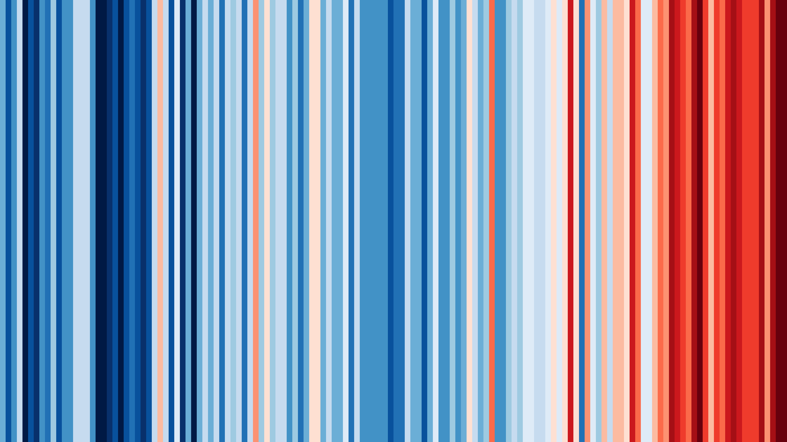

```{ojs}
import {
  atlasHero,
  downloadButton,
  multiLineText,
  loaderDiv,
  loaderContent,
} from "/helpers/uiComponents.ojs";

import { filterableDataTable as dataTable } from "/components/atlasTable.ojs";

import { cleanAdminInput_SQL, patchWindowsCache } from "/helpers/data.js";

import { enhancedMultiSelect } from "/helpers/enhancedMultiSelect.ojs";

import { atlasTOC } from "/helpers/toc.ojs";

import { chartDownloadMenu, elementToPngBlob }                        from "/helpers/chartDownloadMenu.ojs";
import { mannKendall, trendOverlayMarks }                             from "/helpers/trend.ojs";
import { observationalUncertaintyBand, observationalUncertaintyMarks } from "/helpers/observationalUncertainty.ojs";

// Old hero (white-boxed title overlaid on a generic crop photo).
// Replaced by the warming-stripes hero in the cell below. Left commented
// pending Pete's verification — remove once the new hero is signed off.
// atlasHero(nbTitle, "../../images/default_crop.webp");
```

```{ojs}
// Warming-stripes hero. Replaces the old atlasHero white-box title.
// - Full-bleed background PNG: Nigeria warming stripes 1886–2025,
//   credit Ed Hawkins (University of Reading), CC-BY 4.0, sourced from
//   showyourstripes.info. See Acknowledgements for full attribution.
// - Dark left-to-right gradient overlay for legibility.
// - Eyebrow / title / chip strings flow through _lang(...) so EN+FR
//   render correctly (see data/climateRationale/nbText.json).
// - Technical tokens like "SSP3-7.0" and "18-GCM" are intentionally
//   left untranslated in both locales (per CLAUDE.md convention).
html`<div class="cr-hero">
  
  <div class="cr-hero-overlay"></div>
  <div class="cr-hero-content">
    <div class="cr-hero-eyebrow">${_lang(nbText.sections.hero.eyebrow)}</div>
    <h1 class="cr-hero-title" id="notebook-title">${nbTitle}</h1>
    <div class="cr-hero-chips">
      <span class="cr-hero-chip">${_lang(nbText.sections.hero.chips.coverage)}</span>
      <span class="cr-hero-chip">${_lang(nbText.sections.hero.chips.period)}</span>
      <span class="cr-hero-chip">${_lang(nbText.sections.hero.chips.scenarios)}</span>
      <span class="cr-hero-chip">${_lang(nbText.sections.hero.chips.ensemble)}</span>
    </div>
  </div>
</div>`
```

```{ojs}
atlasTOC({
  skip: ["notebook-title", "source-code"],
  heading: `<b>${Lang.toSentenceCase(_lang(general_translations.toc))}</b>`,
});
```

```{ojs}
// Hidden state inputs backing the sidebar controls. Declared separately
// from the visible inputs (which live inside the floating .atlas-toc
// panel) so they can be referenced from anywhere via OJS reactivity.
// Controls apply to every plot container in the notebook.
viewof plotTextSize = Inputs.input(10);
viewof plotTextBold = Inputs.input(false);
viewof plotLineWidth = Inputs.input(1.5);
viewof facetCols = Inputs.input(3);
viewof includeAdmin0 = Inputs.input(false);
```

```{ojs}
//| output: false
// Inject the plot-text controls into the floating "In this notebook" TOC.
// atlasTOC re-renders its container on every MutationObserver tick, so
// we observe for a fresh .atlas-toc node and re-append the controls into
// it whenever it's recreated. The inputs are bound to viewof
// plotTextSize / plotTextBold so values flow through OJS reactivity.
{
  function injectPlotTextControls() {
    const toc = document.querySelector(".atlas-toc");
    if (!toc) return;
    if (toc.querySelector(".atlas-toc-extras")) return;
    const slider = Inputs.bind(
      Inputs.range([8, 20], {
        step: 1,
        value: plotTextSize,
        label: "Plot text size",
      }),
      viewof plotTextSize,
    );
    const boldToggle = Inputs.bind(
      Inputs.toggle({
        label: "Bold plot text",
        value: plotTextBold,
      }),
      viewof plotTextBold,
    );
    const lineWidthSlider = Inputs.bind(
      Inputs.range([0.5, 4], {
        step: 0.5,
        value: plotLineWidth,
        label: "Line / point size",
      }),
      viewof plotLineWidth,
    );
    const facetColsSelect = Inputs.bind(
      Inputs.select([2, 3, 4], {
        label: "Facet columns",
        value: facetCols,
      }),
      viewof facetCols,
    );
    const includeAdmin0Toggle = Inputs.bind(
      Inputs.toggle({
        label: "Include national",
        value: includeAdmin0,
      }),
      viewof includeAdmin0,
    );
    // CSS-only instant tooltip: ⓘ icon next to the label with a bubble
    // that appears on hover via visibility/opacity (no ~1s native
    // tooltip delay). Bubble opens to the LEFT of the icon because the
    // sidebar sits at the right edge of the viewport.
    function attachTooltip(inputEl, tipText) {
      const lbl = inputEl.querySelector("label");
      if (!lbl) return;
      const wrap = html`<span class="cr-tooltip-wrap" style="position: relative; display: inline-block; margin-left: 4px;">
        <span class="cr-tooltip-icon" aria-label="${tipText}" title="${tipText}" style="cursor: help; color: #2563eb; font-size: 1.05em;">ⓘ</span>
        <span class="cr-tooltip-bubble" role="tooltip" style="
          visibility: hidden; opacity: 0;
          transition: opacity 0.08s ease-out;
          position: absolute;
          right: 130%; top: 50%; transform: translateY(-50%);
          background: #1f2937; color: #fff;
          padding: 8px 10px; border-radius: 4px;
          font-size: 12px; line-height: 1.45;
          width: 240px; max-width: 60vw;
          z-index: 1050; pointer-events: none;
          box-shadow: 0 2px 8px rgba(0,0,0,0.2);
        ">${tipText}</span>
      </span>`;
      lbl.appendChild(wrap);
    }
    if (!document.getElementById("cr-tooltip-style")) {
      const style = document.createElement("style");
      style.id = "cr-tooltip-style";
      style.textContent = `
        .cr-tooltip-wrap:hover .cr-tooltip-bubble,
        .cr-tooltip-wrap:focus-within .cr-tooltip-bubble {
          visibility: visible; opacity: 1;
        }
      `;
      document.head.appendChild(style);
    }
    attachTooltip(
      facetColsSelect,
      "Number of admin1 panels per row in faceted plots. Higher = narrower individual panels; switch to 2 if labels get cramped, 4 if you want a denser grid.",
    );
    attachTooltip(
      includeAdmin0Toggle,
      "When ON, plots include country-level (admin0) values alongside any selected admin1 regions. When OFF (default), only the selected admin1 regions are shown.",
    );
    const wrapper = html`<div class="atlas-toc-extras">
      <div class="atlas-toc-extras-heading">All plots</div>
      ${slider}
      ${boldToggle}
      ${lineWidthSlider}
      ${facetColsSelect}
      ${includeAdmin0Toggle}
    </div>`;
    toc.appendChild(wrapper);
  }
  injectPlotTextControls();
  const observer = new MutationObserver(() => injectPlotTextControls());
  observer.observe(document.body, { childList: true, subtree: true });
}
```

```{ojs}
//| output: false
// Floating-TOC show/hide toggle. The TOC (.atlas-toc) is fixed to the
// top-right of the viewport and overlaps the content column when the
// viewport gets narrow (browser zoom, side-by-side windows). Adds a
// small button in the same corner that toggles a body class which
// CSS uses to fade the TOC out of view. Initial state is collapsed
// below 1480 px viewport width so the overlap doesn't happen on
// first paint; once the user clicks the button their choice sticks
// (no auto-resize re-trigger).
{
  const NARROW = 1480; // px
  if (
    !document.body.classList.contains("atlas-toc-collapsed") &&
    !document.body.dataset.atlasTocUserChose &&
    window.innerWidth < NARROW
  ) {
    document.body.classList.add("atlas-toc-collapsed");
  }
  if (!document.querySelector(".atlas-toc-toggle")) {
    const btn = document.createElement("button");
    btn.className = "atlas-toc-toggle";
    btn.setAttribute("aria-label", "Toggle table of contents");
    btn.setAttribute("title", "Show/hide table of contents");
    const render = () => {
      btn.textContent = document.body.classList.contains("atlas-toc-collapsed")
        ? "☰"
        : "×";
    };
    btn.addEventListener("click", () => {
      document.body.classList.toggle("atlas-toc-collapsed");
      document.body.dataset.atlasTocUserChose = "1";
      render();
    });
    render();
    document.body.appendChild(btn);
  }
}
```

```{ojs}
//| output: false
// Apply the slider + toggle values as CSS variables on the document
// root. Every plot container ([id^="plot"]) inherits font-size and
// font-weight from these variables via the rule in the global <style>
// block.
document.documentElement.style.setProperty(
  "--plot-text-size",
  `${plotTextSize}px`,
);
document.documentElement.style.setProperty(
  "--plot-text-weight",
  plotTextBold ? "700" : "400",
);
```

```{=html}
<style>
  /* Climate-Rationale hero. Warming-stripes background with a dark
     left-to-right gradient overlay, eyebrow + title + 4 metadata chips.
     Scoped to .cr-hero — does not affect other notebooks. */
  .cr-hero {
    position: relative;
    width: 100%;
    height: 280px;
    overflow: hidden;
    margin: 0 0 1rem;
    background: #07121e;
  }
  .cr-hero-bg {
    position: absolute;
    inset: 0;
    width: 100%;
    height: 100%;
    object-fit: cover;
    display: block;
  }
  .cr-hero-overlay {
    position: absolute;
    inset: 0;
    background: linear-gradient(
      to right,
      rgba(7, 18, 30, 0.78),
      rgba(7, 18, 30, 0.30)
    );
  }
  .cr-hero-content {
    position: relative;
    z-index: 2;
    height: 100%;
    display: flex;
    flex-direction: column;
    justify-content: center;
    padding: 0 2rem;
    color: #fff;
  }
  .cr-hero-eyebrow {
    text-transform: uppercase;
    letter-spacing: 0.18em;
    font-size: 0.78rem;
    font-weight: 600;
    opacity: 0.85;
    margin-bottom: 0.4rem;
  }
  .cr-hero-title {
    all: unset;
    display: block;
    font-size: 2.4rem;
    font-weight: 700;
    line-height: 1.1;
    margin: 0;
    color: #fff;
    max-width: 70%;
    word-wrap: break-word;
  }
  .cr-hero-chips {
    display: flex;
    flex-wrap: wrap;
    gap: 0.5rem;
    margin-top: 1rem;
  }
  .cr-hero-chip {
    display: inline-block;
    padding: 0.32rem 0.75rem;
    font-size: 0.78rem;
    font-weight: 500;
    color: #fff;
    background: rgba(255, 255, 255, 0.15);
    border: 1px solid rgba(255, 255, 255, 0.55);
    border-radius: 9999px;
    -webkit-backdrop-filter: blur(6px);
    backdrop-filter: blur(6px);
    white-space: nowrap;
    line-height: 1.2;
  }
  @media (max-width: 768px) {
    .cr-hero {
      height: 220px;
    }
    .cr-hero-content {
      padding: 0 1.25rem;
    }
    .cr-hero-title {
      font-size: 1.7rem;
      max-width: 100%;
    }
    .cr-hero-eyebrow {
      font-size: 0.7rem;
      letter-spacing: 0.14em;
    }
  }

  .atlasFigCaption {
    position: relative;
    z-index: -1;
    display: inline;
    font-size: 0.76em;
    font-family: Georgia, Cambria, "Times New Roman", serif;
    font-style: normal;
    line-height: 1.3;
    color: #555;
  }

  /* Suppress the implicit paragraph spacing between caption lines that
     <br> sometimes inherits from the surrounding markdown body. */
  .atlasFigCaption + br + .atlasFigCaption {
    margin-top: 0;
  }

  /* Footer row sitting under each plot: optional download button on the
     left, "About this plot" disclosure immediately to its right. Same
     pattern across every chart section so the user always knows where
     to find them. */
  .plot-footer-row {
    display: flex;
    align-items: center;
    justify-content: flex-start;
    gap: 0.5rem;
    margin: 0.25rem 0 0.75rem;
  }
  .plot-footer-row > .plot-caption-details {
    margin: 0;
    flex: 0 0 auto;
  }
  /* Inputs.button renders as a <form> with Observable's default grid
     layout (label column + value column) plus a min-height. Strip all of
     that so the bare <button> sits flush against the "About this plot"
     disclosure on the right. */
  .plot-footer-row > form {
    display: block !important;
    grid-template-columns: none !important;
    min-height: 0 !important;
    margin: 0 !important;
    padding: 0 !important;
    flex: 0 0 auto;
    width: auto !important;
  }
  .plot-footer-row > form > label {
    display: none !important;
  }
  .plot-footer-row > form > button {
    margin: 0;
  }

  /* Plot text-size slider lives at the bottom of the floating
     "In this notebook" TOC (.atlas-toc). The CSS variable below is read
     by the SVG text rule and updated reactively by the slider. */
  .atlas-toc-extras {
    margin-top: 10px;
    padding-top: 8px;
    border-top: 1px solid rgba(0, 0, 0, 0.1);
    font-size: 11px;
  }
  .atlas-toc-extras-heading {
    font-size: 10px;
    font-weight: 698;
    text-transform: uppercase;
    color: #331;
    margin-bottom: 4px;
  }
  .atlas-toc-extras form {
    font-size: 11px;
    min-height: 0;
    margin: 0;
  }
  .atlas-toc-extras form > label {
    font-size: 10.5px;
  }
  .atlas-toc-extras input[type="range"] {
    width: 100%;
  }
  /* Hide the number-input value display next to Inputs.range — the
     slider alone is enough in the cramped sidebar (Pete: "the number
     box is not needed"). */
  .atlas-toc-extras form input[type="number"] {
    display: none;
  }
  /* Override toc.ojs's 78vh cap and hide the scrollbar visually.
     Content is still scrollable on tiny viewports, just without the
     chrome — Pete flagged the visible bar as an unwanted appearance. */
  .atlas-toc {
    max-height: 92vh;
    scrollbar-width: none;
    -ms-overflow-style: none;
    transition: opacity 0.15s ease-out, transform 0.15s ease-out;
  }
  .atlas-toc::-webkit-scrollbar {
    display: none;
  }

  /* Toggle button for the floating TOC. Sits in the top-LEFT corner
     (same side as the TOC itself) — when the TOC is open the button
     overlays its top-right corner like a close button; when
     collapsed the button sits where the panel used to be. JS sets
     the initial state based on viewport width (collapsed below
     1480 px so the TOC doesn't overlap the content column when
     zoomed in or in narrow windows); once the user clicks, their
     choice sticks. */
  .atlas-toc-toggle {
    position: fixed;
    top: 80px;
    left: 24px;
    width: 28px;
    height: 28px;
    border: 1px solid rgba(0, 0, 0, 0.18);
    border-radius: 4px;
    background: rgba(255, 255, 255, 0.96);
    color: #442;
    cursor: pointer;
    font-size: 15px;
    line-height: 1;
    z-index: 12; /* above .atlas-toc (z-index: 10) */
    display: flex;
    align-items: center;
    justify-content: center;
    box-shadow: 0 2px 4px rgba(0, 0, 0, 0.08);
    padding: 0;
  }
  .atlas-toc-toggle:hover {
    color: #d2a017;
    border-color: rgba(210, 160, 23, 0.5);
  }
  /* When TOC is open, add a touch of top padding so the heading
     "IN THIS NOTEBOOK" clears the toggle button overlaid on it. */
  body:not(.atlas-toc-collapsed) .atlas-toc {
    padding-top: 36px;
  }
  body.atlas-toc-collapsed .atlas-toc {
    opacity: 0;
    transform: translateX(-20px);
    pointer-events: none;
  }

  /* Slider- and toggle-controlled font-size and font-weight for every
     plot container in the notebook. Targets both:
       - SVG <text>/<tspan> (axis labels, tick labels, ramp legend text)
       - HTML legend swatches (Plot's categorical color legend renders
         labels as inline <span>s inside a [class*="-swatches"] wrapper)
     Plot's default <text font-size="10"> attribute is overridden because
     CSS wins over the SVG presentation attribute. */
  [id^="plot"] text,
  [id^="plot"] tspan {
    font-size: var(--plot-text-size, 10px) !important;
    font-weight: var(--plot-text-weight, 400) !important;
  }
  [id^="plot"] [class*="-swatches"],
  [id^="plot"] [class*="-swatches"] span {
    font-size: var(--plot-text-size, 10px) !important;
    font-weight: var(--plot-text-weight, 400) !important;
  }

  /* Tree map overrides — the global plot-text rule above caps at the
     sidebar slider value, but treemap labels are denser and benefit
     from being a touch larger. Rules below the global rule so they
     win the !important + same-specificity cascade. */
  [id^="plot"] text.cr-treemap-label {
    font-size: calc(var(--plot-text-size, 10px) + 2px) !important;
  }
  [id^="plot"] text.cr-treemap-value {
    font-size: calc(var(--plot-text-size, 10px) + 1px) !important;
  }
  /* Custom hover tooltip rendered just below the treemap (faster than
     the default native SVG <title> ~1s delay). The `<title>` element
     is kept as an accessibility fallback. */
  .cr-treemap-tip {
    position: fixed;
    pointer-events: none;
    background: rgba(31, 41, 55, 0.92);
    color: #fff;
    padding: 5px 9px;
    border-radius: 4px;
    font-size: 12px;
    z-index: 9999;
    display: none;
    white-space: nowrap;
    box-shadow: 0 2px 6px rgba(0, 0, 0, 0.2);
  }

  /* Plot caption furled under a clickable summary. */
  .plot-caption-details {
    margin: 0.25rem 0 0.75rem;
  }
  .plot-caption-details > summary {
    cursor: pointer;
    list-style: none;
    font-size: 0.85em;
    color: #666;
    padding: 0.25rem 0;
  }
  .plot-caption-details > summary::-webkit-details-marker { display: none; }
  .plot-caption-details > summary::marker { content: ""; }
  .plot-caption-details > summary::before {
    content: "▸";
    display: inline-block;
    width: 1em;
  }
  .plot-caption-details[open] > summary::before { content: "▾"; }
  .plot-caption-details > summary:hover { color: #2E7636; }
  .plot-caption-body {
    margin-top: 0.3rem;
  }

  .climate-var-description {
    font-size: 0.85em;
    color: #555;
    margin: 0.5rem 0 0;
    line-height: 1.4;
  }
  .climate-var-description a {
    margin-left: 0.4em;
  }
  /* When rendered as a <details> for a collapsible long description:
     the summary shows the bold label + first sentence; clicking
     expands to the rest of the description. */
  details.climate-var-description > summary {
    cursor: pointer;
    list-style: none;
    padding-right: 1.4em;
    position: relative;
  }
  details.climate-var-description > summary::-webkit-details-marker {
    display: none;
  }
  details.climate-var-description > summary::after {
    content: "▸ more";
    position: absolute;
    right: 0;
    top: 0;
    color: #2a7a2a;
    font-size: 0.95em;
    font-style: italic;
  }
  details.climate-var-description[open] > summary::after {
    content: "▾ less";
  }
  details.climate-var-description > .cv-desc-rest {
    margin: 0.4rem 0 0;
  }

  /* Compact horizontal row of secondary controls (view type, palette,
     toggles). Each child cell sits flush with its content; row wraps
     onto a second line when the viewport is narrow. */
  .controls-row {
    display: flex;
    flex-wrap: wrap;
    align-items: flex-end;
    gap: 1.25rem 1.5rem;
    margin: 0.5rem 0 0.75rem;
  }
  .controls-row > .cell,
  .controls-row > .quarto-layout-cell,
  .controls-row > div.sourceCode {
    margin: 0;
    flex: 0 0 auto;
  }
  .controls-row .cell-output-display {
    margin: 0;
  }

  /* Hide the ±1 SD ribbon toggle when Future Projections is in
     "Summary" View Type — the whisker IS the uncertainty band in that
     view, so the ribbon toggle is meaningless. The class is added by
     a side-effect OJS cell that watches viewFutureChanges. Toggle's
     value persists, so switching back to Plot view restores its state. */
  body.future-view-summary .fp-uncertainty-toggle {
    display: none;
  }

  /* Variant: force an exact column count regardless of natural input
     widths. Use .cols-3 to lay out 9 controls as 3 rows of 3 (Future
     Projections) or 6 controls as 2 rows of 3 (Recent Changes). Each
     Quarto cell becomes one grid item; long checkbox rows (e.g. the
     scenario selector) compress to fit instead of wrapping to a new
     visual line. */
  .controls-row.cols-3 {
    display: grid;
    grid-template-columns: repeat(3, minmax(0, 1fr));
    gap: 0.75rem 1.5rem;
    align-items: end;
    margin: 0.5rem 0 0.75rem;
  }
  .controls-row.cols-3 > .cell,
  .controls-row.cols-3 > .quarto-layout-cell,
  .controls-row.cols-3 > div.sourceCode {
    margin: 0;
    min-width: 0;
  }

  /* Variant for a single full-width control (e.g. the commodities
     multi-select checkbox grid). Drops the flex layout so the child form
     spans the full row width, and lets the checkbox option grid wrap
     naturally instead of being capped by Inputs.checkbox's default. */
  .controls-row.full-width {
    display: block;
  }
  .controls-row.full-width form {
    width: 100%;
    max-width: 100%;
  }
  .controls-row.full-width form > div {
    max-width: 100%;
  }

  .global-admin-selectors {
    position: sticky;
    top: 56px; /* sits just below the always-visible Quarto navbar */
    z-index: 1019;
    background: #fff;
    padding: 0.5rem 0;
    border-bottom: 1px solid #e5e7eb;
    margin-bottom: 1rem;
    box-shadow: 0 2px 4px rgba(0, 0, 0, 0.05);
  }

  /* Disable Quarto's headroom hide-on-scroll so navbar stays pinned. */
  header#quarto-header.headroom--unpinned,
  .navbar.headroom--unpinned,
  .headroom--unpinned {
    transform: translateY(0) !important;
  }

  /* Small "→ Methods and data sources" link sitting just below each section
     H1. Kept out of the H1 itself so it doesn't appear in the nav sidebar TOC
     as a separate entry. */
  .below-h1-methods-link {
    margin: -0.2rem 0 0.6rem 0;
    font-size: 0.88em;
  }
  .below-h1-methods-link a {
    color: #2E7636;
    text-decoration: none;
  }
  .below-h1-methods-link a:hover {
    text-decoration: underline;
  }

  /* Collapsible help callouts (rendered as <details class="help-callout">). */
  details.help-callout {
    padding: 0.5rem 1rem;
  }
  details.help-callout > summary {
    cursor: pointer;
    font-weight: 600;
    list-style: none;
    padding: 0.25rem 0;
  }
  details.help-callout > summary::marker,
  details.help-callout > summary::-webkit-details-marker {
    display: none;
  }
  details.help-callout > summary::before {
    content: "▸";
    display: inline-block;
    width: 1.1em;
    transition: transform 0.15s;
  }
  details.help-callout[open] > summary::before {
    transform: rotate(90deg);
  }
  details.help-callout[open] > summary {
    margin-bottom: 0.5rem;
  }
</style>
```

::: {.global-admin-selectors}

```{ojs}
globalA0 = renderA0Multi({ maxSelections: 2, requireAtLeastOne: true });
globalA1 = renderA1Multi({ maxSelections: 9 });
inputTemplate()([globalA0, globalA1]);
```

:::

# `{ojs} heading1` {#overview}

```{ojs}
md`${_lang(nbText.sections.intro.text)}`; // wrapped in md for lists to work
```

```{ojs}
md`${_lang(nbText.sections.intro.furtherReading)}`;
```

# `{ojs} heading2` {#keyFacts}

<p class="below-h1-methods-link"><a href="#methods-socioeconomic">→ Methods and data sources for this section</a></p>

`{ojs} _lang(nbText.sections.keyFacts.introText)`

```{ojs}
loaderDiv("plotPov");
```

```{ojs}
loaderDiv("plotGdp");
```

```{ojs}
loaderDiv("plotLanduse");
```

```{ojs}
//| output: false
{
  [admin0Iso3, admin1Names];
  for (const id of ["plotPov", "plotGdp", "plotLanduse"]) {
    const div = document.getElementById(id);
    if (div) div.replaceChildren(loaderContent());
  }
}
```

```{ojs}
//| output: false
{
  renderToDiv("plotPov", povBar_keyFacts);
  renderToDiv("plotGdp", gdpBar_keyFacts);
  renderToDiv("plotLanduse", areaBar_keyFacts);
}
```

```{ojs}
captionDetails(
  html`<span class="atlasFigCaption">
    <strong>Poverty Rates.</strong> Data uses 2017 PPP. Poverty threshold is $4.20 USD/day (2017 PPP). Source: <a href="https://datacatalog.worldbank.org/search/dataset/0042041">World Bank Global Subnational Atlas of Poverty (GSAP)</a>, 2023 release.<br>
    <strong>Country GDP by Sector.</strong> Data is from ${gdp_plotData[0]?.year ?? "?"}, measured in constant ${gdp_plotData[0]?.unit?.split("-").pop() ?? "?"} US dollars. Source: <a href="https://databank.worldbank.org/source/world-development-indicators">World Bank World Development Indicators (WDI)</a>.<br>
    <strong>Country Land Use by Sector.</strong> Data is based on ${landuse_plotData[0]?.year ?? "?"} values. Source: <a href="https://www.fao.org/faostat/">FAOSTAT</a>.<br>
    Atlas-hosted data: <a href="https://radiantearth.github.io/stac-browser/#/external/digital-atlas.s3.amazonaws.com/stac/public_stac/catalog.json">STAC catalog</a>.
  </span>`,
  "About these plots (poverty, GDP, land use)",
  downloadButton(keyFacts_combinedData, "keyFacts")
);
```

### `{ojs} _lang(nbText.general.quickInsight)`

```{ojs}
html`<div id="insightKeyFacts"></div>`;
```

```{ojs}
//| output: false
renderToDiv("insightKeyFacts", () => createCountryInsights([agInsight, povInsight]));
```

```{ojs}
keyFacts_combinedData = {
  const pov = pov_plotData.map((d) => ({
    iso3: d.iso3,
    admin1_name: d.admin1_name,
    metric: "poverty",
    sub_group: d.group,
    year: d.value_year,
    value: d.pov_rate,
    unit: d.unit,
    source: "World Bank GSAP (2023 release)",
  }));
  const gdp = gdp_plotData.map((d) => ({
    iso3: d.iso3,
    admin1_name: null,
    metric: "gdp",
    sub_group: d.sector,
    year: d.year,
    value: d.gdp_usd2015,
    unit: d.unit,
    source: "World Bank WDI",
  }));
  const lu = landuse_plotData.map((d) => ({
    iso3: d.iso3,
    admin1_name: null,
    metric: "landuse",
    sub_group: d.sub_group,
    year: d.year,
    value: d.ha,
    unit: d.unit,
    source: "FAOSTAT",
  }));
  return [...pov, ...gdp, ...lu];
}
```

# `{ojs} heading_production` {#productionTrends}

<p class="below-h1-methods-link"><a href="#methods-production">→ Methods and data sources for this section</a></p>

`{ojs} _lang(nbText.sections.productionTrends.introText)`

```{ojs}
md`<details class="alert alert-info help-callout" role="note">
<summary>Heads up — not directly comparable to the MapSPAM section below.</summary>

The [Subnational Agricultural Production Statistics](#agProduction) section that follows uses a **different** production dataset (MapSPAM 2020, nominal 2021 US$, subnational snapshot). This section uses FAOSTAT — national totals, constant 2014–2016 dollars, deep time-series. The two are **not directly comparable** (different value bases, different geographic units, different time coverage). See [Methods and data sources](#methods-production) below for the full explanation.

</details>`;
```

::: {.controls-row}

```{ojs}
viewof productionVar = {
  // Defined inline so `value:` can reference the same option object —
  // ensures `productionVar.description` is populated from initial load.
  const options = [
    {
      id: "vop_intd15",
      label: "Value of production (constant 2014–2016 thousand I$)",
      description: "Annual gross value of production in constant 2014–2016 international dollars (Int$). Each year's physical output is multiplied by the 2014–2016 reference price for that commodity, then converted via FAO's Geary-Khamis purchasing-power-parity rates instead of market exchange rates — so $1 Int$ buys the same basket of goods anywhere. Best metric for cross-country comparison of production value. Source: FAOSTAT QV (element 154). Byproducts (cocoa butter, raisins, refined sugar, etc.) are not surfaced for this variable — FAOSTAT QV records farm-gate output only; switch to an Export or Import value variable to see the byproducts rollup.",
    },
    {
      id: "vop_usd15",
      label: "Value of production (constant 2014–2016 thousand US$)",
      description: "Annual gross value of production in constant 2014–2016 US dollars. Each year's physical output is multiplied by the 2014–2016 reference price for that commodity, then converted at 2014–2016 exchange rates — long-run trends reflect changes in physical output, not in prices or exchange rates. Good for absolute dollar amounts in a single, familiar currency. For cross-country comparison prefer the Int$ variant above (which normalises for price-level differences). Source: FAOSTAT QV (element 152). Byproducts are not surfaced for this variable — FAOSTAT QV records farm-gate output only; switch to an Export or Import value variable to see the byproducts rollup.",
    },
    {
      id: "production",
      label: "Production (tonnes)",
      description: "Annual physical output of the commodity, in tonnes (live-weight for animal products). Includes all production whether sold or consumed on-farm. Source: FAOSTAT QCL. Byproducts are not surfaced for this variable — physical quantities don't combine across raw and processed forms (1 t cocoa beans ≠ 1 t cocoa butter); switch to an Export or Import value variable to see the byproducts rollup.",
    },
    {
      id: "yield",
      label: "Yield (kg/ha)",
      description: "Production per hectare of harvested area, in kilograms per hectare — a productivity benchmark that strips out the effect of area expansion or contraction. Useful for spotting agronomic improvement vs land-use shifts. Source: FAOSTAT QCL. Byproducts are not surfaced for this variable — yield is a ratio (kg ÷ ha) and can't be summed across commodities or transformation states.",
    },
    {
      id: "export_quantity",
      label: "Export quantity (tonnes)",
      description: "Annual physical exports of the commodity, in tonnes (live-weight for animals). From FAOSTAT trade matrices — reflects what leaves the country, not what's produced. Years with no exports for a commodity simply don't appear in the data. Use this rather than Export value for cross-year comparison since it's an unambiguous physical quantity. Source: FAOSTAT TM. Byproducts are not surfaced for this variable — physical quantities don't combine across raw and processed forms (1 t cocoa beans ≠ 1 t cocoa butter); switch to Export value to see the byproducts rollup.",
    },
    {
      id: "export_value",
      label: "Export value (current US$)",
      description: "Annual export value in current (nominal) US dollars — each year reported at then-year prices, NOT deflated to a reference period like Value of production above. Long-run nominal trends mix volume changes with inflation; for cross-year comparison prefer Export quantity or the constant-USD variant below. Useful for a single-year or short-window snapshot of the dollar value of exports. Source: FAOSTAT TM. Toggle \"Include byproducts\" to roll up the value chain (e.g. raw Grapes + Raisins, raw Cocoa beans + butter + paste + powder) — currency converts cleanly across raw and processed forms, so the sum is well-defined.",
    },
    {
      id: "export_value_usd15",
      label: "Export value (constant 2014–2016 thousand US$)",
      description: "Annual export value deflated to constant 2014–2016 US dollars — the current-USD Export value above adjusted for inflation using FAOSTAT's Deflators series. Removes the price-level confound so long-run trends reflect changes in real export flows relative to the 2014–2016 baseline. Best monetary trade variable for cross-year comparison. Source: FAOSTAT TM + Deflators. Toggle \"Include byproducts\" to roll up the value chain (e.g. raw Grapes + Raisins, raw Cocoa beans + butter + paste + powder) — currency converts cleanly across raw and processed forms, so the sum is well-defined.",
    },
    {
      id: "import_quantity",
      label: "Import quantity (tonnes)",
      description: "Annual physical imports of the commodity, in tonnes (live-weight for animals). From FAOSTAT trade matrices — reflects what enters the country, not what's consumed. Years with no imports for a commodity simply don't appear in the data. Use this rather than Import value for cross-year comparison since it's an unambiguous physical quantity. Source: FAOSTAT TM. Byproducts are not surfaced for this variable — physical quantities don't combine across raw and processed forms; switch to Import value to see the byproducts rollup.",
    },
    {
      id: "import_value",
      label: "Import value (current US$)",
      description: "Annual import value in current (nominal) US dollars — each year reported at then-year prices, NOT deflated to a reference period. Long-run nominal trends mix volume changes with inflation; for cross-year comparison prefer Import quantity or the constant-USD variant below. Useful for single-year or short-window snapshots of the country's import bill. Source: FAOSTAT TM. Toggle \"Include byproducts\" to roll up the value chain (raw + processed forms summed by commodity group) — currency converts cleanly across transformation states.",
    },
    {
      id: "import_value_usd15",
      label: "Import value (constant 2014–2016 thousand US$)",
      description: "Annual import value deflated to constant 2014–2016 US dollars — the current-USD Import value above adjusted for inflation using FAOSTAT's Deflators series. Removes the price-level confound so long-run trends reflect changes in real import flows relative to the 2014–2016 baseline. Best monetary import variable for cross-year comparison. Source: FAOSTAT TM + Deflators. Toggle \"Include byproducts\" to roll up the value chain (raw + processed forms summed by commodity group) — currency converts cleanly across transformation states.",
    },
  ];
  return Inputs.select(options, {
    value: options[0],
    format: (d) => d.label,
    label: "Variable",
  });
}
```

```{ojs}
// View Type is gated by the active variable: stacked bar and tree map
// rely on sums-across-commodities making sense for the variable. That
// holds for monetary and physical-output variables but breaks for
// yield (kg/ha is a ratio — summing yields across crops is meaningless).
// When yield is selected, restrict to [line, table] and default to line;
// otherwise the full four-option set is available and stacked bar is
// the default (most informative for sector composition at a glance).
viewof viewProductionTrends = {
  const isYield = productionVar.id === "yield";
  const options = isYield
    ? ["line", "table"]
    : ["line", "stackedBar", "treemap", "table"];
  const labels = {
    line: "Line plot",
    stackedBar: "Stacked bar",
    treemap: "Tree map",
    table: "Table",
  };
  return Inputs.select(options, {
    label: "View Type",
    value: isYield ? "line" : "stackedBar",
    format: (d) => labels[d],
  });
}
```

```{ojs}
viewof paletteProduction = categoricalPaletteSelector({
  value: "Tableau10",
  label: "Palette",
});
```

```{ojs}
// Byproducts toggle — gates the value-chain rollup. When ON and the
// active variable is monetary trade, commodities are aggregated by
// commodity_group (e.g. Cocoa = beans + butter + paste + powder) and
// summed across (raw, processed) types. State persists across
// variable switches; visibility is gated by the productionVar.id
// being in productionByproductsCapableVars below.
viewof productionIncludeByproducts = Inputs.toggle({
  label: "Include byproducts",
  value: false,
});
```

```{ojs}
// Variables for which the byproducts toggle is meaningful. Trade
// variables only — FAOSTAT QV/QCL (vop_*, production, yield) are
// raw-only by I-2 invariant; physical trade variables can't combine
// raw and processed by units; only the four monetary trade variables
// have processed rows in the parquet AND sum-safe currency units.
productionByproductsCapableVars = new Set([
  "export_value",
  "export_value_usd15",
  "import_value",
  "import_value_usd15",
]);
```

```{ojs}
//| output: false
// Visibility controller — hides the toggle widget when the active
// variable can't use it. Mutates the existing widget's style so
// toggle state (ON/OFF) survives variable switches between capable
// variables (e.g. flipping Export value → Import value preserves
// the user's ON setting).
{
  const capable = productionByproductsCapableVars.has(productionVar.id);
  const tog = viewof productionIncludeByproducts;
  tog.style.display = capable ? "" : "none";
}
```

:::

::: {.controls-row}

```{ojs}
viewof productionTopN = Inputs.range(
  [1, Math.max(1, productionAvailableEntities.length)],
  {
    step: 1,
    value: Math.min(5, Math.max(1, productionAvailableEntities.length)),
    label: `Top N commodities (of ${productionAvailableEntities.length} available)`,
  },
);
```

```{ojs}
// Year range — two side-by-side native range inputs. Earlier attempts to
// overlay both handles on a single track had visual issues across browsers
// (see Pete's 2026-05-15 feedback). Two separate widgets is the simple
// reliable fallback.
viewof productionYearStart = Inputs.range(
  [productionAvailableYears.min, productionAvailableYears.max],
  {
    step: 1,
    value: Math.max(productionAvailableYears.min, 2010),
    label: "From year",
  },
);
```

```{ojs}
viewof productionYearEnd = Inputs.range(
  [productionAvailableYears.min, productionAvailableYears.max],
  {
    step: 1,
    value: productionAvailableYears.max,
    label: "To year",
  },
);
```

:::

::: {.controls-row .full-width}

```{ojs}
// Manual commodities multi-select. Defaults to the top-N (by current
// variable + year range). Changing top-N / variable / year / country
// recomputes the defaults and re-renders this widget — manual overrides
// are lost on reset, which is the expected reset behaviour.
viewof commoditiesSelect = Inputs.checkbox(productionAvailableEntities, {
  label: "Commodities (override top-N)",
  value: productionTopEntities,
});
```

:::

```{ojs}
// Variable description block — full-width, collapsible. Summary shows
// the bold label + first sentence (fits in one or two lines); clicking
// the summary expands to the rest of the description + the Methods
// link. Designed for the long v5-era descriptions that span ~600+ chars.
{
  const descText = productionVar.description ?? "";
  if (!descText) return html`<span></span>`;
  const splitAt = descText.indexOf(". ");
  const firstSentence =
    splitAt > 0 ? descText.slice(0, splitAt + 1) : descText;
  const rest = splitAt > 0 ? descText.slice(splitAt + 2).trim() : "";
  if (!rest) {
    return html`<p class="climate-var-description">
      <strong>${productionVar.label}.</strong>
      ${firstSentence}
      <a href="#methods-production">More in Methods →</a>
    </p>`;
  }
  return html`<details class="climate-var-description">
    <summary><strong>${productionVar.label}.</strong> ${firstSentence}</summary>
    <p class="cv-desc-rest">
      ${rest}
      <a href="#methods-production">More in Methods →</a>
    </p>
  </details>`;
}
```

```{ojs}
loaderDiv("plotProductionTrends");
```

```{ojs}
//| output: false
{
  [admin0Iso3, productionVar, viewProductionTrends, paletteProduction,
   productionTopN, productionYearStart, productionYearEnd, commoditiesSelect,
   productionIncludeByproducts];
  const div = document.getElementById("plotProductionTrends");
  if (div) div.replaceChildren(loaderContent());
}
```

```{ojs}
//| output: false
{
  renderToDiv("plotProductionTrends", () => {
    if (viewProductionTrends === "table") {
      return html`<div>
        ${dataTable(productionTrends_data)}
        <div class="plot-footer-row">${downloadButton(productionTrends_data, "productionTrends")}</div>
      </div>`;
    }
    if (viewProductionTrends === "treemap") return treemap_productionTrends();
    return chart_productionTrends();
  });
}
```

# `{ojs} heading_agProduction` {#agProduction}

<p class="below-h1-methods-link"><a href="#methods-socioeconomic">→ Methods and data sources for this section</a></p>

```{ojs}
md`${_lang(nbText.sections.agProduction.introText)}`;
```

```{ojs}
md`<details class="alert alert-info help-callout" role="note">
<summary>Heads up — not directly comparable to the FAOSTAT section above.</summary>

The plot below uses **MapSPAM 2020 in nominal 2021 US dollars** — a single subnational (admin1) snapshot. For *historical national time-series* of the same commodities, see the [National Production Trends](#productionTrends) section above; the two datasets are **not directly comparable** (different value bases, different geographic units, different time coverage). See [Methods and data sources](#methods-socioeconomic) for the full explanation.

</details>`;
```

::: {.controls-row}

```{ojs}
viewof prod_type = Inputs.select(
  [null, "all_ungrouped", ...Object.keys(exposure_groups)],
  {
    format: (d) => {
      if (d === null) return "All commodities (grouped)";
      if (d === "all_ungrouped") return "All commodities (ungrouped)";
      return _lang(cropTranslations[d]);
    },
    value: null,
    label: "Production Type",
  },
);
```

```{ojs}
viewof viewAgProduction = Inputs.select(["treemap", "bars"], {
  label: "View Type",
  value: "treemap",
  format: (d) => (d === "treemap" ? "Tree map" : "Bars"),
});
```

```{ojs}
// Shared categorical palette list across both production sections
// (National Production Trends + Subnational Ag Production) — Pete asked
// for the same dropdown options in both. Coloring within each plot is
// now by crop/category (categorical), not by value (sequential).
viewof paletteAgProd = categoricalPaletteSelector({
  value: "Tableau10",
  label: "Palette",
});
```

:::

```{ojs}
loaderDiv("plotExposure");
```

```{ojs}
//| output: false
{
  // Only data-changing inputs in the loader-dep array (view type is
  // presentation-only and re-renders synchronously from existing data).
  [admin0Iso3, admin1Names, prod_type];
  const div = document.getElementById("plotExposure");
  if (div) div.replaceChildren(loaderContent());
}
```

```{ojs}
//| output: false
{
  renderToDiv("plotExposure", () => {
    if (viewAgProduction === "treemap") return treemap_agProduction();
    return exposureBars_keyFacts();
  });
}
```

### `{ojs} _lang(nbText.general.quickInsight)`

```{ojs}
html`<div id="insightCommodity"></div>`;
```

```{ojs}
//| output: false
renderToDiv("insightCommodity", () => createCountryInsights([exposureInsight]));
```

# `{ojs} heading3` {#recentChanges}

<p class="below-h1-methods-link">
  <a href="#methods-climate-data">→ Climate data sources</a>
  &nbsp;·&nbsp;
  <a href="#methods-trend-estimation">→ Trend estimation</a>
  &nbsp;·&nbsp;
  <a href="#methods-observational-uncertainty">→ Observational uncertainty</a>
</p>

`{ojs} _lang(nbText.sections.recentChanges.introText)`

```{ojs}
md`<details class="alert alert-info help-callout" role="note">
<summary>${_lang(nbText.sections.recentChanges.help.framingTitle)}</summary>

${_lang(nbText.sections.recentChanges.help.framing)}

</details>`;
```

```{ojs}
md`<details class="alert alert-info help-callout" role="note">
<summary>${_lang(nbText.sections.recentChanges.help.anomalyTitle)}</summary>

${_lang(nbText.sections.recentChanges.help.anomaly)}

</details>`;
```

::: {.controls-row .cols-3}

```{ojs}
Inputs.bind(
  Inputs.select(seasons, {
    format: (d) => d.season_string,
    label: _lang(general_translations.season),
  }),
  viewof seasonSelect,
);
```

```{ojs}
// Section-local variable bind — only the 6 observational-record variables
// are selectable here (TAVG / TMAX / TMIN / PTOT / SPEI-03 / SPEI-12).
// The 6 heat indices in hazards_obj (NDWL0 / NDWS / NTx35 / NTx40 /
// THI-max / HSH-max) are NOT in the CHIRPS / CHIRTS observational
// parquet — they're projection-only. When the user picks a heat
// index elsewhere (e.g. Future Projections), the chart below renders
// a "not available in observational record" placeholder.
Inputs.bind(
  Inputs.select(obsHazards, {
    format: (d) => _lang(d.name),
    label: _lang(general_translations.climateVar),
  }),
  viewof climateVarSelect,
);
```

```{ojs}
// Defaults to ON so bar / line views read as anomalies relative to the
// 1991-2020 WMO baseline (per Pete's 2026-05-21 review — absolute
// values cram inter-annual variation against a non-zero baseline). SPEI
// ignores this toggle (it's already a standardised z-score).
viewof anomaly_obs = Inputs.toggle({ label: "Show as anomaly (vs 1991-2020)", value: true });
```

:::

::: {.controls-row .cols-3}

```{ojs}
// Monthly view checkbox. Only meaningful when the selected season is
// "annual" (otherwise the season's 3-month window already specifies a
// fixed month range, and "monthly" is redundant). SPEI also disables
// — SPEI queries pin to a single month per year regardless. The
// derived `viewType_obs` string downstream resolves to "monthly" or
// "periods" based on this checkbox + the gating rules.
viewof monthly_obs = {
  const isSPEI = (climateVarSelect.id || "").startsWith("SPEI");
  const season = seasonSelect.season;
  const enabled = season === "annual" && !isSPEI;
  return Inputs.toggle({
    label: enabled
      ? "Show monthly resolution (within annual)"
      : (isSPEI
          ? "Monthly view (N/A — SPEI is one value per year)"
          : "Monthly view (only available when season = Annual)"),
    value: false,
    disabled: !enabled,
  });
}
```

```{ojs}
//| output: false
// Derived view-type used by the data fetch + render cells. Resolves to
// "monthly" only when the gating conditions hold AND the checkbox is on;
// otherwise "periods" (the seasonal / annual query against the
// admin-periods parquet).
viewType_obs = {
  const isSPEI = (climateVarSelect.id || "").startsWith("SPEI");
  const season = seasonSelect.season;
  const enabled = season === "annual" && !isSPEI;
  return enabled && monthly_obs ? "monthly" : "periods";
}
```

```{ojs}
// Plot-type selector. Available options depend on the chosen variable:
// SPEI = bars only; PTOT and temperature = line / bars / stripes / line+stripes;
// plus "table" as a tabular fallback (replaces the deprecated
// viewRecentChanges = "table" branch).
viewof plotType_obs = {
  const id = climateVarSelect.id || "";
  const isSPEI = id.startsWith("SPEI");
  const options = isSPEI
    ? ["bars", "table"]
    : ["line", "bars", "stripes", "line+stripes", "table"];
  const labels = {
    "line":         "Line + bands",
    "bars":         "Bars",
    "stripes":      id === "PTOT" ? "Wet-dry stripes" : "Warming stripes",
    "line+stripes": id === "PTOT" ? "Line + wet-dry stripes" : "Line + warming stripes",
    "table":        "Table",
  };
  return Inputs.select(options, {
    label: "Plot type",
    value: isSPEI ? "bars" : "line",
    format: (k) => labels[k],
  });
}
```

```{ojs}
// Mann-Kendall + Theil-Sen trend layer (line + 95 % CI band + badge
// + IPCC qualifier). Defaults to ON. Off here suppresses every trend
// artefact at once.
viewof showTrend_obs = Inputs.toggle({ label: "Show trend layer (Mann-Kendall + Theil-Sen)", value: true });
```

```{ojs}
// Heuristic observational-uncertainty band around the data line.
// Defaults to OFF — the "(indicative)" qualifier is important so
// users don't read it as a statistical CI. Suppressed for SPEI
// regardless of toggle. See helpers/observationalUncertainty.ojs
// for the per-variable defaults and citation anchors.
viewof showObsUncertainty_obs = Inputs.toggle({ label: "Show observational uncertainty band (indicative)", value: false });
```

:::

```{ojs}
{
  const descText = climateVarSelect.description
    ? _lang(climateVarSelect.description)
    : "";
  if (!descText) return html`<span></span>`;
  // Cross-references (issue #12 Pete 2026-05-21): link the variable
  // description to (a) the underlying product methods, (b) the trend
  // statistics methods, (c) the observational uncertainty methods, and
  // (d) the data-sources entry for the source product.
  const links = html`<span class="cv-desc-links">
    <a href="#methods-climate-data">Methods → data</a>
    &nbsp;·&nbsp;
    <a href="#methods-trend-estimation">trend</a>
    &nbsp;·&nbsp;
    <a href="#methods-observational-uncertainty">uncertainty</a>
    &nbsp;·&nbsp;
    <a href="#data-sources">data sources</a>
  </span>`;
  const splitAt = descText.indexOf(". ");
  const firstSentence =
    splitAt > 0 ? descText.slice(0, splitAt + 1) : descText;
  const rest = splitAt > 0 ? descText.slice(splitAt + 2).trim() : "";
  if (!rest) {
    return html`<p class="climate-var-description">
      <strong>${_lang(climateVarSelect.name)}.</strong>
      ${firstSentence}
      ${links}
    </p>`;
  }
  return html`<details class="climate-var-description">
    <summary><strong>${_lang(climateVarSelect.name)}.</strong> ${firstSentence}</summary>
    <p class="cv-desc-rest">${rest} ${links}</p>
  </details>`;
}
```

```{ojs}
//| output: false
// Whitelist of variable codes present in the observational parquet
// (per the smoke-test against the refreshed parquet, 2026-05-21).
// SPEI windows beyond 03 / 12 exist in the parquet (01, 06, 24) but
// are not exposed in hazards_obj — limited per dispatch scope.
obsVarCodes = ["TAVG", "TMAX", "TMIN", "PTOT", "SPEI-03", "SPEI-12"];

// Filtered subset of hazards_obj. The Recent Changes variable selector
// binds this list (instead of the full hazards_obj) so heat indices
// don't appear as choices here.
obsHazards = hazards_obj.filter((h) => obsVarCodes.includes(h.id));

// Section-local SPEI-aware flags driving the lifted cells below.
isSPEI_obs = (climateVarSelect.id || "").startsWith("SPEI");
useAnomaly_obs = anomaly_obs && !isSPEI_obs;

// Map season-code → last month of season. SPEI is sampled at the
// season's last month (one value per year) so the index aligns
// naturally with the "JJA" / "DJF" labelling.
seasonLastMonth = ({
  annual: 12, JFM: 3, FMA: 4, MAM: 5, AMJ: 6, MJJ: 7, JJA: 8, JAS: 9,
  ASO: 10, SON: 11, OND: 12, NDJ: 1, DJF: 2,
});

// admin0Iso3 is an array (renderA0Multi maxSelections=2). Observational
// query is single-country; take the first. Same fallback name lookup.
obsAdmin0Iso3 = admin0Iso3[0] ?? null;
obsAdmin0Name = (admin0Select[0] && admin0Select[0].translation)
  ? _lang(admin0Select[0].translation)
  : (obsAdmin0Iso3 ?? "");
```

```{ojs}
//| output: false
// Per-admin1 fetch. Behaviour:
//   0 admin1s  → national query (adm0 parquet), one group ("National").
//   1 admin1   → admin1 query, one group.
//   2+ admin1s → admin1 query with IN-list, N groups (facet, per Pete's
//                multi-admin override on 2026-05-21). The deprecated
//                country-fallback for 2+ is removed; faceting was the
//                old production behaviour and is now restored.
// Every returned row carries `adminName` so downstream cells can group
// without re-deriving it.
// Returns { rows, fetchMs, nQueries, source } so downstream cells can
// surface fetch timing in the chart status line (matches the map's
// "country fetch X.Xs" header pattern Pete asked to preserve
// 2026-05-22). `rows` is the concatenated query result; everything
// else is metadata.
observed_obs_raw = {
  const empty = { rows: [], fetchMs: 0, nQueries: 0, source: "none" };
  if (obsAdmin0Iso3 == null) return empty;
  if (!obsVarCodes.includes(climateVarSelect.id)) return empty;  // heat-index placeholder branch
  const gaul = mainGaul.get(obsAdmin0Iso3);
  if (gaul == null) return empty;
  const useAdm1 = admin1Names.length > 0;
  const variable = climateVarSelect.id;
  const season = seasonSelect.season;
  const safeName = obsAdmin0Name.replace(/'/g, "''");

  // SQL builders. fetchOne issues a single query against either the
  // adm0 or adm1 parquet and returns rows with a literal adminName
  // column already filled in.
  const buildQuery = (level) => {
    const baseURL    = level === "adm1" ? monthlyAdm1URL : monthlyAdm0URL;
    const periodsURL = level === "adm1" ? periodsAdm1URL : periodsAdm0URL;
    const adminSelect = level === "adm1"
      ? "admin1_name AS adminName"
      : `'${safeName}' AS adminName`;
    const admin1Filter = level === "adm1"
      ? `AND admin1_name IN (${admin1Names.map((n) => `'${n.replace(/'/g, "''")}'`).join(", ")})`
      : "";
    if (isSPEI_obs) {
      const mo = seasonLastMonth[season];
      return `
        SELECT ${adminSelect}, year, month, value_mean
        FROM read_parquet('${baseURL}')
        WHERE iso3 = '${obsAdmin0Iso3}'
          AND gaul0_code = ${gaul}
          ${admin1Filter}
          AND variable = '${variable}'
          AND month = ${mo}
          AND value_mean IS NOT NULL AND isfinite(value_mean)
        ORDER BY adminName, year
      `;
    } else if (viewType_obs === "monthly") {
      return `
        SELECT ${adminSelect}, year, month, value_mean
        FROM read_parquet('${baseURL}')
        WHERE iso3 = '${obsAdmin0Iso3}'
          AND gaul0_code = ${gaul}
          ${admin1Filter}
          AND variable = '${variable}'
          AND value_mean IS NOT NULL AND isfinite(value_mean)
        ORDER BY adminName, year, month
      `;
    } else {
      return `
        SELECT ${adminSelect}, year, value_mean
        FROM read_parquet('${periodsURL}')
        WHERE iso3 = '${obsAdmin0Iso3}'
          AND gaul0_code = ${gaul}
          ${admin1Filter}
          AND variable = '${variable}'
          AND period = '${season}'
          AND value_mean IS NOT NULL AND isfinite(value_mean)
        ORDER BY adminName, year
      `;
    }
  };

  // Primary query — adm1 when 1+ admin1s selected, else national.
  const t0 = performance.now();
  const rows = Array.from(await db.query(buildQuery(useAdm1 ? "adm1" : "adm0")));
  let nQueries = 1;

  // National-overlay query (issue #1 Pete's 2026-05-21 review). When
  // the sidebar "Include National" toggle is on AND at least one
  // admin1 is selected, ALSO fetch the country-level series and
  // append it as one extra facet labelled with the country name.
  // (When admin1Names is empty, the primary query is already national.)
  if (useAdm1 && includeAdmin0) {
    const nationalRows = Array.from(await db.query(buildQuery("adm0")));
    rows.push(...nationalRows);
    nQueries++;
  }
  const fetchMs = performance.now() - t0;

  return {
    rows,
    fetchMs,
    nQueries,
    source: useAdm1 ? (includeAdmin0 ? "adm1 + national overlay" : "adm1") : "national",
  };
}

// Per-admin baseline {mean, sd, n} keyed by adminName. The 1991-2020
// WMO normal is computed independently per admin1 so each facet's
// hazard bands + z-scores reference the right baseline.
baselines_obs = {
  const byAdmin = new Map();
  for (const row of observed_obs_raw.rows) {
    if (row.year < 1991 || row.year > 2020) continue;
    if (!byAdmin.has(row.adminName)) byAdmin.set(row.adminName, []);
    byAdmin.get(row.adminName).push(row.value_mean);
  }
  const result = new Map();
  for (const [name, vals] of byAdmin) {
    const mean = d3.mean(vals);
    const sd = d3.deviation(vals) ?? 0;
    result.set(name, { mean, sd, n: vals.length });
  }
  return result;
}

// Distinct admin names in the fetched data, preserving the order in
// which admin1Names was selected. Drives faceting + per-admin trend.
// When `includeAdmin0` is on and 1+ admin1s selected, the national
// facet appears LAST in the grid (admin1s remain the primary view;
// national is supplementary context).
adminNames_obs = {
  if (admin1Names.length === 0) return [obsAdmin0Name];
  const names = [...admin1Names];
  if (includeAdmin0) names.push(obsAdmin0Name);
  return names;
}

observed_obs = observed_obs_raw.rows.map((d) => {
  const base = baselines_obs.get(d.adminName) ?? { mean: 0, sd: 0, n: 0 };
  const v = useAnomaly_obs ? d.value_mean - base.mean : d.value_mean;
  const z = base.sd > 0 ? (d.value_mean - base.mean) / base.sd : 0;
  let cls = "normal";
  if (isSPEI_obs) {
    const av = Math.abs(d.value_mean);
    if (av >= 1.5) cls = "extreme";
    else if (av >= 1) cls = "unusual";
  } else {
    const az = Math.abs(z);
    if (az >= 2) cls = "extreme";
    else if (az >= 1) cls = "unusual";
  }
  const year_frac = d.month != null ? d.year + (d.month - 1) / 12 : d.year;
  return { ...d, value_plot: v, z, cls, year_frac };
});
```

```{ojs}
//| output: false
// Standalone cell — splitting from the multi-statement cell above keeps
// Quarto's OJS preprocessor from dropping the parens around the object
// literal (see sandbox lineage commit 46ffda9).
extremeColour_obs = ({ normal: "#bbbbbb", unusual: "#f4a261", extreme: "#e15759" });
```

```{ojs}
recentChanges_obs = {
  // Heat-index placeholder. When the user has picked a hazards_obj
  // variable that doesn't exist in the observational parquet (NTx35
  // etc., normally selected from another section), surface a clear
  // message + link to Future Projections rather than rendering an
  // empty / broken chart.
  if (!obsVarCodes.includes(climateVarSelect.id)) {
    return html`<div style="padding: 1.2em 1em; background: #f8f8f8; border-left: 3px solid #aaa; color: #555;">
      <strong>${_lang(climateVarSelect.name)}</strong> is derived from CMIP6 projections — it is not part of the observational record (CHIRPS v3 + CHIRTS-ERA5) used in this section.
      <div style="margin-top: 6px; font-size: 0.9em;">
        See <a href="#futureProjections">→ Future Projections</a> for this variable, or pick one of TAVG / TMAX / TMIN / PTOT / SPEI-03 / SPEI-12 for the observed-record trend.
      </div>
    </div>`;
  }
  if (obsAdmin0Iso3 == null) return html`<div style="padding: 1em; color: #999;">Select a country to see the observational trend.</div>`;
  if (observed_obs.length === 0) return html`<div style="padding: 1em; color: #999;">No data for this selection.</div>`;

  // Table-view branch — replaces the deprecated viewRecentChanges = "table"
  // path. Columns mirror the lifted observed_obs schema.
  if (plotType_obs === "table") {
    return html`<div>
      ${dataTable(observed_obs, {
        format: { year: (d) => d },
        header: {
          year:        "Year",
          month:       "Month",
          value_mean:  "Value",
          value_plot:  useAnomaly_obs ? "Anomaly" : "Value (plotted)",
          z:           "z (σ vs 1991-2020 baseline)",
          cls:         "Classification",
        },
        columns: ["year", "month", "value_mean", "value_plot", "z", "cls"],
      })}
      <div class="plot-footer-row">${downloadButton(observed_obs, `obs_${obsAdmin0Iso3}_${climateVarSelect.id}_${seasonSelect.season}`)}</div>
    </div>`;
  }

  // SPEI is its own named quantity — the values plotted come straight
  // from the parquet, we don't z-score anything ourselves. Labelling
  // "(z-score)" implied a transform we don't perform.
  const variable = climateVarSelect.id;
  const season = seasonSelect.season;
  const unit = isSPEI_obs ? ""
    : variable === "PTOT" ? (viewType_obs === "monthly" ? "(mm / month)" : "(mm / period)")
    : "(°C)";
  const yLabel = isSPEI_obs
    ? variable
    : (useAnomaly_obs ? `${variable} anomaly ${unit}` : `${variable} ${unit}`);

  const xField = viewType_obs === "monthly" || (isSPEI_obs && viewType_obs === "monthly") ? "year_frac" : "year";
  const stripeWidth = viewType_obs === "monthly" ? 1/12 : 1;
  const nFacets = adminNames_obs.length;
  const isFaceted = nFacets > 1;

  // NxM facet grid wiring (issue #6). The sidebar `facetCols` input
  // controls how many columns the facet grid uses; the row count is
  // derived. Each admin gets a (_fx, _fy) position. When unfaceted
  // (single admin / national), these resolve to (0, 0) and Plot draws
  // a single panel regardless.
  const facetColsValue = Math.max(1, Math.min(facetCols || 3, Math.max(1, nFacets)));
  const nRows = Math.max(1, Math.ceil(nFacets / facetColsValue));
  const positionMap = new Map(
    adminNames_obs.map((name, i) => [name, {
      _fx: i % facetColsValue,
      _fy: Math.floor(i / facetColsValue),
    }])
  );
  const fxOf = (adminName) => positionMap.get(adminName)?._fx ?? 0;
  const fyOf = (adminName) => positionMap.get(adminName)?._fy ?? 0;
  // Decorator: stamps _fx + _fy onto an existing data row from its
  // adminName. Used to augment all data inputs (observed_obs, bands,
  // rule data) so Plot.plot's facet channels route each row into the
  // right cell of the NxM grid.
  const withFP = (d) => ({ ...d, _fx: fxOf(d.adminName), _fy: fyOf(d.adminName) });
  const observed_obs_aug = observed_obs.map(withFP);

  // Diverging colour for stripes — anomaly mapped to ±2σ of admin's
  // OWN baseline (per-facet, since baselines differ across admin1s).
  // RdBu (reversed) for temperature, BrBG for precipitation.
  const stripeColour = (d) => {
    const base = baselines_obs.get(d.adminName) ?? { mean: 0, sd: 1 };
    const anom = d.value_mean - base.mean;
    const scale = base.sd > 0 ? base.sd * 2 : 1;
    const t = Math.max(-1, Math.min(1, anom / scale));
    if (variable === "PTOT") {
      return d3.interpolateBrBG(0.5 + t * 0.5);
    }
    return d3.interpolateRdBu(0.5 - t * 0.5);
  };

  // For bars on temperature in ABSOLUTE mode, anchor bars at the
  // ADMIN'S baseline mean (delta-style) so 1-2°C variation isn't
  // crushed against a 0 baseline. PTOT bars start from 0. Anomaly
  // mode → all bars from 0. Returned per-row so each facet uses
  // its own baseline.
  const barBaselineFor = (d) => {
    if (useAnomaly_obs) return 0;
    if (variable === "PTOT") return 0;
    return (baselines_obs.get(d.adminName)?.mean) ?? 0;
  };

  // Bumped opacities (was 0.10 / 0.14 — too faint to read against the
  // chart background). 0.20 / 0.28 still reads as "background tint"
  // without competing with the data layer for attention.
  const _bandUnusual = "rgba(244, 162, 97, 0.20)";
  const _bandExtreme = "rgba(225,  87, 89, 0.28)";

  // Per-admin hazard bands. One band-row per (admin, level, sign).
  // Plot.rect data carries adminName so the facet system routes each
  // band to the right panel automatically when faceted; when not
  // faceted, all rows are drawn into the single panel.
  //
  // Non-SPEI uses σ-based zones (1σ unusual, 2σ extreme) around the
  // admin's baseline mean. SPEI uses fixed WMO categorical thresholds
  // (|SPEI| = 1 unusual, 1.5 extreme) regardless of empirical sd, so
  // bars match the categorical dot colours from extremeColour_obs.
  const bandsData = [];
  for (const adminName of adminNames_obs) {
    const adminVals = observed_obs.filter((d) => d.adminName === adminName).map((d) => d.value_plot);
    if (adminVals.length === 0) continue;
    const dataYMin = d3.min(adminVals);
    const dataYMax = d3.max(adminVals);
    const _fx = fxOf(adminName), _fy = fyOf(adminName);
    if (isSPEI_obs) {
      const topCap    = Math.max(dataYMax, 2.5);
      const bottomCap = Math.min(dataYMin, -2.5);
      bandsData.push(
        { adminName, _fx, _fy, y1: 1.5,        y2: topCap,    fill: _bandExtreme },
        { adminName, _fx, _fy, y1: bottomCap,  y2: -1.5,      fill: _bandExtreme },
        { adminName, _fx, _fy, y1: 1.0,        y2: 1.5,       fill: _bandUnusual },
        { adminName, _fx, _fy, y1: -1.5,       y2: -1.0,      fill: _bandUnusual },
      );
    } else {
      const base = baselines_obs.get(adminName);
      if (!base || base.sd === 0) continue;
      const mFb = useAnomaly_obs ? 0 : base.mean;
      const topCap    = Math.max(dataYMax, mFb + 3 * base.sd);
      const bottomCap = Math.min(dataYMin, mFb - 3 * base.sd);
      bandsData.push(
        { adminName, _fx, _fy, y1: mFb + 2 * base.sd, y2: topCap,                   fill: _bandExtreme },
        { adminName, _fx, _fy, y1: bottomCap,         y2: mFb - 2 * base.sd,        fill: _bandExtreme },
        { adminName, _fx, _fy, y1: mFb + base.sd,     y2: mFb + 2 * base.sd,        fill: _bandUnusual },
        { adminName, _fx, _fy, y1: mFb - 2 * base.sd, y2: mFb - base.sd,            fill: _bandUnusual },
      );
    }
  }

  // SPEI reference rule lines (still drawn for context). Per admin
  // so they sit inside each facet.
  const speiRuleData = isSPEI_obs
    ? adminNames_obs.flatMap((adminName) => {
        const _fx = fxOf(adminName), _fy = fyOf(adminName);
        return [-2, -1.5, -1, 0, 1, 1.5, 2].map((y) => ({ adminName, _fx, _fy, y }));
      })
    : [];

  // X-axis domain padding (issue #10) — pull the axis out by half a
  // year (annual) / half a month (monthly) so edge bars don't get
  // clipped at the plot border.
  const xMinRaw = d3.min(observed_obs, (d) => d[xField]);
  const xMaxRaw = d3.max(observed_obs, (d) => d[xField]);
  const xPad = viewType_obs === "monthly" ? 1/24 : 0.6;
  const xDomain = [xMinRaw - xPad, xMaxRaw + xPad];

  // Per-admin baseline ruleY data. Drawn one per facet.
  const baselineRuleData = isSPEI_obs ? [] : adminNames_obs
    .map((adminName) => {
      const base = baselines_obs.get(adminName);
      if (!base) return null;
      return { adminName, _fx: fxOf(adminName), _fy: fyOf(adminName), y: useAnomaly_obs ? 0 : base.mean };
    })
    .filter((r) => r != null);

  // Admin-label data for the per-facet name tag (Plot.text, top-right
  // of each panel). Only emitted when faceting.
  const adminLabelData = isFaceted
    ? adminNames_obs.map((name) => ({ adminName: name, _fx: fxOf(name), _fy: fyOf(name) }))
    : [];

  // Per-admin yMin/yMax precompute for stripe marks (O(N) not O(N²)).
  const yRangesByAdmin = new Map();
  for (const name of adminNames_obs) {
    const vals = observed_obs.filter((d) => d.adminName === name).map((d) => d.value_plot);
    yRangesByAdmin.set(name, { yMin: d3.min(vals), yMax: d3.max(vals) });
  }

  // Tooltip config — hide the mark-internal channels (x, y, fill,
  // stroke, x1/x2/y1/y2, fx/fy) by setting their format to null;
  // only the user-meaningful `channels: { … }` declared per mark
  // surface in the tip. Issue #7 (Pete's 2026-05-21 review).
  const tipOpts = { format: {
    x: null, y: null,
    x1: null, x2: null, y1: null, y2: null,
    fill: null, stroke: null,
    fx: null, fy: null,
  }};

  // Mark builders. All marks consume observed_obs_aug (carries _fx/_fy)
  // so the facet system routes them into the right grid cell.
  const stripesMark = Plot.rect(observed_obs_aug, {
    x1: (d) => d[xField] - stripeWidth/2,
    x2: (d) => d[xField] + stripeWidth/2,
    y1: (d) => yRangesByAdmin.get(d.adminName)?.yMin,
    y2: (d) => yRangesByAdmin.get(d.adminName)?.yMax,
    fill: stripeColour,
    stroke: null,
    fx: isFaceted ? "_fx" : undefined,
    fy: isFaceted ? "_fy" : undefined,
    channels: { admin: "adminName", year: "year", value: "value_mean" },
    tip: tipOpts,
  });
  const barMark = Plot.rect(observed_obs_aug, {
    x1: (d) => d[xField] - stripeWidth * 0.4,
    x2: (d) => d[xField] + stripeWidth * 0.4,
    y1: barBaselineFor,
    y2: "value_plot",
    fill: (d) => extremeColour_obs[d.cls],
    stroke: (d) => extremeColour_obs[d.cls],
    fx: isFaceted ? "_fx" : undefined,
    fy: isFaceted ? "_fy" : undefined,
    channels: { admin: "adminName", year: "year", value: "value_mean", anomaly: "value_plot", classification: "cls" },
    tip: tipOpts,
  });
  const lineMarks = [
    Plot.line(observed_obs_aug, {
      x: xField, y: "value_plot", stroke: "#333",
      strokeWidth: plotLineWidth,
      z: isFaceted ? "adminName" : undefined,
      fx: isFaceted ? "_fx" : undefined,
      fy: isFaceted ? "_fy" : undefined,
    }),
    Plot.dot(observed_obs_aug, {
      x: xField, y: "value_plot", r: 2.5,
      fill: (d) => extremeColour_obs[d.cls],
      stroke: (d) => extremeColour_obs[d.cls],
      fx: isFaceted ? "_fx" : undefined,
      fy: isFaceted ? "_fy" : undefined,
      channels: { admin: "adminName", year: "year", value: "value_mean", anomaly: "value_plot", z: "z", classification: "cls" },
      tip: tipOpts,
    }),
  ];

  // Hazard-band mark (per-facet via _fx/_fy if faceted). Spans the
  // full x domain inside each facet.
  const hazardBandMark = (bandsData.length === 0) ? null : Plot.rect(bandsData, {
    x1: xDomain[0],
    x2: xDomain[1],
    y1: "y1", y2: "y2", fill: "fill",
    fx: isFaceted ? "_fx" : undefined,
    fy: isFaceted ? "_fy" : undefined,
  });

  // SPEI reference lines as data-driven ruleY.
  const speiRuleMark = speiRuleData.length === 0 ? null : Plot.ruleY(speiRuleData, {
    y: "y",
    stroke: (d) => Math.abs(d.y) === 0 ? "#999" : (Math.abs(d.y) >= 1.5 ? "#e15759" : (Math.abs(d.y) >= 1 ? "#f4a261" : "#76b7b2")),
    strokeDasharray: "2,3",
    fx: isFaceted ? "_fx" : undefined,
    fy: isFaceted ? "_fy" : undefined,
  });

  // Baseline mean rule (per-facet).
  const baselineRuleMark = (baselineRuleData.length === 0 || isSPEI_obs) ? null : Plot.ruleY(baselineRuleData, {
    y: "y",
    stroke: "#4682b4",
    strokeDasharray: "3,2",
    fx: isFaceted ? "_fx" : undefined,
    fy: isFaceted ? "_fy" : undefined,
  });

  // Per-facet admin name label (top-right of each panel).
  const adminLabelMark = (!isFaceted) ? null : Plot.text(adminLabelData, {
    fx: "_fx", fy: "_fy",
    frameAnchor: "top-right",
    dx: -6, dy: 4,
    text: "adminName",
    fontSize: (plotTextSize || 10) + 1,
    fontWeight: "bold",
    fill: "#222",
  });

  // Split into bgMarks + dataLayerMarks so trend CI + obs uncertainty
  // bands can interleave between them.
  let bgMarks = [];
  let dataLayerMarks = [];
  if (isSPEI_obs) {
    bgMarks = [hazardBandMark, speiRuleMark].filter((m) => m != null);
    dataLayerMarks = [
      Plot.barY(observed_obs_aug, {
        x: xField, y: "value_plot",
        fill: (d) => extremeColour_obs[d.cls],
        stroke: (d) => extremeColour_obs[d.cls],
        fx: isFaceted ? "_fx" : undefined,
        fy: isFaceted ? "_fy" : undefined,
        channels: { admin: "adminName", year: "year", value: "value_mean", classification: "cls" },
        tip: tipOpts,
      }),
    ];
  } else if (plotType_obs === "bars") {
    bgMarks = [hazardBandMark, baselineRuleMark].filter((m) => m != null);
    dataLayerMarks = [barMark];
  } else if (plotType_obs === "stripes") {
    bgMarks = [];
    dataLayerMarks = [stripesMark];
  } else if (plotType_obs === "line+stripes") {
    bgMarks = [stripesMark, baselineRuleMark].filter((m) => m != null);
    dataLayerMarks = lineMarks;
  } else {
    bgMarks = [hazardBandMark, baselineRuleMark].filter((m) => m != null);
    dataLayerMarks = lineMarks;
  }

  // Per-admin trend stats (issue #1). One mannKendall per admin so
  // each facet's trend overlay + badge uses the right slope.
  const trendStatsByAdmin = new Map();
  if (showTrend_obs && !isSPEI_obs) {
    for (const adminName of adminNames_obs) {
      const adminData = observed_obs.filter((d) => d.adminName === adminName);
      const ts = mannKendall(adminData.map((d) => d.value_plot), {
        xValues: adminData.map((d) => Number(d.year)),
      });
      trendStatsByAdmin.set(adminName, ts);
    }
  }
  // Single-admin convenience reference (used by legend + filename
  // generation below; never the badge).
  const trendStats = trendStatsByAdmin.get(adminNames_obs[0]) ?? null;

  // Unified neutral trend colour (issue #6) — was variable-coded
  // (PTOT blue, others red), which read as jarring when switching
  // variables. Dark grey now, same regardless of variable.
  const trendStroke = "#333";
  const trendMarks = (showTrend_obs && !isSPEI_obs && trendStats && !trendStats.error &&
                      (plotType_obs === "line" || plotType_obs === "line+stripes" || plotType_obs === "bars"))
    ? trendOverlayMarks(observed_obs_aug, {
        xField: "year",
        yField: "value_plot",
        groupField: isFaceted ? "adminName" : null,
        preserveFields: isFaceted ? ["_fx", "_fy"] : [],
        fx: isFaceted ? "_fx" : null,
        fy: isFaceted ? "_fy" : null,
        showCI: true,
        ciOpacity: 0.18,
        trendStroke,
        trendStrokeWidth: plotLineWidth,
        trendStrokeDasharray: "4 3",
      })
    : [];

  // Observational-uncertainty band (heuristic; not a statistical CI).
  // Suppressed for SPEI and for stripes-only. Per-admin when faceted.
  const obsBandMarks = (showObsUncertainty_obs && !isSPEI_obs && plotType_obs !== "stripes")
    ? observationalUncertaintyMarks(observed_obs_aug, {
        xField: "year",
        yField: "value_plot",
        // valueField: drive band WIDTH from the raw rainfall / temperature
        // value (value_mean) so anomaly mode renders constant ±10% / ±0.5°C
        // bands instead of the tilted ones from sizing off the anomaly.
        // Issue #6 (Pete's 2026-05-21 review).
        valueField: "value_mean",
        groupField: isFaceted ? "adminName" : null,
        preserveFields: isFaceted ? ["_fx", "_fy"] : [],
        fx: isFaceted ? "_fx" : null,
        fy: isFaceted ? "_fy" : null,
        variable,
        fill: "#666",
        fillOpacity: 0.14,
      })
    : [];

  // Split trendMarks into [CI band(s), trend line(s)] for explicit
  // z-order interleaving. trendOverlayMarks returns 2 marks per group
  // when showCI:true (CI band, then line). With groupField, that's
  // 2*N marks: alternating [areaY, line, areaY, line, …]. Split.
  const trendCIMarks = [];
  const trendLineMarks = [];
  if (trendMarks.length > 0) {
    // Even indices = CI bands, odd = lines (per trendOverlayMarks docs).
    for (let i = 0; i < trendMarks.length; i++) {
      if (i % 2 === 0) trendCIMarks.push(trendMarks[i]);
      else trendLineMarks.push(trendMarks[i]);
    }
  }

  // Wire sidebar plot controls (issue #3): plotTextSize / plotTextBold
  // / plotLineWidth feed the chart's font + line styling.
  // Height scales with row count (issue #6 NxM grid) so each row keeps
  // ~200px usable plot area regardless of how wide the grid is.
  const perFacetHeight = isFaceted ? 200 : 380;
  const chart = Plot.plot({
    width: 1200,
    height: nRows * perFacetHeight + (isFaceted ? 40 : 0),
    marginLeft: 70,
    marginBottom: 50,
    marginTop: 30,
    style: {
      color: "#333",
      background: "#fff",
      fontSize: `${plotTextSize}px`,
      fontWeight: plotTextBold ? "bold" : "normal",
    },
    x: {
      label: "Year",
      domain: xDomain,
      tickFormat: (d) => `${Math.floor(d)}`,
      // ~one tick per 5 years across the data range — keeps the year
      // labels legible (issue #7) instead of every-year cramming.
      ticks: Math.ceil((xDomain[1] - xDomain[0]) / 5),
    },
    y: { label: yLabel, grid: true, nice: true },
    // Hide the auto fx/fy axes when faceting — the admin labels are
    // drawn via Plot.text per facet instead (cleaner than Plot's
    // default "_fx=0, _fx=1, …" auto-ticks).
    fx: isFaceted ? { axis: null, padding: 0.05 } : undefined,
    fy: isFaceted ? { axis: null, padding: 0.08 } : undefined,
    marks: [
      ...bgMarks,
      ...obsBandMarks,
      ...trendCIMarks,
      ...dataLayerMarks,
      ...trendLineMarks,
      ...(adminLabelMark ? [adminLabelMark] : []),
    ],
  });

  // Trend badge above the chart + IPCC-style confidence qualifier
  // below. SPEI gets a distinct treatment (slope-per-decade
  // suppressed because z-score-per-decade is meaningless).
  const trendDisplayUnit = variable === "PTOT"
    ? (viewType_obs === "monthly" ? "mm/month" : "mm")
    : "°C";
  const fmtSlope = (v) => {
    if (!isFinite(v) || v === 0) return Number(v).toFixed(2);
    const digits = Math.ceil(Math.log10(Math.abs(v)));
    const decimals = Math.max(0, 2 - digits);
    return v.toFixed(decimals);
  };
  const fmtP = (p) => p < 0.001 ? "< 0.001" : p < 0.01 ? "< 0.01" : `= ${p.toFixed(2)}`;
  const sourceProduct = variable === "PTOT" ? "CHIRPS v3" : "CHIRTS-ERA5";
  const yearSpan = (trendStats && !trendStats.error)
    ? `${trendStats.xStart}–${trendStats.xEnd}`
    : `${d3.min(observed_obs, d => d.year)}–${d3.max(observed_obs, d => d.year)}`;
  const chartRegionLabel =
    admin1Names.length === 0 ? obsAdmin0Name :
    admin1Names.length === 1 ? `${admin1Names[0]}, ${obsAdmin0Name}` :
    `${obsAdmin0Name} (${admin1Names.length} admin1s)`;

  // Single-admin badge renderer. Same wording as the original, with
  // unified trend colour (was variable-coded).
  const renderSingleBadge = (adminName, ts) => {
    if (!ts || ts.error) {
      return html`<div style="font-size: 0.9em; color: #999; margin-bottom: 6px;">Insufficient data for trend test (${ts?.error ?? "no data"}).</div>`;
    }
    if (ts.significant5pct) {
      return html`<div style="font-size: 0.95em; padding: 8px 12px; background: #f6f6f6; border-left: 3px solid ${trendStroke}; margin-bottom: 6px;">
        <div>
          <strong>${isFaceted ? `${adminName} — Trend:` : "Trend:"}</strong> ${ts.slopePerDecade >= 0 ? "+" : ""}${fmtSlope(ts.slopePerDecade)} ${trendDisplayUnit}/decade
          · <em>statistical</em> 95 % CI ${fmtSlope(ts.slopeLower95 * 10)} to ${fmtSlope(ts.slopeUpper95 * 10)}
          · MK p ${fmtP(ts.pValue)}
          · n = ${ts.n} years (${`${ts.xStart}–${ts.xEnd}`})${ts.usedTFPW ? " · TFPW applied" : ""}
        </div>
        ${isFaceted ? "" : html`<div style="font-size: 0.85em; color: #777; margin-top: 4px; font-style: italic;">
          CI reflects sampling uncertainty in the slope given the observed values; it does not include observational uncertainty in the underlying ${sourceProduct} estimates.
        </div>`}
      </div>`;
    }
    return html`<div style="font-size: 0.95em; padding: 8px 12px; background: #fafafa; border-left: 3px solid #999; margin-bottom: 6px;">
      <strong>${isFaceted ? `${adminName} — Trend:` : "Trend:"}</strong> no significant change at 5 % (MK p ${fmtP(ts.pValue)} · n = ${ts.n} years, ${`${ts.xStart}–${ts.xEnd}`})${ts.usedTFPW ? " · TFPW applied" : ""}.
    </div>`;
  };

  let trendBadge, ipccQualifier;
  if (!showTrend_obs) {
    trendBadge = "";
    ipccQualifier = "";
  } else if (isSPEI_obs) {
    // Per-admin SPEI MK p-only badges.
    const speiBadges = adminNames_obs.map((adminName) => {
      const adminData = observed_obs.filter((d) => d.adminName === adminName);
      const ts = mannKendall(adminData.map((d) => d.value_plot), {
        xValues: adminData.map((d) => Number(d.year)),
      });
      if (!ts || ts.error) {
        return html`<div style="font-size: 0.9em; color: #999; margin-bottom: 4px;">${isFaceted ? `${adminName}: ` : ""}Insufficient data for trend test (need ≥ 20 years).</div>`;
      }
      return html`<div style="font-size: 0.9em; padding: 6px 10px; background: #f6f6f6; border-left: 3px solid #888; margin-bottom: 4px;">
        <strong>${isFaceted ? `${adminName} — ${variable} trend:` : `${variable} trend:`}</strong> Mann-Kendall p ${fmtP(ts.pValue)} · n = ${ts.n} years (${`${ts.xStart}–${ts.xEnd}`})${ts.usedTFPW ? " · TFPW applied" : ""}.
      </div>`;
    });
    trendBadge = html`<div>${speiBadges}${isFaceted ? "" : html`<div style="font-size: 0.85em; color: #777; margin-bottom: 6px; font-style: italic;">For SPEI trend interpretation see the dry-month-frequency view (forthcoming Phase 2).</div>`}</div>`;
    ipccQualifier = "";
  } else if (isFaceted) {
    // Multi-admin: stack one badge per admin. IPCC qualifier rolled
    // into per-admin text to avoid a wall of repeated copy.
    trendBadge = html`<div>${adminNames_obs.map((adminName) => renderSingleBadge(adminName, trendStatsByAdmin.get(adminName)))}</div>`;
    ipccQualifier = html`<div style="font-size: 0.85em; color: #777; padding: 6px 10px; border-top: 1px solid #eee; margin-top: 6px; font-style: italic;">
      Trends estimated independently per admin1 (Mann-Kendall + Theil-Sen). 95 % CIs reflect sampling uncertainty given the observed values; they do not include observational uncertainty in the underlying ${sourceProduct} estimates.
    </div>`;
  } else {
    trendBadge = renderSingleBadge(adminNames_obs[0], trendStats);
    // IPCC calibrated-language qualifier (single-admin view only).
    if (trendStats && !trendStats.error) {
      ipccQualifier = trendStats.significant5pct
        ? html`<div style="font-size: 0.9em; color: #444; padding: 6px 10px; border-top: 1px solid #eee; margin-top: 6px;">
            <em>High confidence</em> that ${variable} has ${trendStats.slope > 0 ? "increased" : "decreased"} over ${chartRegionLabel} during ${yearSpan} (Theil-Sen ${trendStats.slopePerDecade >= 0 ? "+" : ""}${fmtSlope(trendStats.slopePerDecade)} ${trendDisplayUnit}/decade, MK p ${fmtP(trendStats.pValue)}).
          </div>`
        : html`<div style="font-size: 0.9em; color: #444; padding: 6px 10px; border-top: 1px solid #eee; margin-top: 6px;">
            <em>Insufficient evidence</em> to detect a trend in ${variable} over ${chartRegionLabel} during ${yearSpan} at the 5 % level (MK p ${fmtP(trendStats.pValue)}).
          </div>`;
    } else {
      ipccQualifier = "";
    }
  }

  // Filename for the chartDownloadMenu download (constructed here so
  // it's in scope for the wrapper below — the wrapper itself has to
  // wait for `legend` to be declared further down to avoid a TDZ).
  const regionToken = admin1Names.length === 1
    ? admin1Names[0]
    : admin1Names.length > 1
      ? `${obsAdmin0Iso3}-multi${admin1Names.length}`
      : obsAdmin0Iso3;
  const filename = `obs_chart_${obsAdmin0Iso3}_${regionToken}_${variable}_${season}_${viewType_obs}`
    .split(" ").join("_");

  // Adaptive legend.
  const legendItems = [];
  const isStripesOnly = plotType_obs === "stripes";
  const showsBars       = isSPEI_obs || plotType_obs === "bars";
  const showsLineDots   = !isSPEI_obs && (plotType_obs === "line" || plotType_obs === "line+stripes");
  const showsStripes    = !isSPEI_obs && (plotType_obs === "stripes" || plotType_obs === "line+stripes");
  // Bands now also render for SPEI (issue #8). Always show in bar /
  // line views when a baseline exists for at least one admin.
  const anyAdminHasBaseline = adminNames_obs.some((n) => (baselines_obs.get(n)?.sd ?? 0) > 0);
  const showsBands      = (plotType_obs === "line" || plotType_obs === "bars") && (isSPEI_obs || anyAdminHasBaseline);
  const showsBaselineRule = !isSPEI_obs && !isStripesOnly;
  const showsTrendOverlay = showTrend_obs && !isSPEI_obs && trendStats && !trendStats.error &&
                            (plotType_obs === "line" || plotType_obs === "line+stripes" || plotType_obs === "bars");

  const classKind = showsLineDots ? "dot" : "fill";
  if (showsBars || showsLineDots) {
    if (isSPEI_obs) {
      legendItems.push({ kind: classKind, color: extremeColour_obs.normal,  label: "normal (|SPEI| < 1)" });
      legendItems.push({ kind: classKind, color: extremeColour_obs.unusual, label: "unusual (1 ≤ |SPEI| < 1.5)" });
      legendItems.push({ kind: classKind, color: extremeColour_obs.extreme, label: "extreme (|SPEI| ≥ 1.5)" });
    } else {
      legendItems.push({ kind: classKind, color: extremeColour_obs.normal,  label: "normal (|departure| < 1σ)" });
      legendItems.push({ kind: classKind, color: extremeColour_obs.unusual, label: "unusual (1σ ≤ |departure| < 2σ)" });
      legendItems.push({ kind: classKind, color: extremeColour_obs.extreme, label: "extreme (|departure| ≥ 2σ)" });
    }
  }
  if (showsBands) {
    legendItems.push({
      kind: "band",
      color: _bandUnusual,
      label: isSPEI_obs ? "unusual zone shading (1 ≤ |SPEI| < 1.5)" : "unusual zone shading (1σ–2σ)",
    });
    legendItems.push({
      kind: "band",
      color: _bandExtreme,
      label: isSPEI_obs ? "extreme zone shading (|SPEI| ≥ 1.5)" : "extreme zone shading (>2σ)",
    });
  }
  if (showsBaselineRule) {
    legendItems.push({ kind: "rule", color: "#4682b4", dasharray: "3 2", label: "1991-2020 baseline mean" });
  }
  if (isSPEI_obs) {
    legendItems.push({ kind: "rule", color: "#e15759", dasharray: "2 3", label: "WMO SPEI reference lines (±1, ±1.5, ±2)" });
  }
  if (showsStripes) {
    const colors = variable === "PTOT"
      ? ["#8c510a", "#f5f5f5", "#01665e"]
      : ["#2166ac", "#f5f5f5", "#b2182b"];
    legendItems.push({
      kind: "gradient",
      colors,
      label: variable === "PTOT" ? "dry ← anomaly vs baseline → wet" : "cool ← anomaly vs baseline → warm",
    });
  }
  if (showsTrendOverlay) {
    legendItems.push({ kind: "rule", color: trendStroke, dasharray: "4 3", label: "Theil-Sen trend line" });
    legendItems.push({ kind: "band", color: trendStroke, opacity: 0.15, label: "95 % CI (slope envelope, statistical)" });
  }
  const showsObsBand = showObsUncertainty_obs && !isSPEI_obs && plotType_obs !== "stripes" && obsBandMarks.length > 0;
  if (showsObsBand) {
    legendItems.push({ kind: "band", color: "#666", opacity: 0.10, label: "observational uncertainty band (indicative — see methods)" });
  }

  const swatchOf = (item) => {
    if (item.kind === "fill") {
      return html`<span style="display:inline-block; width:14px; height:14px; background:${item.color}; border:1px solid #999; border-radius:2px;"></span>`;
    }
    if (item.kind === "dot") {
      return html`<svg width="14" height="14" style="display:inline-block; vertical-align:middle;">
        <circle cx="7" cy="7" r="4.5" fill="${item.color}" stroke="#666" stroke-width="0.8"/>
      </svg>`;
    }
    if (item.kind === "rule") {
      return html`<svg width="22" height="6" style="display:inline-block; vertical-align:middle;">
        <line x1="1" y1="3" x2="21" y2="3" stroke="${item.color}" stroke-width="2" stroke-dasharray="${item.dasharray || ""}"/>
      </svg>`;
    }
    if (item.kind === "band") {
      return html`<span style="display:inline-block; width:22px; height:10px; background:${item.color}; opacity:${item.opacity == null ? 1 : item.opacity}; border:1px solid #ddd;"></span>`;
    }
    if (item.kind === "gradient") {
      return html`<span style="display:inline-block; width:54px; height:12px; background:linear-gradient(to right, ${item.colors.join(", ")}); border:1px solid #999;"></span>`;
    }
    return "";
  };

  const legend = legendItems.length === 0 ? "" : html`<div style="display:flex; flex-wrap:wrap; gap:10px 18px; font-size:0.82em; line-height:1.3; color:#444; padding:8px 12px; border-top:1px solid #eee; margin-top:6px;">
    ${legendItems.map((item) => html`<span style="display:inline-flex; align-items:flex-start; gap:6px; max-width:260px;">
      <span style="flex-shrink:0; display:inline-flex; align-items:center; height:1.3em;">${swatchOf(item)}</span>
      <span style="white-space:normal; word-break:normal; overflow-wrap:break-word;">${item.label}</span>
    </span>`)}
  </div>`;

  // chartDownloadMenu handles PNG / SVG / CSV exports. Wrap chart +
  // legend together so the download button sits below the legend.
  // PNG = chart only (no legend in the export); SVG = chart only.
  //
  // Two composite-PNG attempts failed (commits 48a2e82 + 24feca1):
  // foreignObject for an HTML legend nested inside an SVG envelope
  // appears to taint the canvas in this browser, so canvas.toBlob
  // returns null and the button looks dead. Including the legend in
  // PNG/SVG export needs a deeper refactor — see dispatch
  // 2026-05-22_recent-changes-followups.md.
  const chartAndLegend = html`<div style="background:#fff; display:block;"></div>`;
  chartAndLegend.appendChild(chart);
  if (legend) chartAndLegend.appendChild(legend);
  const chartAndLegendWithDownload = chartDownloadMenu(chartAndLegend, {
    filename,
    data: observed_obs,
    csvColumns: ["adminName", "year", "month", "value_mean", "value_plot", "z", "cls"],
  });

  // Fetch-time status header, mirroring the map's. Pete confirmed
  // 2026-05-22 this readout is useful for spotting slow queries.
  // (nRows is already declared above as the facet-grid row count, so
  // use nObsRows here.)
  const fetchSec = (observed_obs_raw.fetchMs / 1000).toFixed(2);
  const nObsRows = observed_obs.length;
  const status = html`<div style="font-size: 0.82em; color: #666; margin-bottom: 4px;">
    data fetch ${fetchSec}s · ${nObsRows} rows · ${observed_obs_raw.nQueries} ${observed_obs_raw.nQueries === 1 ? "query" : "queries"} · source: ${observed_obs_raw.source}
  </div>`;

  // Layout (issues #2, #3, #5): chart + legend wrapped together (download
  // button sits below the wrapper, i.e. below the legend); per-admin
  // trend badges + IPCC qualifier render UNDERNEATH the chart. The
  // per-admin baseline numbers live in the recentChanges_obs_caption
  // cell that renders directly below this output.
  return html`<div>${status}${chartAndLegendWithDownload}${trendBadge}${ipccQualifier}</div>`;
}

recentChanges_obs_caption = {
  if (obsAdmin0Iso3 == null) return md``;
  if (!obsVarCodes.includes(climateVarSelect.id)) return md``;
  const variable = climateVarSelect.id;
  const season = seasonSelect.season;
  const speiMonth = isSPEI_obs ? seasonLastMonth[season] : null;
  const region = admin1Names.length === 1
    ? `${admin1Names[0]}, ${obsAdmin0Name}`
    : admin1Names.length > 1
      ? `${obsAdmin0Name} — ${admin1Names.length} admin1 regions (faceted)`
      : `${obsAdmin0Name} (national)`;
  // Per-admin baseline summary. Single admin → one line; multi-admin →
  // compact list. Faceted in the chart above, so listing per-admin
  // baselines here gives the reader the numeric ground truth for each
  // facet without crowding the chart legend.
  let baselineCopy;
  if (adminNames_obs.length === 1) {
    const b = baselines_obs.get(adminNames_obs[0]);
    baselineCopy = (b && b.n > 0)
      ? `Baseline (1991-2020): μ = ${b.mean.toFixed(2)}, σ = ${b.sd.toFixed(2)}, n = ${b.n} years.`
      : `Baseline (1991-2020): insufficient data.`;
  } else {
    const lines = adminNames_obs.map((name) => {
      const b = baselines_obs.get(name);
      return (b && b.n > 0)
        ? `**${name}**: μ = ${b.mean.toFixed(2)}, σ = ${b.sd.toFixed(2)}, n = ${b.n}`
        : `**${name}**: insufficient data`;
    });
    baselineCopy = `Per-admin baselines (1991-2020): ${lines.join(" · ")}.`;
  }
  const speiCopy = isSPEI_obs
    ? `SPEI is the ${variable.replace("SPEI-","").replace(/^0+/, "")}-month accumulation ending in month ${speiMonth}. Reference lines: ±1 moderate, ±1.5 severe, ±2 extreme (WMO).`
    : "";
  // Issue #4 (Pete's 2026-05-21 review): dropped the meta-info line
  // ("Region: X · Variable: Y · Season: Z · View: W · Plot: V · …").
  // The controls + selector labels already make every one of those
  // settings visible on screen; the repeat just clutters the caption.
  const multiCountryNote = admin0Iso3.length > 1
    ? ` *Note: ${admin0Iso3.length} countries selected; the observational view shows only the first (${obsAdmin0Name}).*`
    : "";
  return md`${baselineCopy} ${speiCopy}${multiCountryNote}`;
}
```

::: {#recent-changes-plot}
:::

```{ojs}
//| output: false
{
  // Re-show loader only on data-changing inputs. Plot-side toggles
  // (showTrend_obs, showObsUncertainty_obs) re-render synchronously
  // from already-fetched data — they must NOT trip the loader, or
  // they race with the render cell and the spinner clobbers the
  // rendered viz (see feedback_loader-render-race memory).
  [admin0Iso3, admin1Names, climateVarSelect, seasonSelect, monthly_obs, plotType_obs, anomaly_obs, includeAdmin0];
  const div = document.getElementById("recent-changes-plot");
  if (div) div.replaceChildren(loaderContent());
}
```

```{ojs}
//| output: false
{
  const div = document.getElementById("recent-changes-plot");
  if (div) div.replaceChildren(recentChanges_obs);
}
```

```{ojs}
recentChanges_obs_caption
```

### Map — average conditions over the country (1991–2020)

The map shows the **average value over 1991–2020** of the selected variable, season by season — for example, "mean annual rainfall" or "mean January–March maximum temperature" — across the country. Where you've selected one or more admin1 regions in the sidebar, those regions are outlined; the rest of the country still renders for context.

The colour ramp adapts to the values actually present in the visible area, so the contrast is maximised for the region you're looking at. Flip the **"Lock map ramp to global limits"** toggle if you want a fixed scale that lets you compare across countries or seasons. The **"Map palette"** dropdown lets you swap colour schemes.

::: {.callout-note collapse="true"}
## Methods notes (click to expand)

Source data: **CHIRPS v3** for precipitation and **CHIRTS-ERA5** for temperature, downsampled to a Cloud-Optimized GeoTIFF (COG) of the 1991–2020 mean per (variable × season). For SPEI the map shows the *standard deviation* over 1991–2020 (the SPEI mean is ~0 by construction, since SPEI is standardised against its own reference window). Boundary polygons are GAUL 2024 admin1 simplified to a vector tile-friendly resolution. See **[Methods → Climate data sources](#methods-climate-data)** and **[Methods → Observational uncertainty](#methods-observational-uncertainty)** for product details and known caveats.
:::

Map controls (affect this map only):

::: {.controls-row .cols-3}

```{ojs}
viewof rampLockFixed_obs = Inputs.toggle({ label: "Lock map ramp to global limits (off = rescale to admin1 / country data)", value: false });
```

```{ojs}
viewof showGraticule_obs = Inputs.toggle({ label: "Show lat/lon ticks on map", value: false });
```

```{ojs}
viewof showAdmin1Labels_obs = Inputs.toggle({ label: "Show admin1 names on map", value: false });
```

```{ojs}
// Map colour palette. "Default" keeps the per-variable ramp (viridis-
// like for temperature, white→blue for PTOT, green→amber→red for SPEI
// — chosen for semantic fit). The other options remap the variable's
// existing breakpoints onto a single d3-scale-chromatic interpolator
// so the user can flip palettes without breaking the legend's
// numeric ticks.
viewof mapPalette_obs = Inputs.select(
  ["default", "viridis", "magma", "inferno", "turbo", "warm-cool (RdYlBu reversed)"],
  { label: "Map palette", value: "default" }
);
```

```{ojs}
// Default OFF — discrete CHIRPS / CHIRTS-ERA5 cells render as
// individual blocks, preserving the true ~5 km resolution of the
// underlying raster. Toggle ON to enable browser bilinear/bicubic
// interpolation between adjacent cells for a smoother presentation
// look (does not change the underlying values). See nbText
// sections.recentChanges.help.mapRendering for the help copy.
viewof mapSmooth_obs = Inputs.toggle({
  label: "Smooth map (interpolate between raster cells)",
  value: false,
});
```

:::

```{ojs}
//| output: false
// geotiff.js + topojson-client via esm.sh ESM. OJS handles dynamic
// imports natively and resolves each cell to the module namespace,
// which downstream cells reference via dataflow.
GeoTIFF_obs        = await import("https://esm.sh/geotiff@2.1.3");
topojsonClient_obs = await import("https://esm.sh/topojson-client@3.1.0");
```

```{ojs}
//| output: false
admin0_geo_obs = {
  const tj = await FileAttachment("/data/shared/atlas_gaul24_a0_africa_simple-vlowres.topojson").json();
  const objectName = Object.keys(tj.objects)[0];
  return topojsonClient_obs.feature(tj, tj.objects[objectName]);
}

admin0_feature_obs = {
  const iso3 = obsAdmin0Iso3;
  if (iso3 == null) return null;
  const f = admin0_geo_obs.features.find((f) => f.properties && (f.properties.iso3 === iso3 || f.properties.ISO3 === iso3 || f.properties.iso_3 === iso3));
  return f ?? null;
}

admin1_geo_obs = {
  const tj = await FileAttachment("/data/shared/atlas_gaul24_a1_africa_simple-vlowres.topojson").json();
  const objectName = Object.keys(tj.objects)[0];
  return topojsonClient_obs.feature(tj, tj.objects[objectName]);
}

// admin1 polygons for the currently-selected admin1Names array.
// Returns an array (possibly empty). Match is on (iso3, admin1_name).
admin1_features_obs = {
  if (!admin1Names || admin1Names.length === 0 || obsAdmin0Iso3 == null) return [];
  const iso3 = obsAdmin0Iso3;
  return admin1Names
    .map((name) => admin1_geo_obs.features.find((f) =>
      f.properties &&
      f.properties.iso3 === iso3 &&
      f.properties.admin1_name === name
    ))
    .filter((f) => f != null);
}

cogURL_for_obs = ({ variable, season, clim = "1991-2020", stat = "mean" }) => {
  // CR-076 single-physical-directory workaround. The publish pipeline
  // still writes every (variable × season × clim × stat) COG into one
  // physical directory regardless of their partition tokens — we just
  // construct against that directory and let the filename carry the
  // metadata. The 2026-05-21 re-bake moved the physical directory
  // from `period=AMJ` (the old random-token workaround) to
  // `period=annual`. Old AMJ paths now 404 — that mismatch is what
  // hung the notebook for ~12 hours, generating cascading 404 errors
  // from every map-cell evaluation.
  const dir = "https://digital-atlas.s3.amazonaws.com/domain=climate/type=observational/source=chirps-chirts-era5/region=africa/processing=climatology/variable=PTOT/period=annual/clim=wmo_1991-2020/stat=max";
  return `${dir}/${variable}_${season}_${clim}_${stat}.tif`;
}
```

```{ojs}
//| output: false
// Standalone cell so any preprocessor weirdness here can't take down
// the upstream loader cells. SPEI 1991-2020 *mean* is ~0 by
// construction (standardisation window), so switch SPEI to stat=sd
// to show real spatial variability.
mapStat_obs = (climateVarSelect.id || "").startsWith("SPEI") ? "sd" : "mean";
```

```{ojs}
//| output: false
// Reusable colour-ramp helper. stops sorted by `at`; linear RGB
// interpolation between adjacent stops; clamps at endpoints; returns
// null (transparent) for NaN / non-finite values.
colorRamp_obs = (value, stops) => {
  if (value == null || !isFinite(value)) return null;
  if (value <= stops[0].at) return [...stops[0].rgb, 255];
  const last = stops[stops.length - 1];
  if (value >= last.at) return [...last.rgb, 255];
  for (let i = 0; i < stops.length - 1; i++) {
    const a = stops[i], b = stops[i + 1];
    if (value >= a.at && value <= b.at) {
      const t = (value - a.at) / (b.at - a.at);
      return [
        Math.round(a.rgb[0] + t * (b.rgb[0] - a.rgb[0])),
        Math.round(a.rgb[1] + t * (b.rgb[1] - a.rgb[1])),
        Math.round(a.rgb[2] + t * (b.rgb[2] - a.rgb[2])),
        255,
      ];
    }
  }
  return null;
}

ramps_obs = ({
  TAVG: [
    { at:  0, rgb: [ 68,   1,  84] },
    { at: 10, rgb: [ 59,  82, 139] },
    { at: 20, rgb: [ 32, 144, 140] },
    { at: 25, rgb: [ 94, 201,  98] },
    { at: 30, rgb: [253, 231,  37] },
    { at: 40, rgb: [253, 100,  20] },
  ],
  TMAX: [
    { at:  5, rgb: [ 68,   1,  84] },
    { at: 15, rgb: [ 59,  82, 139] },
    { at: 25, rgb: [ 32, 144, 140] },
    { at: 35, rgb: [ 94, 201,  98] },
    { at: 40, rgb: [253, 231,  37] },
    { at: 45, rgb: [253, 100,  20] },
  ],
  TMIN: [
    { at: -10, rgb: [ 68,   1,  84] },
    { at:   0, rgb: [ 59,  82, 139] },
    { at:  10, rgb: [ 32, 144, 140] },
    { at:  20, rgb: [ 94, 201,  98] },
    { at:  25, rgb: [253, 231,  37] },
    { at:  35, rgb: [253, 100,  20] },
  ],
  PTOT: [
    { at:    0, rgb: [247, 251, 255] },
    { at:  100, rgb: [222, 235, 247] },
    { at:  300, rgb: [198, 219, 239] },
    { at:  600, rgb: [158, 202, 225] },
    { at: 1000, rgb: [107, 174, 214] },
    { at: 1500, rgb: [ 49, 130, 189] },
    { at: 2000, rgb: [  8,  81, 156] },
    { at: 2500, rgb: [  8,  48, 107] },
  ],
  "SPEI-03": [
    { at: 0.5, rgb: [247, 252, 245] },
    { at: 0.7, rgb: [199, 233, 192] },
    { at: 0.9, rgb: [161, 217, 155] },
    { at: 1.0, rgb: [254, 224, 144] },
    { at: 1.1, rgb: [253, 174,  97] },
    { at: 1.3, rgb: [244, 109,  67] },
    { at: 1.5, rgb: [165,   0,  38] },
  ],
  "SPEI-12": [
    { at: 0.5, rgb: [247, 252, 245] },
    { at: 0.7, rgb: [199, 233, 192] },
    { at: 0.9, rgb: [161, 217, 155] },
    { at: 1.0, rgb: [254, 224, 144] },
    { at: 1.1, rgb: [253, 174,  97] },
    { at: 1.3, rgb: [244, 109,  67] },
    { at: 1.5, rgb: [165,   0,  38] },
  ],
})
```

```{ojs}
//| output: false
// Compute the geographic bbox of a GeoJSON feature (Polygon or
// MultiPolygon) in EPSG:4326, with a small percentage pad.
featureBbox_obs = (feature, padPct = 0.02) => {
  let xmin = Infinity, ymin = Infinity, xmax = -Infinity, ymax = -Infinity;
  const visit = (coords) => {
    if (typeof coords[0] === "number") {
      if (coords[0] < xmin) xmin = coords[0];
      if (coords[0] > xmax) xmax = coords[0];
      if (coords[1] < ymin) ymin = coords[1];
      if (coords[1] > ymax) ymax = coords[1];
    } else {
      for (const c of coords) visit(c);
    }
  };
  visit(feature.geometry.coordinates);
  const px = (xmax - xmin) * padPct;
  const py = (ymax - ymin) * padPct;
  return { xmin: xmin - px, ymin: ymin - py, xmax: xmax + px, ymax: ymax + py };
}
```

```{ojs}
//| output: false
// XML/HTML-attribute escape for text we inject into raw SVG markup.
// Standalone cell — chained .replace regex literals kept far from any
// top-level object literal (OJS preprocessor quirk).
escapeXml_obs = (str) => String(str)
  .split("&").join("&amp;")
  .split("<").join("&lt;")
  .split(">").join("&gt;")
  .split('"').join("&quot;");
```

```{ojs}
//| output: false
// Country-level raster cache. Depends ONLY on (country, variable,
// season, mapStat). Admin1 selection does NOT invalidate this cell —
// OJS dataflow memoises for free.
countryRaster_obs = {
  if (obsAdmin0Iso3 == null) return { error: "No country selected." };
  if (!obsVarCodes.includes(climateVarSelect.id)) return { error: "Variable not available in observational record." };
  const f = admin0_feature_obs;
  if (!f) return { error: `No admin0 polygon for ${obsAdmin0Iso3}.` };

  const bbox = featureBbox_obs(f);
  const cogUrl = cogURL_for_obs({ variable: climateVarSelect.id, season: seasonSelect.season, stat: mapStat_obs });
  const t0 = performance.now();

  try {
    const tiff = await GeoTIFF_obs.fromUrl(cogUrl);
    const image = await tiff.getImage();

    const imgBbox = image.getBoundingBox();
    const imgW = image.getWidth();
    const imgH = image.getHeight();
    const xRes = (imgBbox[2] - imgBbox[0]) / imgW;
    const yRes = (imgBbox[3] - imgBbox[1]) / imgH;

    const wx1 = Math.max(0,    Math.floor((bbox.xmin  - imgBbox[0]) / xRes));
    const wy1 = Math.max(0,    Math.floor((imgBbox[3] - bbox.ymax)  / yRes));
    const wx2 = Math.min(imgW, Math.ceil ((bbox.xmax  - imgBbox[0]) / xRes));
    const wy2 = Math.min(imgH, Math.ceil ((imgBbox[3] - bbox.ymin)  / yRes));
    if (wx2 <= wx1 || wy2 <= wy1) {
      // Almost always CR-076 in practice: publish pipeline has shipped
      // a COG whose actual geographic extent is wrong. See
      // dispatches/2026-05-21_observational-cog-extent-bug-plus-optimizations.md.
      return { error:
        `Country bbox does not overlap COG extent — likely a CR-076 mis-published COG. ` +
        `image bbox = [${imgBbox.map(v => v.toFixed(3)).join(", ")}], ` +
        `country bbox = [${bbox.xmin.toFixed(3)}, ${bbox.ymin.toFixed(3)}, ${bbox.xmax.toFixed(3)}, ${bbox.ymax.toFixed(3)}], ` +
        `image size = ${imgW}×${imgH}, ` +
        `cogUrl = ${cogUrl}`
      };
    }

    const rasters = await image.readRasters({ window: [wx1, wy1, wx2, wy2] });
    const data = rasters[0];
    const w = rasters.width, h = rasters.height;

    const actualBbox = {
      xmin: imgBbox[0] + wx1 * xRes,
      ymax: imgBbox[3] - wy1 * yRes,
      xmax: imgBbox[0] + wx2 * xRes,
      ymin: imgBbox[3] - wy2 * yRes,
    };

    const noData = typeof image.getGDALNoData === "function" ? image.getGDALNoData() : null;

    return {
      data, w, h, xRes, yRes,
      bbox: actualBbox,
      noData,
      cogUrl,
      fetchMs: performance.now() - t0,
    };
  } catch (e) {
    console.error("countryRaster_obs fetch", e);
    return { error: String(e) };
  }
}
```

```{ojs}
//| output: false
// Horizontal colour-bar legend mirroring colorRamp_obs interpolation.
buildLegend_obs = (stops, variable, stat) => {
  const W = 600;
  const barH = 14;
  const padTop = 6, padBottom = 22, padX = 8;
  const totalH = padTop + barH + padBottom;

  const v0 = stops[0].at;
  const v1 = stops[stops.length - 1].at;
  const range = v1 - v0;
  const xForVal = (v) => padX + (v - v0) / range * (W - 2 * padX);

  const gradientId = "legend-grad-obs-" + variable.split("-").join("_") + "-" + stat;
  const gradientStops = stops.map((s) => {
    const pct = ((s.at - v0) / range * 100).toFixed(2);
    return `<stop offset="${pct}%" stop-color="rgb(${s.rgb.join(",")})" />`;
  }).join("");

  const ticks = stops.map((s) => {
    const x = xForVal(s.at);
    const label = Math.abs(s.at) >= 100 ? Math.round(s.at) : (Math.abs(s.at) >= 10 ? s.at.toFixed(0) : s.at.toFixed(1));
    return `
      <line x1="${x}" x2="${x}" y1="${padTop}" y2="${padTop + barH + 3}" stroke="#333" stroke-width="0.8"/>
      <text x="${x}" y="${padTop + barH + 16}" font-size="10" fill="#333" text-anchor="middle" font-family="system-ui, sans-serif">${label}</text>
    `;
  }).join("");

  const unit = variable === "PTOT" ? "mm" : variable.startsWith("SPEI") ? (stat === "sd" ? "σ (z)" : "z") : "°C";
  const titleText = `${variable} (${stat}) — ${unit}`;

  const svgMarkup = `
    <svg width="${W}" height="${totalH}" style="display:block; margin-top: 6px;" xmlns="http://www.w3.org/2000/svg">
      <defs>
        <linearGradient id="${gradientId}" x1="0" x2="1" y1="0" y2="0">
          ${gradientStops}
        </linearGradient>
      </defs>
      <rect x="${padX}" y="${padTop}" width="${W - 2 * padX}" height="${barH}" fill="url(#${gradientId})" stroke="#333" stroke-width="0.6"/>
      ${ticks}
    </svg>
  `;
  const container = html`<div style="font-size: 11px; color: #333; margin-top: 4px;">
    <div style="font-weight: 500; margin-bottom: 2px;">${titleText}</div>
  </div>`;
  const parser = new DOMParser();
  const doc = parser.parseFromString(svgMarkup, "image/svg+xml");
  const svgEl = document.importNode(doc.documentElement, true);
  container.appendChild(svgEl);
  return container;
}
```

```{ojs}
recentChangesMap_obs = {
  if (countryRaster_obs.error) {
    return html`<div style="padding: 1em; color: #c33;">${countryRaster_obs.error}</div>`;
  }

  const W = 600;
  const status = html`<div style="font-size: 0.85em; color: #666; margin-bottom: 4px; min-height: 1.2em;"></div>`;
  const setStatus = (msg) => { status.textContent = msg; };

  // Full admin1 set for the country — drives mask + always-drawn
  // boundary layer. Using admin1 (not admin0) for the mask keeps the
  // boundary line and the mask edge from the SAME simplification, so
  // they align perfectly.
  const countryAdmin1Features = admin1_geo_obs.features.filter((f) =>
    f.properties && f.properties.iso3 === obsAdmin0Iso3
  );

  const renderFeatures = admin1_features_obs.length > 0
    ? admin1_features_obs
    : (countryAdmin1Features.length > 0 ? countryAdmin1Features : [admin0_feature_obs]);
  const renderLabel =
    admin1_features_obs.length === 0 ? obsAdmin0Name :
    admin1_features_obs.length === 1 ? `${admin1_features_obs[0].properties.admin1_name}, ${obsAdmin0Name}` :
    `${obsAdmin0Name} (${admin1_features_obs.length} admin1s)`;

  // Union bbox across selected features, then pad.
  const featBboxes = renderFeatures.map((f) => featureBbox_obs(f, 0));
  const unionRaw = featBboxes.reduce((acc, b) => ({
    xmin: Math.min(acc.xmin, b.xmin), ymin: Math.min(acc.ymin, b.ymin),
    xmax: Math.max(acc.xmax, b.xmax), ymax: Math.max(acc.ymax, b.ymax),
  }), { xmin: Infinity, ymin: Infinity, xmax: -Infinity, ymax: -Infinity });
  const padPct = 0.02;
  const renderBbox = {
    xmin: unionRaw.xmin - (unionRaw.xmax - unionRaw.xmin) * padPct,
    ymin: unionRaw.ymin - (unionRaw.ymax - unionRaw.ymin) * padPct,
    xmax: unionRaw.xmax + (unionRaw.xmax - unionRaw.xmin) * padPct,
    ymax: unionRaw.ymax + (unionRaw.ymax - unionRaw.ymin) * padPct,
  };

  const { data, w: cw, h: ch, bbox: cbbox } = countryRaster_obs;
  const cxRes = (cbbox.xmax - cbbox.xmin) / cw;
  const cyRes = (cbbox.ymax - cbbox.ymin) / ch;
  let sx1 = Math.max(0,  Math.floor((renderBbox.xmin - cbbox.xmin) / cxRes));
  let sy1 = Math.max(0,  Math.floor((cbbox.ymax - renderBbox.ymax) / cyRes));
  let sx2 = Math.min(cw, Math.ceil ((renderBbox.xmax - cbbox.xmin) / cxRes));
  let sy2 = Math.min(ch, Math.ceil ((cbbox.ymax - renderBbox.ymin) / cyRes));
  if (sx2 <= sx1 || sy2 <= sy1) {
    sx1 = 0; sy1 = 0; sx2 = cw; sy2 = ch;
  }
  const sw = sx2 - sx1, sh = sy2 - sy1;
  const actualRenderBbox = {
    xmin: cbbox.xmin + sx1 * cxRes,
    ymax: cbbox.ymax - sy1 * cyRes,
    xmax: cbbox.xmin + sx2 * cxRes,
    ymin: cbbox.ymax - sy2 * cyRes,
  };

  const noData = countryRaster_obs.noData;
  const isNoData = (v) => {
    if (!isFinite(v)) return true;
    if (noData != null && v === noData) return true;
    if (v <= -9999) return true;
    return false;
  };

  // First pass: scan sub-window to learn min / max of visible data.
  let nValid = 0, vMin = Infinity, vMax = -Infinity;
  for (let row = 0; row < sh; row++) {
    for (let col = 0; col < sw; col++) {
      const v = data[(sy1 + row) * cw + (sx1 + col)];
      if (isNoData(v)) continue;
      nValid++;
      if (v < vMin) vMin = v;
      if (v > vMax) vMax = v;
    }
  }

  // Variable-default ramp (sequential viridis-like for temperature,
  // white→deep-blue for PTOT, green→amber→red for SPEI-sd). Selected
  // palette overrides the RGB stops while preserving each variable's
  // value breakpoints, so the legend's numeric ticks stay valid.
  const baseStops = ramps_obs[climateVarSelect.id] ?? ramps_obs.TAVG;
  const paletteInterp = ({
    "viridis":                       (typeof d3.interpolateViridis === "function") ? d3.interpolateViridis : null,
    "magma":                         (typeof d3.interpolateMagma   === "function") ? d3.interpolateMagma   : null,
    "inferno":                       (typeof d3.interpolateInferno === "function") ? d3.interpolateInferno : null,
    "turbo":                         (typeof d3.interpolateTurbo   === "function") ? d3.interpolateTurbo   : null,
    "warm-cool (RdYlBu reversed)":   (typeof d3.interpolateRdYlBu  === "function") ? ((t) => d3.interpolateRdYlBu(1 - t)) : null,
  })[mapPalette_obs] || null;
  const paletteAdjustedStops = paletteInterp
    ? (() => {
        const v0 = baseStops[0].at;
        const v1 = baseStops[baseStops.length - 1].at;
        const range = v1 - v0 || 1;
        return baseStops.map((s) => {
          const t = (s.at - v0) / range;
          const c = d3.color(paletteInterp(t));
          return { at: s.at, rgb: c ? [c.r, c.g, c.b] : s.rgb };
        });
      })()
    : baseStops;
  const globalStops = paletteAdjustedStops;
  let activeStops = globalStops;
  let rampLabel = "fixed";
  if (!rampLockFixed_obs && nValid > 1 && vMax > vMin) {
    const g0 = globalStops[0].at;
    const g1 = globalStops[globalStops.length - 1].at;
    const gRange = g1 - g0;
    const newRange = vMax - vMin;
    activeStops = globalStops.map((s) => ({
      at: vMin + ((s.at - g0) / gRange) * newRange,
      rgb: s.rgb,
    }));
    rampLabel = "dynamic";
  }

  // Second pass: paint each sub-window pixel via the active ramp.
  const offscreen = document.createElement("canvas");
  offscreen.width = sw;
  offscreen.height = sh;
  const offCtx = offscreen.getContext("2d");
  const img = offCtx.createImageData(sw, sh);
  for (let row = 0; row < sh; row++) {
    for (let col = 0; col < sw; col++) {
      const v = data[(sy1 + row) * cw + (sx1 + col)];
      if (isNoData(v)) continue;
      const c = colorRamp_obs(v, activeStops);
      if (c) {
        const j = (row * sw + col) * 4;
        img.data[j]     = c[0];
        img.data[j + 1] = c[1];
        img.data[j + 2] = c[2];
        img.data[j + 3] = c[3];
      }
    }
  }
  offCtx.putImageData(img, 0, 0);

  const H = Math.round(W * sh / sw);
  const display = document.createElement("canvas");
  display.width = W;
  display.height = H;
  display.style.display = "block";
  display.style.border = "1px solid #ddd";
  display.style.background = "#fafafa";
  // Two-stage upsample fidelity. The canvas-internal upsample (offscreen
  // sw×sh → display W×H) is governed by ctx.imageSmoothingEnabled below.
  // BUT on retina / high-DPR displays the browser then does a SECOND
  // upsample from CSS pixels to physical pixels (CSS 600 → physical
  // ~1200 at DPR 2), and that one uses CSS `image-rendering` rather
  // than the canvas setting. If we don't also pin image-rendering, the
  // nearest-neighbour cells from stage 1 get re-blurred at stage 2 and
  // the toggle appears to do nothing. `pixelated` matches the canvas
  // setting for nearest-neighbour; `auto` lets the browser smooth.
  display.style.imageRendering = mapSmooth_obs ? "auto" : "pixelated";
  const dctx = display.getContext("2d");
  // Default: nearest-neighbour upsample so each native raster cell
  // (CHIRPS / CHIRTS-ERA5 ≈ 0.05°, ~5 km) renders as a discrete
  // block. Pete flagged 2026-05-25 that the previously-default
  // "high"-quality smoothing made the map look artificially gradiented
  // and did not reflect the true underlying raster. Toggle below lets
  // the user opt back into the smoothed rendering for presentation.
  dctx.imageSmoothingEnabled = mapSmooth_obs;
  if (mapSmooth_obs) dctx.imageSmoothingQuality = "high";

  const tx = (lon) => (lon - actualRenderBbox.xmin) / (actualRenderBbox.xmax - actualRenderBbox.xmin) * W;
  const ty = (lat) => (actualRenderBbox.ymax - lat) / (actualRenderBbox.ymax - actualRenderBbox.ymin) * H;

  const buildPath2D = (feature) => {
    const p = new Path2D();
    const addRing = (ring) => {
      ring.forEach(([lo, la], i) => {
        const x = tx(lo);
        const y = ty(la);
        if (i === 0) p.moveTo(x, y);
        else p.lineTo(x, y);
      });
      p.closePath();
    };
    const g = feature.geometry;
    if (g.type === "Polygon") g.coordinates.forEach(addRing);
    else if (g.type === "MultiPolygon") g.coordinates.forEach((poly) => poly.forEach(addRing));
    return p;
  };

  const combinedMask = new Path2D();
  renderFeatures.forEach((f) => combinedMask.addPath(buildPath2D(f)));
  dctx.save();
  dctx.clip(combinedMask, "evenodd");
  if (mapSmooth_obs) {
    // Smoothed path: bilinear/bicubic upsample via drawImage.
    dctx.drawImage(offscreen, 0, 0, W, H);
  } else {
    // Faithful raster path: paint each native cell as an explicit
    // fillRect with INTEGER pixel boundaries. Browsers antialias
    // fillRect when its coordinates land between pixels, so the
    // earlier `col * cellW` (float) version was still visibly soft
    // at cell edges. Pre-computing per-row / per-col integer pixel
    // ranges via Math.round means adjacent cells tile exactly —
    // no overlap, no gaps, no subpixel edge rendering.
    const cellW = W / sw;
    const cellH = H / sh;
    // Per-column / per-row pixel boundaries, computed once.
    const colX = new Int32Array(sw + 1);
    for (let i = 0; i <= sw; i++) colX[i] = Math.round(i * cellW);
    const rowY = new Int32Array(sh + 1);
    for (let i = 0; i <= sh; i++) rowY[i] = Math.round(i * cellH);
    for (let row = 0; row < sh; row++) {
      const y0 = rowY[row];
      const rh = rowY[row + 1] - y0;
      const rowBase = (sy1 + row) * cw;
      for (let col = 0; col < sw; col++) {
        const v = data[rowBase + sx1 + col];
        if (isNoData(v)) continue;
        const c = colorRamp_obs(v, activeStops);
        if (!c) continue;
        const x0 = colX[col];
        const rw = colX[col + 1] - x0;
        dctx.fillStyle = `rgba(${c[0]},${c[1]},${c[2]},${c[3] / 255})`;
        dctx.fillRect(x0, y0, rw, rh);
      }
    }
  }
  dctx.restore();

  // SVG overlay: thin admin1 lines + bold selected-admin1 accents.
  const ringToPath = (ring) => "M" + ring.map(([lo, la]) => `${tx(lo).toFixed(1)},${ty(la).toFixed(1)}`).join("L") + "Z";
  const featureToPath = (feat) => {
    const g = feat.geometry;
    if (g.type === "Polygon") return g.coordinates.map(ringToPath).join(" ");
    if (g.type === "MultiPolygon") return g.coordinates.flatMap((poly) => poly.map(ringToPath)).join(" ");
    return "";
  };
  const allAdmin1Paths      = countryAdmin1Features.map(featureToPath).join(" ");
  const selectedAdmin1Paths = admin1_features_obs.map(featureToPath).join(" ");

  let graticuleMarkup = "";
  if (showGraticule_obs) {
    const tickStroke = "#333";
    const lonTicks = d3.ticks(actualRenderBbox.xmin, actualRenderBbox.xmax, 5);
    const latTicks = d3.ticks(actualRenderBbox.ymin, actualRenderBbox.ymax, 5);
    const fmt = (v) => v.toFixed(Math.abs(v) >= 10 ? 0 : 1);
    const lonAxis = lonTicks.map((lo) => {
      const x = tx(lo);
      return `<line x1="${x.toFixed(1)}" x2="${x.toFixed(1)}" y1="${H - 6}" y2="${H}" stroke="${tickStroke}" stroke-width="0.8"/>
              <text x="${x.toFixed(1)}" y="${H - 8}" text-anchor="middle" font-size="9" fill="${tickStroke}" font-family="system-ui, sans-serif" paint-order="stroke" stroke="#fff" stroke-width="2">${fmt(lo)}°${lo >= 0 ? "E" : "W"}</text>`;
    }).join("");
    const latAxis = latTicks.map((la) => {
      const y = ty(la);
      return `<line x1="0" x2="6" y1="${y.toFixed(1)}" y2="${y.toFixed(1)}" stroke="${tickStroke}" stroke-width="0.8"/>
              <text x="8" y="${(y + 3).toFixed(1)}" text-anchor="start" font-size="9" fill="${tickStroke}" font-family="system-ui, sans-serif" paint-order="stroke" stroke="#fff" stroke-width="2">${fmt(Math.abs(la))}°${la >= 0 ? "N" : "S"}</text>`;
    }).join("");
    graticuleMarkup = lonAxis + latAxis;
  }

  let labelsMarkup = "";
  if (showAdmin1Labels_obs) {
    const iso3 = obsAdmin0Iso3;
    const centroidOf = (f) => {
      if (typeof d3.geoCentroid === "function") return d3.geoCentroid(f);
      const b = featureBbox_obs(f, 0);
      return [(b.xmin + b.xmax) / 2, (b.ymin + b.ymax) / 2];
    };
    labelsMarkup = admin1_geo_obs.features
      .filter((f) => f.properties && f.properties.iso3 === iso3)
      .map((f) => ({ f, c: centroidOf(f) }))
      .filter(({ c }) =>
        c[0] >= actualRenderBbox.xmin && c[0] <= actualRenderBbox.xmax &&
        c[1] >= actualRenderBbox.ymin && c[1] <= actualRenderBbox.ymax
      )
      .map(({ f, c }) => {
        const x = tx(c[0]).toFixed(1);
        const y = ty(c[1]).toFixed(1);
        const name = escapeXml_obs(f.properties.admin1_name || "");
        // Issue #3: scale admin1 label font size + halo with the
        // sidebar plotTextSize input. Default 10pt → scale proportionally.
        const fontSize = (plotTextSize || 10);
        const haloW = Math.max(1.5, fontSize / 4);
        return `<text x="${x}" y="${y}" text-anchor="middle" dominant-baseline="middle" font-size="${fontSize}" font-weight="${plotTextBold ? '700' : '500'}" fill="#111" font-family="system-ui, sans-serif" paint-order="stroke" stroke="#fff" stroke-width="${haloW}" stroke-linejoin="round">${name}</text>`;
      })
      .join("");
  }

  // Boundary stroke widths scale with plotLineWidth (issue #3) and
  // start from stronger defaults (issue #1 — previous 0.7px line at
  // 0.75 opacity was barely visible). Selected admin1 stays a hair
  // bolder so the user's selection remains unambiguous.
  const adminLineW    = Math.max(0.6, (plotLineWidth || 1.5) * 0.7);
  const selectedHaloW = Math.max(2.5, (plotLineWidth || 1.5) * 3.0);
  const selectedLineW = Math.max(1.5, (plotLineWidth || 1.5) * 1.5);
  const svgMarkup = `
    <svg xmlns="http://www.w3.org/2000/svg" width="${W}" height="${H}" style="position: absolute; top: 0; left: 0; pointer-events: none;">
      <path d="${allAdmin1Paths}" stroke="#222" stroke-width="${adminLineW}" fill="none" opacity="0.95"/>
      ${selectedAdmin1Paths ? `
        <path d="${selectedAdmin1Paths}" stroke="#ffffff" stroke-width="${selectedHaloW}" fill="none" stroke-linejoin="round"/>
        <path d="${selectedAdmin1Paths}" stroke="#000000" stroke-width="${selectedLineW}" fill="none" stroke-linejoin="round"/>
      ` : ""}
      ${graticuleMarkup}
      ${labelsMarkup}
    </svg>
  `;
  const svgOverlay = new DOMParser()
    .parseFromString(svgMarkup, "image/svg+xml")
    .documentElement;

  const legend = buildLegend_obs(activeStops, climateVarSelect.id, mapStat_obs);

  const mapStack = html`<div style="position: relative; width: ${W}px;"></div>`;
  mapStack.appendChild(display);
  mapStack.appendChild(svgOverlay);

  const statLabel = mapStat_obs === "mean" ? "1991-2020 mean" : `1991-2020 ${mapStat_obs}`;
  const fetchSec = (countryRaster_obs.fetchMs / 1000).toFixed(1);
  const rangeStr = nValid > 0 ? `data range [${vMin.toFixed(2)}, ${vMax.toFixed(2)}]` : "no valid pixels";
  setStatus(`${climateVarSelect.id} ${seasonSelect.season} (${statLabel}) for ${renderLabel} · country fetch ${fetchSec}s · sub-window ${sw}×${sh} → ${W}×${H} · ${rangeStr} · ramp: ${rampLabel} · ${mapSmooth_obs ? "smoothed" : "raster cells"}`);

  // Issues #4 + #5: download button moves below the map, styled
  // identically to the chart's split-button via chartDownloadMenu.
  // The map is a canvas+SVG composite (no Plot SVG to rasterise), so
  // we pass a pngOverride that composites the layers ourselves. SVG
  // and CSV menu items are suppressed (no real SVG to export beyond
  // the boundary overlay; no underlying dataframe for CSV).
  const compositePng = async () => {
    const composite = document.createElement("canvas");
    composite.width = W;
    composite.height = H;
    const cctx = composite.getContext("2d");
    cctx.fillStyle = "#ffffff";
    cctx.fillRect(0, 0, W, H);
    cctx.drawImage(display, 0, 0);
    const svgString = new XMLSerializer().serializeToString(svgOverlay);
    const svgBlob = new Blob([svgString], { type: "image/svg+xml;charset=utf-8" });
    const svgUrl = URL.createObjectURL(svgBlob);
    await new Promise((resolve, reject) => {
      const im = new Image();
      im.onload = () => { cctx.drawImage(im, 0, 0); URL.revokeObjectURL(svgUrl); resolve(); };
      im.onerror = (e) => { URL.revokeObjectURL(svgUrl); reject(e); };
      im.src = svgUrl;
    });
    return await new Promise((resolve) => composite.toBlob((b) => resolve(b), "image/png"));
  };
  const mapAndLegend = html`<div></div>`;
  mapAndLegend.appendChild(mapStack);
  mapAndLegend.appendChild(legend);
  const slug = (renderLabel || "map").replace(/[^a-zA-Z0-9._-]+/g, "_");
  const filename = `obs_map_${climateVarSelect.id}_${seasonSelect.season}_${mapStat_obs}_${slug}`;
  const withDownload = chartDownloadMenu(mapAndLegend, {
    filename,
    pngOverride: compositePng,
    disableSvg: true,
  });

  return html`<div>${status}${withDownload}</div>`;
}
```

::: {#recent-changes-map-wrap}
:::

```{ojs}
//| output: false
{
  const div = document.getElementById("recent-changes-map-wrap");
  if (div) div.replaceChildren(recentChangesMap_obs);
}
```

### `{ojs} _lang(nbText.general.quickInsight)`

<!-- TODO (follow-up dispatch): seasonInsight() / climateInsight() still
read from the NEX-GDDP-CMIP6 historical hindcast (1995-2014 baseline)
via recentChanges_plotData. The lifted Recent Changes chart above is
now driven by the observational record (CHIRPS v3 + CHIRTS-ERA5,
1991-2020 baseline), so the two summaries describe slightly different
quantities. Re-point the insight helpers to observed_obs in a separate
dispatch — out of scope here per dispatches/2026-05-21_sandbox-
integration-recent-changes.md §1.6. -->

```{ojs}
html`<div id="insightRecentSeason"></div>`;
```

```{ojs}
//| output: false
renderToDiv("insightRecentSeason", () => seasonInsight());
```

```{ojs}
html`<div id="insightRecentClimate"></div>`;
```

```{ojs}
//| output: false
renderToDiv("insightRecentClimate", () => createCountryInsights([climateInsight]));
```

# `{ojs} _lang(nbText.sections.whyTwoDatasets.heading)` {#whyTwoDatasets}

`{ojs} _lang(nbText.sections.whyTwoDatasets.introText)`

```{ojs}
md`<details class="alert alert-info help-callout" role="note">
<summary>${_lang(nbText.sections.whyTwoDatasets.help.title)}</summary>

${_lang(nbText.sections.whyTwoDatasets.help.body)}

</details>`;
```

# `{ojs} heading4` {#futureProjections}

<p class="below-h1-methods-link"><a href="#methods-climate-data">→ Methods and data sources for this section</a></p>

`{ojs} _lang(nbText.sections.futureProjections.introText)`

```{ojs}
md`<details class="alert alert-info help-callout" role="note">
<summary>${_lang(nbText.sections.futureProjections.help.framingTitle)}</summary>

${_lang(nbText.sections.futureProjections.help.framing)}

</details>`;
```

```{ojs}
md`<details class="alert alert-info help-callout" role="note">
<summary>${_lang(nbText.sections.futureProjections.help.sspTitle)}</summary>

${_lang(nbText.sections.futureProjections.help.ssp)}

</details>`;
```

::: {.controls-row .cols-3}

```{ojs}
Inputs.bind(
  Inputs.select(seasons, {
    format: (d) => d.season_string,
    label: _lang(general_translations.season),
  }),
  viewof seasonSelect,
);
```

```{ojs}
Inputs.bind(
  Inputs.select(hazards_obj, {
    format: (d) => _lang(d.name),
    label: _lang(general_translations.climateVar),
  }),
  viewof climateVarSelect,
);
```

```{ojs}
viewof viewFutureChanges = Inputs.select(["plot", "summary", "table"], {
  label: "View Type",
  value: "plot",
  // Notebook-specific renames live in nbText (don't touch the shared
  // general_translations.viewTypes since the "plot" label there is used
  // by sibling notebooks). For Future Projections only:
  //   "plot"    → "Ribbon"
  //   "summary" → "Dot plot"
  // "table" still uses the shared translation.
  format: (d) =>
    d === "summary"
      ? _lang(nbText.sections.futureProjections.summaryView.viewTypeLabel)
      : d === "plot"
        ? _lang(nbText.sections.futureProjections.plotView.viewTypeLabel)
        : _lang(general_translations.viewTypes[d]),
});
```

```{ojs}
Inputs.bind(
  Inputs.select(futurePeriods, {
    label: _lang(general_translations.timeperiod),
  }),
  viewof futurePeriodSelect,
);
```

```{ojs}
Inputs.bind(
  Inputs.checkbox(scenarioNames, {
    label: _lang(general_translations.scenario),
  }),
  viewof futureScenarioSelect,
);
```

```{ojs}
viewof paletteFuture = categoricalPaletteSelector({
  value: "Tableau10",
  label: "Palette",
});
```

```{ojs}
viewof showFutureAnomaly = Inputs.toggle({
  label: "Show as anomaly (vs 1995–2014)",
  value: true,
});
```

```{ojs}
// The toggle keeps the same viewof name and structure (no conditional
// swap pattern that caused the CR-070 hang). When View Type = "summary",
// a CSS rule hides the wrapping element via the body.future-view-summary
// class set by the side-effect cell further down. The toggle's *value*
// stays meaningful so switching back to Plot view restores the user's
// last choice. Adds a .fp-uncertainty-toggle class to the form so the
// CSS rule can target only this control, not other toggles in the row.
viewof showFutureUncertainty = (() => {
  const el = Inputs.toggle({ label: "Show ±1 SD ribbon", value: true });
  el.classList.add("fp-uncertainty-toggle");
  return el;
})();
```

```{ojs}
//| output: false
// Tag the body with the current View Type so CSS rules can hide
// view-incompatible controls (currently: the ±1 SD ribbon toggle when
// Summary view is active). Side-effect only — does not feed the plot.
{
  document.body.classList.toggle(
    "future-view-summary",
    viewFutureChanges === "summary",
  );
}
```

```{ojs}
viewof highlightExtremesFuture = Inputs.toggle({
  label: "Highlight unusual / extreme",
  value: false,
});
```

:::

```{ojs}
loaderDiv("plotFutureProjections");
```

```{ojs}
//| output: false
{
  // Data-changing inputs only — presentation toggles (uncertainty band,
  // anomaly, highlight, palette, view type) re-render synchronously and
  // must not trip the loader (race with render cell).
  [admin0Iso3, admin1Names, climateVarSelect, seasonSelect, futurePeriodSelect, futureScenarioSelect];
  const div = document.getElementById("plotFutureProjections");
  if (div) div.replaceChildren(loaderContent());
}
```

```{ojs}
//| output: false
{
  renderToDiv("plotFutureProjections", () => {
    if (viewFutureChanges === "plot") return timeseries_futureProjections();
    if (viewFutureChanges === "summary") return summary_futureProjections();
    return html`<div>
      ${dataTable(futureProjections_plotData)}
      <div class="plot-footer-row">${downloadButton(futureProjections_plotData, "futureProjections")}</div>
    </div>`;
  });
}
```

### `{ojs} _lang(nbText.general.quickInsight)`

```{ojs}
html`<div id="insightFutureSeason"></div>`;
```

```{ojs}
//| output: false
renderToDiv("insightFutureSeason", () => seasonInsight());
```

```{ojs}
html`<div id="insightFutureClimate"></div>`;
```

```{ojs}
//| output: false
renderToDiv("insightFutureClimate", () => createCountryInsights([climateProjectionInsight]));
```

# `{ojs} heading5` {#extremeEvents}

<p class="below-h1-methods-link"><a href="#methods-extreme-events">→ Methods and data sources for this section</a></p>

`{ojs} _lang(nbText.sections.extremeEvents.introText)`

```{ojs}
md`<details class="alert alert-info help-callout" role="note">
<summary>${_lang(nbText.sections.extremeEvents.help.zscoreTitle)}</summary>

${_lang(nbText.sections.extremeEvents.help.zscore)}

${
  (climateVarSelect.tails ?? "both") === "high-only"
    ? _lang(nbText.sections.extremeEvents.help.tailNote.highOnly)
    : _lang(nbText.sections.extremeEvents.help.tailNote.both)
}

</details>`;
```

::: {.controls-row .cols-3}

```{ojs}
Inputs.bind(
  Inputs.select(seasons, {
    format: (d) => d.season_string,
    label: _lang(general_translations.season),
  }),
  viewof seasonSelect,
);
```

```{ojs}
Inputs.bind(
  Inputs.select(hazards_obj, {
    format: (d) => _lang(d.name),
    label: _lang(general_translations.climateVar),
  }),
  viewof climateVarSelect,
);
```

```{ojs}
Inputs.bind(
  Inputs.select(futurePeriods, {
    label: _lang(general_translations.timeperiod),
  }),
  viewof futurePeriodSelect,
);
```

```{ojs}
Inputs.bind(
  Inputs.checkbox(scenarioNames, {
    label: _lang(general_translations.scenario),
  }),
  viewof futureScenarioSelect,
);
```

```{ojs}
viewof viewExtremeEvents = Inputs.select(["plot", "table"], {
  label: "View Type",
  value: "plot",
  format: (d) => _lang(general_translations.viewTypes[d]),
});
```

```{ojs}
viewof paletteExtreme = paletteSelector({ value: "BuRd", label: "Palette" });
```

:::

```{ojs}
loaderDiv("plotExtremeEvents");
```

```{ojs}
//| output: false
{
  [admin0Iso3, admin1Names, climateVarSelect, seasonSelect, futurePeriodSelect, futureScenarioSelect];
  const div = document.getElementById("plotExtremeEvents");
  if (div) div.replaceChildren(loaderContent());
}
```

```{ojs}
//| output: false
{
  renderToDiv("plotExtremeEvents", () => {
    if (viewExtremeEvents === "plot") return bars_extremeEvents();
    return html`<div>
      ${dataTable(extremeEvents_plotData)}
      <div class="plot-footer-row">${downloadButton(extremeEvents_plotData, "extremeEvents")}</div>
    </div>`;
  });
}
```

### `{ojs} _lang(nbText.general.quickInsight)`

```{ojs}
html`<div id="insightExtremeSeason"></div>`;
```

```{ojs}
//| output: false
renderToDiv("insightExtremeSeason", () => seasonInsight());
```

```{ojs}
html`<div id="insightExtremeClimate"></div>`;
```

```{ojs}
//| output: false
renderToDiv("insightExtremeClimate", () => createCountryInsights([extremeEventsInsight]));
```

# `{ojs} heading6` {#hazardExposure}

<p class="below-h1-methods-link"><a href="#methods-hazard-exposure">→ Methods and data sources for this section</a></p>

`{ojs} _lang(nbText.sections.hazardExposure.introText)`

```{ojs}
md`<details class="alert alert-info help-callout" role="note">
<summary>Heads up — season selector does not apply here.</summary>

Hazard exposure aggregates across **the full calendar year of each year in the selected period** (not the season selected in earlier sections). The hazard occurrence is the NEX-GDDP-CMIP6 ensemble mean over all 12 months × all years in the timeframe (historical: 1995–2014, 20 years; future: each future period spans 20 years). Production values are MapSPAM 2020 (nominal 2021 US$, single snapshot).

</details>`;
```

```{ojs}
md`<details class="alert alert-info help-callout" role="note">
<summary>Under construction — known data inconsistency between historic and future panels.</summary>

Historic 1995–2014 and future scenario × period panels **should be directly comparable**, but currently are not: the historic panel reports zero exposure under \`heat\`, \`heat+wet\`, and \`wet\` for many countries, while every future scenario × period shows non-zero exposure across all 7 hazard categories. This is an **upstream pipeline bug** in the hazard categorisation step (the historic baseline and the future projections appear to be categorised by different rules). Investigation and fix in progress; the plot will be re-baked once the pipeline is corrected.

</details>`;
```

```{ojs}
scenarioForm();
```

::: {.controls-row}

```{ojs}
Inputs.bind(
  Inputs.select([null, ...Object.keys(exposure_groups)], {
    format: (d) => d || "All Commodities",
    value: null,
    label: "Production Type",
  }),
  viewof prod_type
);
```

```{ojs}
viewof viewHazardExposure = Inputs.select(["plot", "table"], {
  label: "View Type",
  value: "plot",
  format: (d) => _lang(general_translations.viewTypes[d]),
});
```

:::

```{ojs}
loaderDiv("plotHazardExposure");
```

```{ojs}
//| output: false
{
  // Data-changing inputs only — view type is presentation-only and must
  // not trip the loader (race with render cell).
  [admin0Iso3, admin1Names, futurePeriodSelect, futureScenarioSelect, prod_type];
  const div = document.getElementById("plotHazardExposure");
  if (div) div.replaceChildren(loaderContent());
}
```

```{ojs}
//| output: false
{
  renderToDiv("plotHazardExposure", () => {
    if (viewHazardExposure === "table") {
      return html`<div>
        ${dataTable(hazardExposure_plotData)}
        <div class="plot-footer-row">${downloadButton(hazardExposure_plotData, "hazardExposure")}</div>
      </div>`;
    }
    return stackbars_hazardExposure();
  });
}
```

# `{ojs} summary` {#summary}

`{ojs} _lang(nbText.sections.summary.text)`

# `{ojs} acknowledgementsHeading` {#acknowledgements}

```{ojs}
md`${_lang(nbText.general.acknowledgements.text)}`;
```

# `{ojs} methodsHeading` {#methods}

```{ojs}
md`${_lang(nbText.general.methods.intro)}`;
```

## `{ojs} methodsClimateTitle` {#methods-climate-data}

```{ojs}
md`${_lang(nbText.general.methods.climateData.text)}`;
```

## `{ojs} methodsTrendTitle` {#methods-trend-estimation}

```{ojs}
md`${_lang(nbText.general.methods.trendEstimation.text)}`;
```

## `{ojs} methodsObsUncTitle` {#methods-observational-uncertainty}

```{ojs}
md`${_lang(nbText.general.methods.observationalUncertainty.text)}`;
```

## `{ojs} methodsExtremeTitle` {#methods-extreme-events}

```{ojs}
md`${_lang(nbText.general.methods.extremeEvents.text)}`;
```

## `{ojs} methodsHazardTitle` {#methods-hazard-exposure}

```{ojs}
md`${_lang(nbText.general.methods.hazardExposure.text)}`;
```

## `{ojs} methodsSocioTitle` {#methods-socioeconomic}

```{ojs}
md`${_lang(nbText.general.methods.socioeconomic.text)}`;
```

## `{ojs} methodsProductionTitle` {#methods-production}

```{ojs}
md`${_lang(nbText.general.methods.production.text)}`;
```

## `{ojs} methodsCaveatsTitle` {#methods-caveats}

```{ojs}
md`${_lang(nbText.general.methods.caveats.text)}`;
```

# `{ojs} dataSourcesHeading` {#data-sources}

<div id="datasets"></div>

```{=html}
<script type="module">
  import { buildDatasetDescriptor } from '/components/dataDescriptor.js';

  const datasets = await fetch("/data/climateRationale/nbData.json").then(response => {
    if (!response.ok) throw new Error(`Unable to load JSON. Status: ${response.status}`);
    return response.json();
  })

  document.getElementById("datasets").innerHTML =
    buildDatasetDescriptor(datasets.data);
</script>
```

<!-- Static refs so Quarto's resource scanner copies the navbar logos into
     _site/images/ (NavbarAckLogos injects them via JS, which Quarto can't
     discover at render time). Hidden visually; the real navbar copies are
     injected by the OJS cell above. -->
::: {style="display: none;"}
{width=1}
{width=1}
:::

::: {.hidden}



```{ojs}
// Filter rows by the global includeAdmin0 toggle and the current admin1
// selection. Used by every admin-faceted plot for consistent behaviour.
filterAdminToggle = (rows) => {
  const hasAdmin1 = admin1Select && admin1Select.length > 0;
  if (!hasAdmin1) return rows.filter((d) => d.admin1_name == null);
  if (includeAdmin0) return rows;
  return rows.filter((d) => d.admin1_name != null);
};

// Split admins into up-to-N-wide row chunks so plots wrap into a grid.
adminGridSplit = (rows, cols = 3) => {
  const admins = [...new Set(rows.map((d) => d.adminName))];
  const colsActual = Math.min(cols, admins.length || 1);
  const chunks = [];
  for (let i = 0; i < admins.length; i += colsActual) {
    chunks.push(admins.slice(i, i + colsActual));
  }
  return { admins, chunks, cols: colsActual };
};

// Pad an admin row to the full column count with placeholder names so
// column widths stay consistent on partial last rows.
padFxDomain = (rowAdmins, cols, rowIdx) => {
  const out = [...rowAdmins];
  while (out.length < cols) out.push(`__pad_r${rowIdx}_${out.length}`);
  return out;
};

gridFxTickFormat = (d) =>
  d.startsWith("__pad_") ? "" : wrapTickLabel(d, 14);

// Per-admin standard deviation of the 1995–2014 baseline `mean`, used to
// draw z-score threshold lines (|z| = 1 unusual, |z| = 2 extreme) on the
// anomaly plots.
baselineStdByAdmin = d3.rollup(
  recentChanges_plotData,
  (v) => d3.deviation(v, (d) => d.mean),
  (d) => d.adminName,
);

// Per-admin mean of the 1995–2014 baseline. Drawn as a dashed horizontal
// reference line on the Future Projections plot when the anomaly toggle
// is OFF (absolute values) — gives the reader a visual anchor for "where
// the historical 20-year average sat" against the future projections.
// When the anomaly toggle is ON the baseline is implicitly zero, so no
// extra line is needed.
baselineMeanByAdmin = d3.rollup(
  recentChanges_plotData,
  (v) => d3.mean(v, (d) => d.mean),
  (d) => d.adminName,
);

// Build a small dataset of threshold y-values keyed by adminName so they
// align inside each faceted cell. For "high-only" variables (everything
// except PTOT) only the positive ±σ / ±2σ lines are emitted, since the
// negative tail is not operationally meaningful.
buildThresholdRows = (admins, tails = "both") =>
  admins.flatMap((a) => {
    const sd = baselineStdByAdmin.get(a);
    if (!sd) return [];
    const rows = [
      { adminName: a, y: sd, level: "unusual" },
      { adminName: a, y: 2 * sd, level: "extreme" },
    ];
    if (tails === "both") {
      rows.push({ adminName: a, y: -sd, level: "unusual" });
      rows.push({ adminName: a, y: -2 * sd, level: "extreme" });
    }
    return rows;
  });

// Returns true if a data row's z-score qualifies for the "highlight"
// treatment, given the variable's tail policy. PTOT considers both
// tails; everything else only the upper tail.
qualifiesAsExtreme = (d, tails = "both") => {
  const sd = baselineStdByAdmin.get(d.adminName);
  if (!sd) return false;
  const anomaly = d.mean_anomaly ?? 0;
  if (tails === "high-only") return anomaly / sd >= 1;
  return Math.abs(anomaly / sd) >= 1;
};

// z-score level label, respecting the tail policy.
extremeLevel = (d, tails = "both") => {
  const sd = baselineStdByAdmin.get(d.adminName);
  if (!sd) return "Normal";
  const z = (d.mean_anomaly ?? 0) / sd;
  const abs = tails === "high-only" ? z : Math.abs(z);
  if (abs >= 2) return "Extreme";
  if (abs >= 1) return "Unusual";
  return "Normal";
};

// Tick formatter for the y axis that appends the climate variable's unit
// (when one is configured for the active variable).
yTickWithUnit = (d) => {
  const u = _lang(climateVarSelect.unit);
  if (!u) return d3.format("~g")(d);
  return `${d3.format("~g")(d)} ${u}`;
};

noDataPlaceholder = () => html`
  <div style="
    width: ${width}px;
    height: 200px;
    display: flex;
    align-items: center;
    justify-content: center;
    background: #f5f5f5;
    border-radius: 4px;
    color: #666;
    font-size: 16px;
  ">
    No data available for the plot
  </div>
`;

// Wrap a plot caption in a <details> so it stays compact by default and
// the user can expand it for full source / method text. Used by every
// admin-faceted plot.
// Renders the "About this plot" disclosure with an optional download
// button on the same row (downloadBtn on the left, summary on the
// right). See .plot-footer-row CSS for the layout.
captionDetails = (caption, summary = "About this plot", downloadBtn = null) => html`
  <div class="plot-footer-row">
    ${downloadBtn ?? ""}
    <details class="plot-caption-details">
      <summary>${summary}</summary>
      <div class="plot-caption-body">${caption}</div>
    </details>
  </div>
`;

// Map palette name -> d3 sequential interpolator. BuRd is RdBu reversed
// (blue = low, red = high), to match the existing notebook convention.
paletteInterpMap = ({
  BuRd: (t) => d3.interpolateRdBu(1 - t),
  RdBu: d3.interpolateRdBu,
  BrBG: d3.interpolateBrBG,
  PRGn: d3.interpolatePRGn,
  PiYG: d3.interpolatePiYG,
  PuOr: d3.interpolatePuOr,
  RdYlBu: d3.interpolateRdYlBu,
  RdYlGn: d3.interpolateRdYlGn,
  Spectral: d3.interpolateSpectral,
});

paletteNames = [
  "BuRd",
  "RdBu",
  "BrBG",
  "PRGn",
  "PiYG",
  "PuOr",
  "RdYlBu",
  "RdYlGn",
  "Spectral",
];

// Categorical palette schemes good for distinguishing 4-ish discrete
// classes (e.g. SSPs). All come from d3-scale-chromatic.
categoricalPaletteMap = ({
  Tableau10: d3.schemeTableau10,
  Category10: d3.schemeCategory10,
  Set1: d3.schemeSet1,
  Set2: d3.schemeSet2,
  Dark2: d3.schemeDark2,
  Paired: d3.schemePaired,
  Accent: d3.schemeAccent,
});

categoricalPaletteNames = [
  "Tableau10",
  "Category10",
  "Set1",
  "Set2",
  "Dark2",
  "Paired",
  "Accent",
];

// Sequential palettes for non-diverging numeric scales (e.g. value of
// production). Maps a friendly name to a d3 interpolator (for the
// swatch preview) and to Plot's `scheme` string (lowercased name).
sequentialPaletteInterpMap = ({
  YlGn: d3.interpolateYlGn,
  YlOrRd: d3.interpolateYlOrRd,
  YlGnBu: d3.interpolateYlGnBu,
  Viridis: d3.interpolateViridis,
  Magma: d3.interpolateMagma,
  Plasma: d3.interpolatePlasma,
  Inferno: d3.interpolateInferno,
  Cividis: d3.interpolateCividis,
  Turbo: d3.interpolateTurbo,
  Greens: d3.interpolateGreens,
  Blues: d3.interpolateBlues,
  Reds: d3.interpolateReds,
});

sequentialPaletteNames = [
  "YlGn",
  "YlOrRd",
  "YlGnBu",
  "Viridis",
  "Magma",
  "Plasma",
  "Inferno",
  "Cividis",
  "Turbo",
  "Greens",
  "Blues",
  "Reds",
];

// Build a palette selector by wrapping a native Inputs.select form and
// appending a swatch underneath. This keeps the label/select look in
// sync with every other Inputs.select widget on the page.
// - renderSwatchInto(swatch, name): paints the always-visible swatch
//   below the select (cross-browser).
// - paintOptionPreview(option, name): paints a small swatch as a
//   background-image on each <option> so the user sees a preview when
//   the dropdown opens. Chromium-based browsers honour this; Firefox
//   and Safari silently ignore it (the swatch below is the fallback).
buildPaletteSelector = ({
  names,
  value,
  label,
  renderSwatchInto,
  paintOptionPreview,
}) => {
  const form = Inputs.select(names, { label, value });
  const select = form.querySelector("select");

  if (paintOptionPreview) {
    for (const opt of select.options) {
      paintOptionPreview(opt, opt.value);
    }
  }

  const swatch = html`<div class="palette-swatch"></div>`;
  form.appendChild(swatch);
  renderSwatchInto(swatch, select.value);
  select.addEventListener("input", () =>
    renderSwatchInto(swatch, select.value),
  );
  return form;
};

// Helper: apply a gradient as a right-anchored background swatch on a
// <option> element. Used for sequential and diverging schemes.
paintGradientOption = (opt, gradient) => {
  opt.style.backgroundImage = gradient;
  opt.style.backgroundPosition = "right center";
  opt.style.backgroundSize = "80px 1em";
  opt.style.backgroundRepeat = "no-repeat";
  opt.style.paddingRight = "90px";
};

// Helper: paint discrete stripes for a categorical palette into a
// <option> via a hard-stop gradient.
paintStripesOption = (opt, colors) => {
  if (!colors || !colors.length) return;
  const slice = colors.slice(0, 8);
  const w = 100 / slice.length;
  const stops = slice
    .map((c, i) => `${c} ${i * w}%, ${c} ${(i + 1) * w}%`)
    .join(", ");
  paintGradientOption(opt, `linear-gradient(to right, ${stops})`);
};

// Gradient-swatch selector for sequential schemes. Returns the palette
// name (e.g. "YlGn"); the consuming plot lowercases it for Plot's
// `color.scheme`.
sequentialPaletteSelector = ({
  value = "YlGn",
  label = "Palette",
} = {}) =>
  buildPaletteSelector({
    names: sequentialPaletteNames,
    value,
    label,
    renderSwatchInto: (swatch, name) => {
      const interp =
        sequentialPaletteInterpMap[name] || sequentialPaletteInterpMap.YlGn;
      const stops = d3.range(11).map((i) => interp(i / 10));
      swatch.style.background = `linear-gradient(to right, ${stops.join(", ")})`;
    },
    paintOptionPreview: (opt, name) => {
      const interp =
        sequentialPaletteInterpMap[name] || sequentialPaletteInterpMap.YlGn;
      const stops = d3.range(11).map((i) => interp(i / 10));
      paintGradientOption(
        opt,
        `linear-gradient(to right, ${stops.join(", ")})`,
      );
    },
  });

// Discrete-stripe selector for categorical schemes.
categoricalPaletteSelector = ({
  value = "Tableau10",
  label = "Palette",
  swatchCount = 6,
} = {}) =>
  buildPaletteSelector({
    names: categoricalPaletteNames,
    value,
    label,
    renderSwatchInto: (swatch, name) => {
      const colors =
        categoricalPaletteMap[name] || categoricalPaletteMap.Tableau10;
      const slice = colors.slice(0, swatchCount);
      swatch.style.display = "flex";
      swatch.style.background = "transparent";
      swatch.innerHTML = slice
        .map((c) => `<div style="flex:1; background:${c};"></div>`)
        .join("");
    },
    paintOptionPreview: (opt, name) => {
      const colors =
        categoricalPaletteMap[name] || categoricalPaletteMap.Tableau10;
      paintStripesOption(opt, colors);
    },
  });

// Gradient-swatch selector for diverging schemes (anomaly plots).
paletteSelector = ({ value = "BuRd", label = "Palette" } = {}) =>
  buildPaletteSelector({
    names: paletteNames,
    value,
    label,
    renderSwatchInto: (swatch, name) => {
      const interp = paletteInterpMap[name] || paletteInterpMap.BuRd;
      const stops = d3.range(11).map((i) => interp(i / 10));
      swatch.style.background = `linear-gradient(to right, ${stops.join(", ")})`;
    },
    paintOptionPreview: (opt, name) => {
      const interp = paletteInterpMap[name] || paletteInterpMap.BuRd;
      const stops = d3.range(11).map((i) => interp(i / 10));
      paintGradientOption(
        opt,
        `linear-gradient(to right, ${stops.join(", ")})`,
      );
    },
  });
```

```{ojs}
// This cell is to contain all the headings and the notebook title
nbTitle = _lang({
  en: "Formulate A Climate Rationale",
  fr: "Formuler une justification climatique",
});

nbText = await FileAttachment("/data/climateRationale/nbText.json").json();

heading1 = _lang(general_translations.overview);
heading2 = _lang(nbText.sections.keyFacts.title);
heading_production = _lang(nbText.sections.productionTrends.title);
heading_agProduction = _lang(nbText.sections.agProduction.title);
heading3 = _lang(nbText.sections.recentChanges.title);
heading4 = _lang(nbText.sections.futureProjections.title);
heading5 = _lang(nbText.sections.extremeEvents.title);
heading6 = _lang(nbText.sections.hazardExposure.title);
summary = _lang(general_translations.summary);
methodsHeading = _lang(nbText.general.methods.title);
methodsClimateTitle = _lang(nbText.general.methods.climateData.title);
methodsTrendTitle = _lang(nbText.general.methods.trendEstimation.title);
methodsObsUncTitle = _lang(nbText.general.methods.observationalUncertainty.title);
methodsExtremeTitle = _lang(nbText.general.methods.extremeEvents.title);
methodsHazardTitle = _lang(nbText.general.methods.hazardExposure.title);
methodsSocioTitle = _lang(nbText.general.methods.socioeconomic.title);
methodsProductionTitle = _lang(nbText.general.methods.production.title);
methodsCaveatsTitle = _lang(nbText.general.methods.caveats.title);
dataSourcesHeading = _lang(nbText.general.methods.dataSourcesTitle);
acknowledgementsHeading = _lang(nbText.general.acknowledgements.title);
```

```{ojs}
adminNames = await FileAttachment("/data/shared/atlas_countries.json").json();

iso3ToTranslation = Object.fromEntries(
  adminNames.map(({ iso3c, translation }) => [iso3c, translation]),
);
```

```{ojs}
import {
  inputTemplate,
  formatNumCompactShort,
  formatUSD,
  generateDB,
  wrapTickLabel,
} from "/helpers/std.ojs";
```

```{ojs}
// create where clause that handles null cases
sqlWhereNull = ({ value, field } = {}) => {
  return value === null ? `and ${field} is null` : `and ${field} = '${value}'`;
};

sqlList = (values = []) => `('${values.join("', '")}')`;

withAdminName = (rows = []) =>
  rows.map((row) => ({
    ...row,
    adminName: row.admin1_name ? `${row.admin1_name} (${row.iso3})` : row.iso3,
  }));

renderToDiv = (id, render) => {
  const div = document.getElementById(id);
  const viz = render();
  div.replaceChildren(viz);
};
```


```{ojs}
function NavbarLangSelector(language_obj, masterLanguage) {
  let navEnd = document.querySelector(".navbar-nav.ms-auto .nav-item.compact");
  if (navEnd) {
    let existingLangSelector = document.getElementById("nav-lang-selector");
    if (!existingLangSelector) {
      let lang_sel = Inputs.bind(
        Inputs.radio(language_obj, {
          label: "",
          format: (d) => d.label
        }),
        viewof masterLanguage
      );
      lang_sel.id = "nav-lang-selector";
      
      // Hack the css together for the observable inputs
      lang_sel.style.display = "flex";
      lang_sel.style.alignItems = "center";
      lang_sel.style.marginLeft = "10px";
      let lang_div = lang_sel.querySelector("div");
      lang_div.style.display = "flex";
      lang_div.style.flexDirection = "column";

      // Insert the new item after the GitHub icon and other elements
      navEnd.parentNode.appendChild(lang_sel);
    }
  }
}

NavbarLangSelector(languages, masterLanguage)
```

```{ojs}
// Inject the AoW1 / Alliance Bioversity-CIAT acknowledgement logos into
// the right-hand side of the navbar so funder credit is visible on every
// page-load without having to scroll to the Acknowledgements section.
// Same pattern as NavbarLangSelector above — find the navbar end, insert
// once, idempotent on re-runs. The two PNGs themselves are referenced via
// a hidden markdown block further down the page so Quarto's resource
// scanner copies them into _site/images/ (it can't see JS-injected DOM).
function NavbarAckLogos() {
  if (document.getElementById("nav-ack-logos")) return;
  const navEnd = document.querySelector(".navbar-nav.ms-auto");
  if (!navEnd) return;
  const wrap = document.createElement("div");
  wrap.id = "nav-ack-logos";
  wrap.style.cssText =
    "display: flex; gap: 14px; align-items: center; margin: 0 14px;";
  wrap.innerHTML = `
    <a href="https://www.cgiar.org/cgiar-research-portfolio-2025-2030/climate-action"
       target="_blank" rel="noopener" title="CGIAR Climate Action (AoW1)"
       style="display: inline-flex;">
      
    </a>
    <a href="https://alliancebioversityciat.org"
       target="_blank" rel="noopener" title="Alliance of Bioversity International &amp; CIAT"
       style="display: inline-flex;">
      
    </a>
  `;
  navEnd.parentNode.insertBefore(wrap, navEnd);
}

NavbarAckLogos()
```


```{ojs}
data_obj = {
  const obj = await FileAttachment("/data/climateRationale/nbData.json").json();
  return obj.data
}

// Observational parquet URLs for the Recent Changes (observational) view.
// Mirrors the s3_path pattern of `data: [...]` but lives as a top-level
// `observationalSources` block in nbData.json so the dataset-descriptor
// loop (buildDatasetDescriptor → datasets.data) ignores it. Consumed by
// the lifted sandbox cells in the Recent Changes section, which use
// read_parquet(URL) directly rather than going through `db`.
observationalSources = {
  const obj = await FileAttachment("/data/climateRationale/nbData.json").json();
  return obj.observationalSources;
}
monthlyAdm0URL = observationalSources.base + observationalSources.monthlyAdm0;
monthlyAdm1URL = observationalSources.base + observationalSources.monthlyAdm1;
periodsAdm0URL = observationalSources.base + observationalSources.periodsAdm0;
periodsAdm1URL = observationalSources.base + observationalSources.periodsAdm1;

// Per-iso3 main-polygon-by-admin1-count lookup that drops disputed-
// territory polygons. Disputed-territory polygons each carry exactly 1
// admin1 (Bīr Ṭawīl / Hala'ib / Ilemi / Abyei), so picking the
// gaul0_code with the largest admin1 count reliably resolves to the
// main country polygon. Consumed by the lifted observational data
// fetch in the Recent Changes section.
mainGaul = {
  const resp = await db.query(`
    WITH per_polygon AS (
      SELECT iso3, gaul0_code, COUNT(DISTINCT admin1_name) AS n_admin1
      FROM read_parquet('${monthlyAdm1URL}')
      GROUP BY iso3, gaul0_code
    ),
    ranked AS (
      SELECT iso3, gaul0_code,
             ROW_NUMBER() OVER (PARTITION BY iso3 ORDER BY n_admin1 DESC) AS rn
      FROM per_polygon
    )
    SELECT iso3, gaul0_code FROM ranked WHERE rn = 1
  `);
  const map = new Map();
  for (const row of resp) map.set(row.iso3, row.gaul0_code);
  return map;
}

db ={
  const _cleaned = data_obj.map(item => ({
    ...item,
    s3_path: patchWindowsCache(item.s3_path)
  }));
  return await generateDB(
    // Future projection data is big, so split into different database
    _cleaned.filter((d) => !d.sections.includes("futureProjections")),
  );
}
```

```{ojs}
dbFutureHive = {
    const fut = data_obj.filter((d) => d.sections.includes("futureProjections"));
    const _db = await DuckDBClient.of();
    await _db.query(`SET enable_object_cache = true;`)
    await _db.query(`SET enable_http_metadata_cache = true;`)
    const paths = fut.flatMap((d) => {
      const raw = (d.s3_paths && d.s3_paths.length) ? d.s3_paths : [d.s3_path];
      return raw.filter(Boolean).map((p) => `'${patchWindowsCache(p)}'`);
    })
    await _db.query(`
      CREATE VIEW futureProjections as
        SELECT *, period as timeperiod
        FROM parquet_scan([
          ${paths.join(", ")}
        ],filename=true, hive_partitioning = 1)
    `)
  return _db
}
```

### Sections

#### data - keyFacts

```{ojs}
gdp_plotData = {
  const resp = await db.query(`
    SELECT iso3,
      sector,
      year,
      ROUND(gdp_usd2015, 0) AS gdp_usd2015,
      ROUND(
          gdp_usd2015
            / SUM(CASE WHEN sector != 'total' THEN gdp_usd2015 END)
              OVER (PARTITION BY iso3, year),
          4
        ) * 100 AS pct_of_total,
        'USD-constant-2015' AS unit
    FROM a0_gdp
    WHERE iso3 in ${sqlList(admin0Iso3)}
    AND sector != 'total'
    AND year = 2022
  `)
  return resp
}

landuse_plotData = {
  const resp = await db.query(`
    SELECT iso3,
      sub_group,
      "group",
      year,
      ROUND(ha, 2) AS ha,
      ROUND(
         ha / SUM(ha) OVER (PARTITION BY iso3, year),
         4
        ) * 100 as ha_pct,
       'hectares' AS unit
    FROM a0_landuse
    WHERE iso3 in ${sqlList(admin0Iso3)}
    AND year = 2021
  `)
  return resp
}
```

```{ojs}
pov_plotData = {
  const resp = await db.query(`
    SELECT 
      p.iso3,
      p.admin0_name,
      p.admin1_name,
      g.group_name AS group,
      ROUND(
        CASE 
          WHEN g.group_name = 'in_poverty' THEN p.poor420_ln * 100
          ELSE 100 - p.poor420_ln * 100
        END,
        2
      ) AS pov_rate,
      'percent' AS unit,
      2023 AS value_year
    FROM poverty p
    CROSS JOIN (
      VALUES 
        ('in_poverty'),
        ('not_poverty')
    ) AS g(group_name)
    WHERE 1=1
    AND iso3 in ${sqlList(admin0Iso3)}
    AND (
     admin1_name in ${sqlList(admin1NamesClean)}
     OR admin1_name IS NULL
    )
  `);

  return withAdminName(resp)
}
```

```{ojs}
exposure_plotData = {
  const resp = await db.query(`
  SELECT
    iso3,
    admin1_name,
    crop,
    ROUND(value, 0) AS value,
    'nominal-usd-2021' AS unit,
    2020 AS value_year
  FROM exposure
    WHERE 1=1
    AND iso3 in ${sqlList(admin0Iso3)}
    AND (
     admin1_name in ${sqlList(admin1NamesClean)}
     OR admin1_name IS NULL
    )
  `);
  const cropData = resp.map((row) => {
    const category = cropCategoryMap.get(row.crop) || "other";
    return { ...row, category };
  });

  return withAdminName(cropData)
}

exposureMap = new Map(
  exposure_plotData.map(d => [
    `${d.iso3}|${d.admin1_name}|${d.crop}`,
    d.value
  ])
);

exposure_plotData
```

```{ojs}
mapSpamCrops = await FileAttachment("/data/shared/MapSpamCrops.json").json();

cropTranslations = Object.fromEntries(
  Object.entries(mapSpamCrops).flatMap(([category, { label, items }]) => [
    [category, label],
    ...items.map(({ id, label }) => [id, label]),
  ]),
);

exposure_groups = Object.fromEntries(
  Object.entries(mapSpamCrops).map(([category, data]) => [
    category,
    data.items.map((item) => item.id),
  ]),
);

cropCategoryMap = new Map(
  Object.entries(exposure_groups).flatMap(([category, crops]) =>
    crops.map((crop) => [crop, category]),
  ),
);
```

#### data - productionTrends

```{ojs}
// CR-063 Phase A — FAOSTAT production time series. Filters by the global
// admin0 sticky selector + the section's year-range + the top-N commodities
// (ranked by the user's chosen productionVar over the selected year window)
// + the active variable (vop_intd15 / vop_usd15 / production / yield).
// The parquet is scoped to all of Africa (~54 ISO3) but admin0Iso3 itself
// is Atlas-SSA (the 44 with include: true in atlas_countries.json) so the
// section stays consistent with the rest of the notebook.

// Year range available in the parquet — slider min/max derive from this.
productionYearBounds = {
  const resp = await db.query(`
    SELECT MIN(year) AS min_year, MAX(year) AS max_year
    FROM production_timeseries
  `);
  return resp[0];
}

// Year range available for the CURRENTLY-SELECTED variable × admin0
// combination. Drives the From/To year sliders so they clamp to actual
// data. Important for the export variables — FAOSTAT trade matrices
// often have shorter time series than production / VoP, especially for
// countries that only started reporting exports later.
productionAvailableYears = {
  const fallback = {
    min: productionYearBounds.min_year,
    max: productionYearBounds.max_year,
  };
  if (productionTrends_raw.length === 0) return fallback;
  const filtered = productionTrends_raw.filter(
    (d) =>
      d.variable === productionVar.id &&
      d.value != null &&
      d.value > 0,
  );
  if (filtered.length === 0) return fallback;
  return {
    min: d3.min(filtered, (d) => d.year),
    max: d3.max(filtered, (d) => d.year),
  };
}

// Single DuckDB fetch per country selection. Pulls every (commodity ×
// variable × year) row for the chosen admin0(s); all downstream cells
// (top-N ranking, year-range filtering, value-vs-yield switch,
// commodities multi-select, treemap snapshot) operate on this
// in-memory dataset. Only admin0Iso3 retriggers the query — changing
// the variable / year / commodities does NOT re-hit DuckDB.
//
// FAOSTAT publishes value of production as "thousands of $" (FAOSTAT
// unit "1000 Int$" / "1000 USD"). We keep raw values here and
// multiply by 1000 downstream so the axis reads in raw dollars.
//
// v5 schema (May 2026) adds value-chain awareness — every row carries
// an item_code, a commodity_group (simplified shared name e.g.
// raw cocoa beans + cocoa butter + paste + powder all map to "Cocoa"),
// a type (raw | processed), parent linkage (parent_raw +
// parent_raw_item_code), and a sector class. Downstream cells use
// these to drive the "Include byproducts" toggle for monetary
// variables.
productionTrends_raw = {
  if (!admin0Iso3.length) return [];
  const resp = await db.query(`
    SELECT iso3, item_code, commodity, commodity_group, type,
           parent_raw, parent_raw_item_code, commodity_class,
           variable, year, value
    FROM production_timeseries
    WHERE iso3 IN ${sqlList(admin0Iso3)}
      AND value IS NOT NULL
    ORDER BY iso3, commodity_group, commodity, variable, year
  `);
  return withAdminName(resp);
}

// Aggregation-safety set — must mirror the parquet's build_meta
// $aggregation_rules metadata field. Monetary variables sum freely
// across the (raw, processed) boundary because currency converts
// cleanly between transformation states; physical quantities don't
// (1 t cocoa beans + 1 t cocoa butter is physically meaningless).
// The byproducts toggle is gated by this set.
productionMonetaryVars = new Set([
  "vop_intd15",
  "vop_usd15",
  "export_value",
  "export_value_usd15",
  "import_value",
  "import_value_usd15",
]);

// The view downstream cells consume. Variable-gated rollup:
//   - non-monetary OR toggle off → raw rows only, labelled by commodity
//   - monetary AND toggle on    → grouped by commodity_group, summed
//                                  across (raw, processed) types
// The raw-only filter is a no-op for non-monetary variables (FAOSTAT
// pipeline invariant I-2 guarantees production / yield / *_quantity
// are raw-only) but is kept defensively. For monetary variables with
// the toggle off, byproduct rows (e.g. cocoa butter) are hidden so
// the default view matches v4 behaviour.
productionTrends_filtered = {
  if (productionTrends_raw.length === 0) return [];
  const isMonetary = productionMonetaryVars.has(productionVar.id);

  if (!isMonetary || !productionIncludeByproducts) {
    return productionTrends_raw
      .filter((d) => d.type === "raw")
      .map((d) => ({
        ...d,
        displayLabel: d.commodity,
        isRollup: false,
        rawItems: [d.commodity],
        processedItems: [],
      }));
  }

  // Rollup path: group by (iso3, commodity_group, year, variable).
  // Unit is preserved from the first row in each group — for monetary
  // variables it's always the same unit within a group ("1000 USD",
  // "1000 Int$", or "Thousand US$ (constant 2014-2016)").
  const key = (d) =>
    `${d.iso3}|${d.commodity_group}|${d.year}|${d.variable}`;
  const grouped = d3.group(productionTrends_raw, key);
  const rolled = [];
  for (const [k, rows] of grouped) {
    const [iso3, group, year, variable] = k.split("|");
    if (!group || group === "null" || group === "undefined") continue;
    const rawRows = rows.filter((r) => r.type === "raw");
    const procRows = rows.filter((r) => r.type === "processed");
    const rawSum = d3.sum(rawRows, (r) => r.value);
    const procSum = d3.sum(procRows, (r) => r.value);
    rolled.push({
      iso3,
      adminName: rows[0].adminName,
      commodity: group,
      commodity_group: group,
      displayLabel: group,
      year: +year,
      variable,
      unit: rows[0].unit,
      value: rawSum + procSum,
      value_raw: rawSum,
      value_processed: procSum,
      hasByproducts: procSum > 0,
      n_items: rows.length,
      // Item-name lists drive the tooltips so users can see exactly
      // which FAOSTAT items are rolled into each group.
      rawItems: rawRows.map((r) => r.commodity),
      processedItems: procRows.map((r) => r.commodity),
      isRollup: true,
    });
  }
  return rolled;
}

// All commodities (or commodity_groups when the rollup is active)
// present in the filtered view. Drives the multi-select checkbox and
// the top-N upper bound. Derived from the in-memory filtered view —
// no DB query.
productionAvailableEntities = [
  ...new Set(productionTrends_filtered.map((d) => d.displayLabel)),
].sort();

// Top-N commodities (or commodity_groups when rollup is active) by
// mean value of the currently-selected variable over the
// currently-selected year window. Computed in JS from the filtered
// view — no DB query. When yield is the active variable, the ranking
// surfaces high-yield crops rather than high-value-of-production
// crops (per Pete, 2026-05-14). When the byproducts toggle is on and
// the variable is monetary, the ranking ranks rolled-up groups.
productionTopEntities = {
  const yStart = Math.min(productionYearStart, productionYearEnd);
  const yEnd = Math.max(productionYearStart, productionYearEnd);
  if (productionTrends_filtered.length === 0) return [];
  const filtered = productionTrends_filtered.filter(
    (d) =>
      d.variable === productionVar.id &&
      d.year >= yStart &&
      d.year <= yEnd,
  );
  const means = d3.rollup(
    filtered,
    (v) => d3.mean(v, (r) => r.value),
    (d) => d.displayLabel,
  );
  return [...means.entries()]
    .sort((a, b) => (b[1] ?? -Infinity) - (a[1] ?? -Infinity))
    .slice(0, productionTopN)
    .map(([displayLabel]) => displayLabel);
}

// Filtered + display-formatted view of the rollup-aware filtered cell.
// All filters in JS. When the byproducts toggle is on and the variable
// is monetary, the rows here carry the rolled-up commodity_group
// labels and value_raw / value_processed splits for tooltips. When
// the toggle is off (or the variable is non-monetary), rows carry the
// original commodity labels and isRollup=false.
productionTrends_data = {
  const yStart = Math.min(productionYearStart, productionYearEnd);
  const yEnd = Math.max(productionYearStart, productionYearEnd);
  if (productionTrends_filtered.length === 0 || !commoditiesSelect.length) return [];
  const isValue =
    productionVar.id === "vop_intd15" ||
    productionVar.id === "vop_usd15" ||
    productionVar.id === "export_value" ||
    productionVar.id === "export_value_usd15" ||
    productionVar.id === "import_value" ||
    productionVar.id === "import_value_usd15";
  const displayUnit =
    productionVar.id === "vop_intd15"
      ? "Int$ (constant 2014–2016)"
      : productionVar.id === "vop_usd15"
      ? "US$ (constant 2014–2016)"
      : productionVar.id === "export_value"
      ? "US$ (current)"
      : productionVar.id === "export_value_usd15"
      ? "US$ (constant 2014–2016)"
      : productionVar.id === "import_value"
      ? "US$ (current)"
      : productionVar.id === "import_value_usd15"
      ? "US$ (constant 2014–2016)"
      : productionVar.id === "production"
      ? "tonnes"
      : productionVar.id === "export_quantity"
      ? "tonnes"
      : productionVar.id === "import_quantity"
      ? "tonnes"
      : "kg/ha";
  const commoditiesSet = new Set(commoditiesSelect);
  return productionTrends_filtered
    .filter(
      (d) =>
        d.variable === productionVar.id &&
        d.year >= yStart &&
        d.year <= yEnd &&
        commoditiesSet.has(d.displayLabel),
    )
    .map((d) => ({
      iso3: d.iso3,
      commodity: d.displayLabel,
      year: d.year,
      value: isValue ? d.value * 1000 : d.value,
      // Rollup-aware extras for tooltips + Phase-2 visual splits:
      value_raw:
        isValue && d.isRollup ? d.value_raw * 1000 : d.value_raw ?? null,
      value_processed:
        isValue && d.isRollup
          ? d.value_processed * 1000
          : d.value_processed ?? null,
      isRollup: d.isRollup,
      hasByproducts: d.hasByproducts ?? false,
      n_items: d.n_items ?? 1,
      rawItems: d.rawItems ?? [],
      processedItems: d.processedItems ?? [],
      item_code: d.item_code ?? null,
      commodity_class: d.commodity_class ?? null,
      unit: displayUnit,
      adminName: d.adminName,
    }));
}
```

#### data - recentChanges

```{ojs}
recentChanges_data = {
  const _season = seasonSelect.season;
  // const _variable = climateVarSelect.id;

  const resp = await db.query(`
    SELECT
      iso3,
      admin0_name,
      admin1_name,
      season,
      year,
      hazard,
      mean,
      mean_anomaly,
      sd,
      sd_anomaly
      FROM historic_climate_timeseries
      WHERE 1=1
      AND iso3 in ${sqlList(admin0Iso3)}
      AND (
       admin1_name in ${sqlList(admin1Names)}
       OR admin1_name IS NULL
      )
      ${sqlWhereNull({ field: "season", value: _season })}
  `);
  return withAdminName(resp);
}

recentChanges_plotData = recentChanges_data.filter((d) => d.hazard === climateVarSelect.id)
```

#### data - futureProjections

```{ojs}
futureProjections_data = {
  const _season = seasonSelect.season;

  const resp = await dbFutureHive.query(`
  SELECT
    iso3,
    admin0_name,
    admin1_name,
    season,
    scenario,
    year,
    timeperiod,
    hazard,
    mean,
    mean_anomaly,
    sd,
    sd_anomaly
  FROM futureProjections
    where 1=1
    AND iso3 in ${sqlList(admin0Iso3)}
    AND (
     admin1_name in ${sqlList(admin1Names)}
     OR admin1_name IS NULL
    )
    ${sqlWhereNull({ field: "season", value: _season })}
    AND timeperiod = '${futurePeriodSelect}'
    AND scenario in ${sqlList(futureScenarioSelect.map((d) => d.toLowerCase()))}
  `);

  return withAdminName(resp);
}

futureProjections_data;

futureProjections_plotData = futureProjections_data.filter((d) => d.hazard === climateVarSelect.id)
```

#### data - extremeEvents

```{ojs}
// Build the 1995–2014 baseline mean and std for each
// (admin × season × hazard). The same baseline is applied to historic
// and future rows so a year is classified relative to the historical
// reference, not the window it sits in.
function buildBaseline(data, groupKeys, field = "mean") {
  const groups = d3.group(data, (d) => groupKeys.map((k) => d[k]).join("|"));
  const baseline = new Map();
  for (const [key, records] of groups) {
    baseline.set(key, {
      mean: d3.mean(records, (d) => d[field]),
      std: d3.deviation(records, (d) => d[field]),
    });
  }
  return baseline;
}

// Attach z to each row using the supplied baseline. A proper uncertainty
// treatment requires per-GCM classification followed by ensemble
// aggregation — that needs to happen upstream in the analytical pipeline
// and be written into the parquet, not synthesised inside the notebook.
function applyZ(data, baseline, groupKeys, field = "mean") {
  const result = [];
  for (const d of data) {
    const key = groupKeys.map((k) => d[k]).join("|");
    const stats = baseline.get(key);
    if (!stats || !stats.std) continue;
    result.push({
      ...d,
      z: (d[field] - stats.mean) / stats.std,
      baseline_mean: stats.mean,
      baseline_std: stats.std,
    });
  }
  return result;
}

zThresholds = new Object({
  extreme_low: (z) => z <= -2,
  unusual_low: (z) => z > -2 && z <= -1,
  unusual_high: (z) => z >= 1 && z < 2,
  extreme_high: (z) => z >= 2,
});

function classifyZ(z) {
  return Object.keys(zThresholds).find((k) => zThresholds[k](z)) || null;
}

function aggregateEvents(data, scenario_name) {
  const groups = new Map();

  for (const d of data) {
    const key = `${d.iso3}|${d.admin0_name}|${d.admin1_name}|${d.hazard}|${d.season}|${d.scenario}`;

    if (!groups.has(key)) {
      groups.set(key, {
        iso3: d.iso3,
        admin0: d.admin0_name,
        admin1: d.admin1_name,
        adminName: d.adminName,
        hazard: d.hazard,
        scenario: d.scenario || scenario_name,
        ...Object.fromEntries(Object.keys(zThresholds).map((k) => [k, 0])),
      });
    }

    const group = groups.get(key);
    const category = classifyZ(d.z);

    if (category) group[category] += 1;
  }

  return Array.from(groups.values());
}

extremeEvents_plotData = {
  // Single baseline computed from the 1995–2014 historical period.
  // Future-period rows are classified against this baseline as well,
  // so the cutoff for "unusual" / "extreme" is consistent across
  // historic and future windows.
  const baselineKeys = [
    "iso3",
    "admin0_name",
    "admin1_name",
    "season",
    "hazard",
  ];
  const baseline = buildBaseline(recentChanges_plotData, baselineKeys);

  const historicZ = applyZ(recentChanges_plotData, baseline, baselineKeys);
  const historicData = aggregateEvents(historicZ, "historical");

  const futureZ = applyZ(futureProjections_plotData, baseline, baselineKeys);
  const futureData = aggregateEvents(futureZ);

  const data = [...historicData, ...futureData];

  const longData = data.flatMap((d) =>
    ["extreme_low", "unusual_low", "unusual_high", "extreme_high"].map(
      (category) => ({
        iso3: d.iso3,
        admin0_name: d.admin0,
        admin1_name: d.admin1,
        scenario: d.scenario,
        adminName: d.adminName,
        hazard: d.hazard,
        category,
        num_events: d[category] || 0,
      }),
    ),
  );
  return longData;
}
```

#### data - hazardExposure

```{ojs}
hazardExposure_plotData = {
  const resp = await db.query(`
  SELECT
    iso3,
    admin0_name,
    admin1_name,
    crop,
    hazard,
    timeframe,
    scenario,
    value
    FROM hazard_exposure
    where 1=1
    AND admin2_name IS NULL
    AND hazard_vars in ('NDWS+NTx35+NDWL0', 'NDWS+THI-max+NDWL0')
    AND exposure_unit = 'nominal-usd-2021'
    AND crop != 'generic-crop'
    AND iso3 in ${sqlList(admin0Iso3)}
    AND (
     admin1_name in ${sqlList(admin1Names)}
     OR admin1_name IS NULL
    )
    AND timeframe in ('1995-2014', '${futurePeriodSelect}')
    AND scenario in ${sqlList(['historic', ...futureScenarioSelect.map((d) => d.toLowerCase())])}
  `);

  // Add in total production not exposed
  // const merged = data.map(d => ({
  //   ...d,
  //   total_value: exposureMap.get(`${d.iso3}|${d.admin1_name}|${d.crop}`) ?? null
  // }));
  // return merged
  return withAdminName(resp)
}

hazardExposure_plotData;
```

### Global Selectors

#### Admin Regions



```{ojs}
admin0Iso3 = admin0Select.map((d) => d.iso3c);
admin1Names = admin1Select.map((d) => d.admin1_name);
admin1NamesClean = admin1Select.map((d) => cleanAdminInput_SQL(d.admin1_name));
```

#### Climate data

```{ojs}
seasons = new Array(
  { season: "annual", season_rank: null, season_string: "Annual Average" },
  { season: "JFM", season_rank: 0, season_string: "Jan-Feb-Mar" },
  { season: "FMA", season_rank: 1, season_string: "Feb-Mar-Apr" },
  { season: "MAM", season_rank: 2, season_string: "Mar-Apr-May" },
  { season: "AMJ", season_rank: 3, season_string: "Apr-May-Jun" },
  { season: "MJJ", season_rank: 4, season_string: "May-Jun-Jul" },
  { season: "JJA", season_rank: 5, season_string: "Jun-Jul-Aug" },
  { season: "JAS", season_rank: 6, season_string: "Jul-Aug-Sep" },
  { season: "ASO", season_rank: 7, season_string: "Aug-Sep-Oct" },
  { season: "SON", season_rank: 8, season_string: "Sep-Oct-Nov" },
  { season: "OND", season_rank: 9, season_string: "Oct-Nov-Dec" },
  { season: "NDJ", season_rank: 10, season_string: "Nov-Dec-Jan" },
  { season: "DJF", season_rank: 11, season_string: "Dec-Jan-Feb" },
);

viewof seasonSelect = Inputs.select(seasons, {
  format: (d) => d.season,
});
```

```{ojs}
hazards_obj = {
  const input = general_translations.hazardVariables;

  const hazard_lookup = new Object({
    "ndwl0":   "NDWL0",
    "ndws":    "NDWS",
    "ntx35":   "NTx35",
    "ntx40":   "NTx40",
    "ptot":    "PTOT",
    "tavg":    "TAVG",
    "thi":     "THI-max",
    "tmax":    "TMAX",
    "tmin":    "TMIN",
    "hsh":     "HSH-max",
    "spei-03": "SPEI-03",
    "spei-12": "SPEI-12"
  })
  return Object.entries(input).map(([id, data]) => ({
    id: hazard_lookup[id],
    ...data
  }));
}

viewof climateVarSelect = Inputs.select(hazards_obj, {
  format: (d) => d.id,
  value: hazards_obj.find((d) => d.id === "PTOT") ?? hazards_obj[0],
});
```

```{ojs}
climateForm = () => {
  let season = Inputs.bind(
    Inputs.select(seasons, {
      format: (d) => d.season_string,
      label: _lang(general_translations.season),
    }),
    viewof seasonSelect
  );

  const climateVar = Inputs.bind(
    Inputs.select(hazards_obj, {
      format: (d) => _lang(d.name),
      label: _lang(general_translations.climateVar),
    }),
    viewof climateVarSelect
  )

  return Inputs.form(
    [
      season,
      climateVar
    ],
    {
      template: inputTemplate()
    }
  );
};

// Standalone reactive cell that renders the description block for the
// current climate variable. Only included in the Recent Changes section.
climateVarDescriptionCell = {
  const descText = climateVarSelect.description
    ? _lang(climateVarSelect.description)
    : "";
  if (!descText) return html`<span></span>`;
  const splitAt = descText.indexOf(". ");
  const firstSentence =
    splitAt > 0 ? descText.slice(0, splitAt + 1) : descText;
  const rest = splitAt > 0 ? descText.slice(splitAt + 2).trim() : "";
  if (!rest) {
    return html`<p class="climate-var-description">
      <strong>${_lang(climateVarSelect.name)}.</strong>
      ${firstSentence}
      <a href="#methods-climate-data">More in Methods →</a>
    </p>`;
  }
  return html`<details class="climate-var-description">
    <summary><strong>${_lang(climateVarSelect.name)}.</strong> ${firstSentence}</summary>
    <p class="cv-desc-rest">
      ${rest}
      <a href="#methods-climate-data">More in Methods →</a>
    </p>
  </details>`;
};

climateForm();
```

```{ojs}
// Period strings MUST match the `period=...` partition labels in
// data/climateRationale/nbData.json — they are used verbatim in SQL WHERE
// clauses against the futureProjections view.
futurePeriods = [
  "2021-2040",
  "2041-2060",
  "2061-2080",
  "2081-2100"
]

viewof futurePeriodSelect = Inputs.input(futurePeriods[0]);

scenarioColors = new Object({
  SSP126: "#4FB5B7",
  SSP245: "#F4BB21",
  SSP370: "#EE624F",
  SSP585: "#B34E65",
});

scenarioNames = Object.keys(scenarioColors);

viewof futureScenarioSelect = Inputs.input([scenarioNames[1], scenarioNames[3]]);
```

```{ojs}
scenarioForm = () => {
  const futurePeriod = Inputs.bind(
    Inputs.select(futurePeriods, {
      label: _lang(general_translations.timeperiod),
    }),
    viewof futurePeriodSelect
  );

  const futureScenario = Inputs.bind(
    Inputs.checkbox(scenarioNames, {
      label: _lang(general_translations.scenario),
    }),
    viewof futureScenarioSelect
  );

  return Inputs.form(
    [futurePeriod, futureScenario],
    {
      template: inputTemplate()
    }
  );

}
```

## Quick Insights

```{ojs}
createCountryInsights = (insightFunctions) => {
  // Drop the bold country-name header above each block — every insight
  // narrative already starts with "In {country}, …" / "Within {country}, …"
  // so the explicit header is redundant. When multiple countries are
  // selected the two blocks are separated by a blank line, and the country
  // is identifiable from the narrative itself.
  const country_insights = admin0Iso3
    .map((c) =>
      insightFunctions
        .map((fn) => fn(c))
        .filter(Boolean)
        .join("  \n\n"),
    )
    .join("\n\n");

  return md`${country_insights}`;
};

seasonInsight = () => {
  const seasonTemplate = _lang(
    nbText.sections.recentChanges.quickInsight.season,
  );
  const seasonInsight = Lang.reduceReplaceTemplateItems(seasonTemplate, [
    {
      name: "season",
      value: seasonSelect.season_string,
    },
  ]);
  return md`_${seasonInsight}_`;
};
```

### Insights - Key Facts

```{ojs}
povInsight = (iso3) => {
  const insightBase = nbText.sections.keyFacts.quickInsight.poverty;
  const countryTemplate = _lang(insightBase.country);
  const directions = nbText.general.direction;
  const country = _lang(iso3ToTranslation[iso3]);

  const _pov = pov_plotData.filter(
    (d) => d.iso3 === iso3 && d.group === "in_poverty",
  );

  const _countryPov = _pov.find((d) => !d.admin1_name)?.pov_rate;
  const _adminPov = _pov.filter((d) => d.admin1_name);

  const _countryInsight = Lang.reduceReplaceTemplateItems(countryTemplate, [
    { name: "country", value: country },
    { name: "povPct", value: _countryPov.toFixed(1) },
  ]);

  const _adminInsight =
    _adminPov.length > 0
      ? _adminPov
          .map((d) => {
            const direction =
              d.pov_rate > _countryPov ? directions.greater : directions.less;
            const adminTemplate = _lang(insightBase.admin);
            return Lang.reduceReplaceTemplateItems(adminTemplate, [
              { name: "admin", value: d.admin1_name },
              { name: "povPct", value: d.pov_rate.toFixed(1) },
              { name: "direction", value: _lang(direction) },
            ]);
          })
          .join("\n")
      : "";

  return _adminInsight
    ? `${_countryInsight}\n${_adminInsight}`
    : _countryInsight;
};

agInsight = (iso3) => {
  const _agGDP = gdp_plotData
    .filter((d) => d.iso3 === iso3 && d.sector === "agriculture")
    .reduce(
      (acc, d) => ({
        pct: acc.pct + d.pct_of_total,
        total: acc.total + d.gdp_usd2015,
      }),
      { pct: 0, total: 0 },
    );

  const _agLandUse = landuse_plotData
    .filter((row) => row.iso3 === iso3 && row.group === "Agriculture")
    .reduce(
      (acc, row) => ({
        pct: acc.pct + row.ha_pct,
        total: acc.total + row.ha,
      }),
      { pct: 0, total: 0 },
    );

  const country = _lang(iso3ToTranslation[iso3]);
  const template = _lang(
    nbText.sections.keyFacts.quickInsight.gdpLandUse.country,
  );
  const items = [
    { name: "country", value: country },
    { name: "pctAgGDP", value: _agGDP.pct.toFixed(2) },
    { name: "agGDP", value: formatUSD()(_agGDP.total) },
    { name: "pctAgLandUse", value: _agLandUse.pct.toFixed(2) },
    { name: "LandUse", value: formatNumCompactShort()(_agLandUse.total) },
  ];
  return Lang.reduceReplaceTemplateItems(template, items);
};
```

```{ojs}
exposureInsight = (iso3) => {
  const insightBase = nbText.sections.keyFacts.quickInsight.production;
  const allTemplate = _lang(insightBase.allAdmins);
  const template = _lang(insightBase.topAdmin);
  const directions = nbText.general.direction;
  const country = _lang(iso3ToTranslation[iso3]);

  const getTopCategory = (data) => {
    const categoryTotals = data.reduce((acc, d) => {
      acc[d.category] = (acc[d.category] || 0) + d.value;
      return acc;
    }, {});

    return Object.entries(categoryTotals).reduce(
      (max, [category, total]) =>
        total > max.total ? { category, total } : max,
      { category: null, total: 0 },
    );
  };

  const createAllInsight = (data, adminName) => {
    const topGroup = getTopCategory(data);
    const topCrop = data.reduce((max, d) => (d.value > max.value ? d : max), {
      crop: null,
      value: 0,
    });

    return Lang.reduceReplaceTemplateItems(allTemplate, [
      { name: "admin", value: adminName },
      { name: "group", value: _lang(cropTranslations[topGroup.category]) },
      { name: "groupValue", value: formatUSD()(topGroup.total) },
      { name: "topCommodity", value: _lang(cropTranslations[topCrop.crop]) },
      { name: "topValue", value: formatUSD()(topCrop.value) },
    ]);
  };

  const _countryData = exposure_plotData.filter(
    (d) => d.iso3 === iso3 && !d.admin1_name,
  );
  const _countryInsight = createAllInsight(_countryData, country);

  const _adminData = exposure_plotData.filter(
    (d) => d.iso3 === iso3 && d.admin1_name,
  );

  const _adminInsights =
    _adminData.length > 0
      ? [...new Set(_adminData.map((d) => d.admin1_name))]
          .map((admin1Name) => {
            const admin1Data = _adminData.filter(
              (d) => d.admin1_name === admin1Name,
            );
            return `- ${createAllInsight(admin1Data, admin1Name, allTemplate)}`;
          })
          .join("\n")
      : "";

  return _adminInsights
    ? `${_countryInsight}\n${_adminInsights}`
    : _countryInsight;
};
```

### Insights - recentChanges

```{ojs}
climateInsight = (iso3) => {
  const climateTemplates = {
    temperature: _lang(nbText.sections.recentChanges.quickInsight.temp),
    precipitation: _lang(nbText.sections.recentChanges.quickInsight.precip),
  };
  const climateData = recentChanges_data;
  const country = _lang(iso3ToTranslation[iso3]);
  const alsoNote = _lang(general_translations.alsoNote);

  const countryData = climateData.filter(
    (d) => d.iso3 === iso3 && !d.admin1_name,
  );

  const adminData = climateData.filter((d) => d.iso3 === iso3 && d.admin1_name);

  const buildInsight = (data, adminName) => {
    const tempData = data.filter((d) => d.hazard === "TAVG");
    const precipData = data.filter((d) => d.hazard === "PTOT");

    const tempTrend = climateDataTools.getTrend(tempData);
    const precipTrend = climateDataTools.getTrend(precipData);

    const tempPart = tempTrend
      ? Lang.reduceReplaceTemplateItems(climateTemplates.temperature, [
          { name: "admin", value: adminName },
          {
            name: "tempChange",
            value: Math.abs(tempTrend.totalChange).toFixed(2),
          },
          { name: "startYear", value: tempTrend.startYear },
          { name: "endYear", value: tempTrend.endYear },
          {
            name: "tempPerDecade",
            value: Math.abs(tempTrend.perDecade).toFixed(2),
          },
        ])
      : null;

    const precipPart = precipTrend
      ? Lang.reduceReplaceTemplateItems(climateTemplates.precipitation, [
          { name: "admin", value: adminName },
          {
            name: "precipPerDecade",
            value: Math.abs(precipTrend.perDecade).toFixed(1),
          },
          {
            name: "precipDirection",
            value:
              precipTrend.perDecade < 0
                ? _lang(general_translations.less)
                : _lang(general_translations.more),
          },
        ])
      : null;

    const precipFirst = climateVarSelect.id === "PTOT";
    const [primary, secondary] = precipFirst
      ? [precipPart, tempPart]
      : [tempPart, precipPart];

    const parts = [];
    if (primary) parts.push(primary);
    if (secondary) parts.push(primary ? `${alsoNote} ${secondary}` : secondary);

    return parts.join(" ");
  };

  const countryInsight = buildInsight(countryData, country);

  const adminInsights =
    adminData.length > 0
      ? [...new Set(adminData.map((d) => d.admin1_name))]
          .map((admin1Name) => {
            const admin1Data = adminData.filter(
              (d) => d.admin1_name === admin1Name,
            );
            return `- ${buildInsight(admin1Data, admin1Name)}`;
          })
          .join("\n")
      : "";

  return adminInsights
    ? `${countryInsight}\n\n${adminInsights}`
    : countryInsight;
};
```

```{ojs}
extremeEventsInsight = (iso3) => {
  const insightBase = nbText.sections.extremeEvents.quickInsight;
  const countryTemplate = _lang(insightBase.country);
  const adminTemplate = _lang(insightBase.admin);
  const country = _lang(iso3ToTranslation[iso3]);

  const rank = {
    ssp126: 1,
    ssp245: 2,
    ssp370: 3,
    ssp585: 4,
  };

  const toScenarioSummary = (rows) =>
    rows.reduce((acc, d) => {
      if (!acc[d.scenario]) {
        acc[d.scenario] = {
          unusual_low: 0,
          extreme_low: 0,
          unusual_high: 0,
          extreme_high: 0,
        };
      }
      acc[d.scenario][d.category] += d.num_events;
      return acc;
    }, {});

  const buildInsight = (rows, adminName, template) => {
    if (!rows.length) return null;

    const byScenario = toScenarioSummary(rows);
    const historical = byScenario.historical;
    if (!historical) return null;

    const futureScenario = Object.keys(byScenario)
      .filter((s) => s !== "historical")
      .sort((a, b) => (rank[b] || 0) - (rank[a] || 0))[0];

    if (!futureScenario) return null;

    const future = byScenario[futureScenario];

    return Lang.reduceReplaceTemplateItems(template, [
      { name: "admin", value: adminName },
      { name: "scenario", value: futureScenario.toUpperCase() },
      { name: "extremeHighFuture", value: future.extreme_high },
      { name: "extremeLowFuture", value: future.extreme_low },
      { name: "extremeHighHistorical", value: historical.extreme_high },
      { name: "extremeLowHistorical", value: historical.extreme_low },
    ]);
  };

  const countryRows = extremeEvents_plotData.filter(
    (d) => d.iso3 === iso3 && !d.admin1_name,
  );
  const countryInsight = buildInsight(countryRows, country, countryTemplate);

  const adminRows = extremeEvents_plotData.filter(
    (d) => d.iso3 === iso3 && d.admin1_name,
  );
  const adminInsights = [...new Set(adminRows.map((d) => d.admin1_name))]
    .sort((a, b) => a.localeCompare(b))
    .map((adminName) => {
      const rows = adminRows.filter((d) => d.admin1_name === adminName);
      return buildInsight(rows, adminName, adminTemplate);
    })
    .filter(Boolean)
    .join("\n");

  if (countryInsight && adminInsights)
    return `${countryInsight}\n${adminInsights}`;
  return countryInsight || adminInsights || null;
};
```

```{ojs}
climateDataTools = {
  const getTrend = (data) => {
    if (data.length < 2) return null;

    const sorted = [...data].sort((a, b) => a.year - b.year);
    const first = sorted[0];
    const last = sorted[sorted.length - 1];

    const years = last.year - first.year;
    const totalChange = last.mean - first.mean;
    const perDecade = (totalChange / years) * 10;

    return {
      startYear: first.year,
      endYear: last.year,
      totalChange,
      perDecade,
    };
  };
  return {
    getTrend
  }
}
```

### Insights - futureProjections

```{ojs}
climateProjectionInsight = (iso3) => {
  /* ================================
   * Templates
   * ================================ */

  const insightCopy = nbText.sections.futureProjections.quickInsight;
  const temperatureTemplate = _lang(insightCopy.temperature);
  const precipitationTemplate = _lang(insightCopy.precipitation);
  const tempComparisonTemplate = _lang(insightCopy.tempComparison);
  const precipComparisonTemplate = _lang(insightCopy.precipComparison);
  const adminSummaryTemplate = _lang(insightCopy.adminSummary);
  const uncertaintyNote = insightCopy.uncertaintyNote
    ? _lang(insightCopy.uncertaintyNote)
    : "";

  /* ================================
   * Helpers
   * ================================ */

  const scenarioLabels = {
    ssp126: "very stringent mitigation",
    ssp245: "moderately stringent mitigation",
    ssp370: "high-emissions",
    ssp585: "very high-emissions",
  };

  const getMidYear = (timeperiod) => {
    const [start, end] = timeperiod.split("-").map(Number);
    return Math.round((start + end) / 2);
  };

  const selectScenarioComparison = (scenarios) => {
    if (scenarios.length === 2) return scenarios;

    if (scenarios.includes("ssp245") && scenarios.includes("ssp370")) {
      return ["ssp245", "ssp370"];
    }

    if (scenarios.includes("ssp245") && scenarios.includes("ssp585")) {
      return ["ssp245", "ssp585"];
    }

    // fallback: lowest vs highest forcing
    const sorted = [...scenarios].sort();
    return [sorted[0], sorted[sorted.length - 1]];
  };

  const buildTempComparison = ({ comparePair, byScenario }) => {
    if (!comparePair) return "";

    const [base, compare] = comparePair;
    const diff =
      byScenario[compare][0].mean_anomaly - byScenario[base][0].mean_anomaly;

    return Lang.reduceReplaceTemplateItems(tempComparisonTemplate, [
      { name: "midYear", value: getMidYear(byScenario[base][0].timeperiod) },
      { name: "compareScenario", value: compare.toUpperCase() },
      { name: "baseScenario", value: base.toUpperCase() },
      { name: "diffValue", value: Math.abs(diff).toFixed(2) },
      { name: "diffDirection", value: diff > 0 ? "higher" : "lower" },
    ]);
  };

  const buildPrecipComparison = ({ comparePair, byScenario }) => {
    if (!comparePair) return "";

    const [base, compare] = comparePair;

    const baseTrend = climateDataTools.getTrend(
      byScenario[base].filter((d) => d.hazard === "PTOT"),
    );
    const compTrend = climateDataTools.getTrend(
      byScenario[compare].filter((d) => d.hazard === "PTOT"),
    );

    if (!baseTrend || !compTrend) return "";

    return Lang.reduceReplaceTemplateItems(precipComparisonTemplate, [
      { name: "baseScenario", value: base.toUpperCase() },
      { name: "compareScenario", value: compare.toUpperCase() },
      {
        name: "precipDiff",
        value: (compTrend.perDecade - baseTrend.perDecade).toFixed(1),
      },
      {
        name: "midYear",
        value: getMidYear(byScenario[base][0].timeperiod),
      },
    ]);
  };

  /* ================================
   * Data prep
   * ================================ */

  const data = futureProjections_data;
  const country = _lang(iso3ToTranslation[iso3]);

  const countryData = data.filter((d) => d.iso3 === iso3 && !d.admin1_name);
  const adminData = data.filter((d) => d.iso3 === iso3 && d.admin1_name);

  /* ================================
   * Country-level narrative
   * ================================ */

  const buildCountryInsight = (rows, adminName) => {
    if (!rows.length) return null;

    // group by scenario
    const byScenario = rows.reduce((acc, d) => {
      acc[d.scenario] = acc[d.scenario] || [];
      acc[d.scenario].push(d);
      return acc;
    }, {});

    const scenarios = Object.keys(byScenario);
    if (!scenarios.length) return null;

    // comparison logic (shared everywhere)
    const comparePair =
      scenarios.length >= 2 ? selectScenarioComparison(scenarios) : null;

    // primary scenario = higher forcing if comparison exists
    const primaryScenario = comparePair ? comparePair[1] : scenarios[0];

    /* ================================
     * Temperature paragraph
     * ================================ */

    const tempData = byScenario[primaryScenario].filter(
      (d) => d.hazard === "HSH-max",
    );
    const tempTrend = climateDataTools.getTrend(tempData);
    if (!tempTrend) return null;

    const tempComparison = buildTempComparison({ comparePair, byScenario });

    // Inter-model standard deviation of the temperature anomaly, averaged
    // across years of the primary scenario. Replaces the previous
    // min/max-across-models range.
    const tempScenarioData =
      byScenario[comparePair ? comparePair[1] : primaryScenario];
    const sdAnomalyTemp = d3.mean(
      tempScenarioData.filter((d) => d.hazard === "HSH-max"),
      (d) => d.sd_anomaly,
    );

    const temperatureParagraph = Lang.reduceReplaceTemplateItems(
      temperatureTemplate,
      [
        { name: "admin", value: adminName },
        { name: "scenario", value: primaryScenario.toUpperCase() },
        {
          name: "scenarioLabel",
          value: scenarioLabels[primaryScenario] || "climate",
        },
        {
          name: "tempChange",
          value: Math.abs(tempTrend.totalChange).toFixed(2),
        },
        { name: "startYear", value: tempTrend.startYear },
        { name: "endYear", value: tempTrend.endYear },
        {
          name: "tempPerDecade",
          value: Math.abs(tempTrend.perDecade).toFixed(2),
        },
        { name: "tempComparison", value: tempComparison },
        {
          name: "sdAnomaly",
          value: (sdAnomalyTemp ?? 0).toFixed(2),
        },
      ],
    );

    /* ================================
     * Precipitation paragraph
     * ================================ */

    const precipData = byScenario[primaryScenario].filter(
      (d) => d.hazard === "PTOT",
    );
    const precipTrend = climateDataTools.getTrend(precipData);

    let precipitationParagraph = null;

    if (precipTrend) {
      const precipComparison = buildPrecipComparison({
        comparePair,
        byScenario,
      });

      const uPrecipData = byScenario[
        comparePair ? comparePair[1] : primaryScenario
      ].filter((d) => d.hazard === "PTOT");

      // Inter-model standard deviation of seasonal precipitation,
      // averaged across years of the displayed period.
      const sdPrecip = d3.mean(uPrecipData, (d) => d.sd);

      precipitationParagraph = Lang.reduceReplaceTemplateItems(
        precipitationTemplate,
        [
          { name: "admin", value: adminName },
          { name: "scenario", value: primaryScenario.toUpperCase() },
          {
            name: "precipChange",
            value: precipTrend.perDecade.toFixed(1),
          },
          { name: "startYear", value: precipTrend.startYear },
          { name: "endYear", value: precipTrend.endYear },
          { name: "precipComparison", value: precipComparison },
          {
            name: "sdPrecip",
            value: (sdPrecip ?? 0).toFixed(1),
          },
        ],
      );
    }

    /* ================================
     * Final output (2 paragraphs max)
     * ================================ */

    const body = precipitationParagraph
      ? `${temperatureParagraph}\n\n${precipitationParagraph}`
      : temperatureParagraph;
    return uncertaintyNote ? `${body}\n\n_${uncertaintyNote}_` : body;
  };
  /* ================================
   * Admin-level compact summaries
   * ================================ */

  const buildAdminSummary = (rows, adminName) => {
    if (!rows.length) return null;

    const byScenario = rows.reduce((acc, d) => {
      acc[d.scenario] = acc[d.scenario] || [];
      acc[d.scenario].push(d);
      return acc;
    }, {});

    const scenarios = Object.keys(byScenario);
    const comparePair =
      scenarios.length >= 2 ? selectScenarioComparison(scenarios) : null;

    const primaryScenario = comparePair
      ? comparePair[1] // higher forcing
      : scenarios[0];

    // temperature trend
    const tempTrend = climateDataTools.getTrend(
      byScenario[primaryScenario].filter((d) => d.hazard === "HSH-max"),
    );
    if (!tempTrend) return null;

    // precipitation trend (optional)
    const precipTrend = climateDataTools.getTrend(
      byScenario[primaryScenario].filter((d) => d.hazard === "PTOT"),
    );

    // temperature difference (mean anomaly only)
    let tempDiff = "n/a";
    if (comparePair) {
      const [base, compare] = comparePair;
      const baseVal = byScenario[base][0].mean_anomaly;
      const compVal = byScenario[compare][0].mean_anomaly;
      tempDiff = Math.abs(compVal - baseVal).toFixed(2);
    }

    const [compareLow, compareHigh] = comparePair ?? [];

    return Lang.reduceReplaceTemplateItems(adminSummaryTemplate, [
      { name: "admin", value: adminName },
      {
        name: "tempChange",
        value: Math.abs(tempTrend.totalChange).toFixed(2),
      },
      {
        name: "tempPerDecade",
        value: Math.abs(tempTrend.perDecade).toFixed(2),
      },
      { name: "tempDiff", value: tempDiff },
      { name: "compareLow", value: compareLow?.toUpperCase() || "—" },
      { name: "compareHigh", value: compareHigh?.toUpperCase() || "—" },
      {
        name: "precipChange",
        value: precipTrend ? precipTrend.perDecade.toFixed(1) : "n/a",
      },
    ]);
  };

  /* ================================
   * Assemble output
   * ================================ */

  const countryInsight = buildCountryInsight(countryData, country);

  const adminInsights =
    adminData.length > 0
      ? [
          "**Subnational patterns**",
          ...[...new Set(adminData.map((d) => d.admin1_name))].map(
            (admin1Name) => {
              const rows = adminData.filter(
                (d) => d.admin1_name === admin1Name,
              );
              return `- ${buildAdminSummary(rows, admin1Name)}`;
            },
          ),
        ].join("\n")
      : "";

  return adminInsights
    ? `${countryInsight}\n\n${adminInsights}`
    : countryInsight;
};
```

## Figures

### Figures - Key facts

```{ojs}
exposureBars_keyFacts = function () {
  // Default: don't mix admin0 (country totals) with admin1 (subnational)
  // on a shared x-axis. The global `Include national` toggle overrides
  // this when admin1s are selected — see filterAdminToggle.
  const dataCategories = filterAdminToggle(exposure_plotData);

  let _data;
  if (prod_type === null) {
    // "All commodities (grouped)" — roll up to category level.
    _data = Array.from(
      d3.rollup(
        dataCategories,
        (v) => ({
          value: d3.sum(v, (d) => d.value),
          iso3: v[0].iso3,
          admin1_name: v[0].admin1_name,
        }),
        (d) => d.adminName,
        (d) => d.category,
      ),
      ([adminName, catMap]) =>
        Array.from(catMap, ([category, obj]) => ({
          adminName,
          crop: category,
          value: obj.value,
          iso3: obj.iso3,
          admin1_name: obj.admin1_name,
        })),
    ).flat();
  } else if (prod_type === "all_ungrouped") {
    // "All commodities (ungrouped)" — show every individual crop, no
    // category rollup. Same shape the per-category branch produces.
    _data = dataCategories;
  } else {
    _data = dataCategories.filter((d) => d.category === prod_type);
  }

  // Drop y-axis levels (crops or categories) whose total across every
  // displayed admin is zero or null — they just clutter the plot.
  const yTotals = d3.rollup(
    _data,
    (v) => d3.sum(v, (d) => Number(d.value) || 0),
    (d) => d.crop,
  );
  const visibleCrops = new Set(
    [...yTotals.entries()].filter(([, total]) => total > 0).map(([k]) => k),
  );
  _data = _data.filter((d) => visibleCrops.has(d.crop));

  if (_data.length === 0) {
    return html`
      <div style="
        width: ${width}px;
        height: 400px;
        display: flex;
        align-items: center;
        justify-content: center;
        background: #f5f5f5;
        border-radius: 4px;
        color: #666;
        font-size: 16px;
      ">
        No data available for the plot
      </div>
    `;
  }

  // Grid layout: up to facetCols admin panels per row (sidebar-controlled),
  // wrap to additional rows. Each row is its own Plot.plot so heights stay bounded.
  const cols = Math.min(facetCols, new Set(_data.map((d) => d.adminName)).size);
  const allAdmins = [...new Set(_data.map((d) => d.adminName))];
  const rowChunks = [];
  for (let i = 0; i < allAdmins.length; i += cols) {
    rowChunks.push(allAdmins.slice(i, i + cols));
  }

  // Shared scales across all rows so values are comparable.
  const xMax = d3.max(_data, (d) => d.value);

  // Categorical colour by crop (matches the new tree-map encoding and
  // the National Production Trends line plot's commodity-keyed
  // palette). paletteAgProd is now a categorical palette name (Pete
  // asked for shared palette lists across the two prod sections).
  const cropsForColor = [...visibleCrops];
  const paletteColorsAgProd =
    categoricalPaletteMap[paletteAgProd] || categoricalPaletteMap.Tableau10;
  const colorRangeAgProd =
    cropsForColor.length <= paletteColorsAgProd.length
      ? cropsForColor.map((_, i) => paletteColorsAgProd[i])
      : d3.quantize(
          d3.piecewise(d3.interpolateRgb.gamma(2.2), paletteColorsAgProd),
          cropsForColor.length,
        );

  const renderRow = (rowAdmins, rowIdx) => {
    const rowData = _data.filter((d) => rowAdmins.includes(d.adminName));

    // Pad domain so column widths stay consistent across rows.
    const padded = [...rowAdmins];
    while (padded.length < cols) {
      padded.push(`__pad_r${rowIdx}_${padded.length}`);
    }

    const isFirst = rowIdx === 0;
    const isLast = rowIdx === rowChunks.length - 1;

    // Scale plot height to the number of visible crop rows so labels
    // don't overlap when "All commodities (ungrouped)" is selected
    // (30+ rows) — but stay at the original ~300 px when grouped to
    // categories (4–6 rows). Roughly 20 px per row plus ~100 px chrome.
    const rowH = 20;
    const dynHeight = Math.max(300, 100 + visibleCrops.size * rowH);

    return Plot.plot({
      width,
      height: dynHeight,
      // Wider left margin so long crop labels (e.g. "Sweet potatoes",
      // "Sugar beets") fit on a single line without wrapping. Wrapped
      // labels overlapped vertically when the plot text-size slider was
      // increased.
      marginLeft: 130,
      marginRight: 30,
      // Every row needs ~35px of top margin to render its fx facet labels
      // (admin names — kept on a single line via tickFormat below).
      marginTop: isFirst ? 55 : 35,
      marginBottom: isLast ? 40 : 18,
      subtitle: isFirst ? "Agricultural Production" : undefined,

      x: {
        axis: "bottom",
        grid: true,
        label: isLast ? "Value of Production" : null,
        tickFormat: formatUSD(),
        domain: [0, xMax],
      },

      y: {
        label: null,
        tickFormat: (d) => _lang(cropTranslations[d]),
      },

      fx: {
        domain: padded,
        label: null,
        tickFormat: (d) => (d.startsWith("__pad_") ? "" : d),
      },

      facet: {
        data: rowData,
        x: "adminName",
        label: null,
      },

      color: {
        domain: cropsForColor,
        range: colorRangeAgProd,
      },

      marks: [
        Plot.barX(rowData, {
          x: "value",
          y: "crop",
          fill: "crop",
          stroke: "#888",
          strokeWidth: 0.5,
          sort: { y: "x", reverse: true },
          channels: {
            crop: { label: "Crop", value: "crop" },
            a1: { label: "Region", value: "admin1_name" },
            a0: {
              label: "Country",
              value: (d) => _lang(iso3ToTranslation[d.iso3]),
            },
          },
          tip: {
            format: {
              a0: true,
              a1: true,
              crop: (d) => _lang(cropTranslations[d]),
              fill: false,
              y: false,
              fx: false,
            },
          },
        }),
      ],
    });
  };

  const caption = multiLineText(
    [
      `Data is from ${exposure_plotData[0]?.value_year ?? "?"}, measured in nominal ${exposure_plotData[0]?.unit?.split("-").pop() ?? "?"} US dollars.`,
      html`Source: <a href="https://cgspace.cgiar.org/items/5736e3ff-aadc-4999-8922-8bac50b1c916">MapSPAM 2020 v1r2 SSA</a> (Adaptation Atlas commissioned variant). Atlas-hosted data: <a href="https://radiantearth.github.io/stac-browser/#/external/digital-atlas.s3.amazonaws.com/stac/public_stac/catalog.json">STAC catalog</a>.`,
      "MapSPAM 2020 production values are derived from nationally-reported agricultural census data and subnational agricultural statistics; consult country-level census references for context.",
    ],
    "atlasFigCaption",
  );

  return html`<div>
    ${rowChunks.map((r, idx) => renderRow(r, idx))}
    ${captionDetails(caption, undefined, downloadButton(exposure_plotData, "agProductionBySector"))}
  </div>`;
};
```

```{ojs}
// Shared helpers for the tree-map views.
//   treemapTextColor — picks "#000" or "#fff" based on the cell's
//     fill colour (WCAG-style relative luminance). White text on dark
//     cells, black on light cells. OEC-style high-viz.
//   treemapTextLayout — given a box's pixel size and the label/value
//     character counts, returns the largest font size that fits the
//     label horizontally + leaves room for the value below. Returns
//     showLabel/showValue flags + labelSize/valueSize in px. Caps at
//     plotTextSize + 4 so the sidebar slider still has some influence.
treemapTextColor = (bg) => {
  const rgb = d3.color(bg).rgb();
  const f = (c) => {
    const s = c / 255;
    return s <= 0.03928 ? s / 12.92 : Math.pow((s + 0.055) / 1.055, 2.4);
  };
  const L = 0.2126 * f(rgb.r) + 0.7152 * f(rgb.g) + 0.0722 * f(rgb.b);
  return L > 0.55 ? "#000" : "#fff";
};

treemapTextLayout = (w, h, labelLen, valueLen, maxBase) => {
  const padX = 12;
  const padY = 6;
  const availW = Math.max(0, w - padX);
  const availH = Math.max(0, h - padY);
  if (availW < 18 || availH < 12) {
    return { showLabel: false, showValue: false, labelSize: 0, valueSize: 0 };
  }
  const charW = 0.55; // approx em-width of a Latin glyph
  const fitW = (txtLen) => availW / Math.max(1, txtLen * charW);
  let labelSize = Math.min(fitW(labelLen), availH * 0.55, maxBase);
  let valueSize = Math.min(fitW(valueLen), labelSize * 0.85);
  const MIN = 6.5;
  const showLabel = labelSize >= MIN;
  const totalNeeded = labelSize * 1.3 + valueSize * 1.2;
  const showValue = showLabel && valueSize >= MIN && totalNeeded <= availH;
  return {
    showLabel,
    showValue,
    labelSize: Math.round(labelSize * 10) / 10,
    valueSize: Math.round(valueSize * 10) / 10,
  };
};
```

```{ojs}
// Tree-map alternative view for the Subnational Ag Production section.
// Reuses exposure_plotData — same aggregation logic as
// exposureBars_keyFacts (when prod_type is null, sums to category
// level; otherwise filters to that category and shows individual
// crops). Layout: one tree map per selected admin, arranged in a
// facet-cols grid, sized by value, coloured by value (same sequential
// palette as the bars view). No new DuckDB query.
treemap_agProduction = () => {
  const dataCategories = filterAdminToggle(exposure_plotData);

  let rows;
  if (prod_type === null) {
    rows = Array.from(
      d3.rollup(
        dataCategories,
        (v) => ({
          value: d3.sum(v, (d) => d.value),
          iso3: v[0].iso3,
          admin1_name: v[0].admin1_name,
        }),
        (d) => d.adminName,
        (d) => d.category,
      ),
      ([adminName, catMap]) =>
        Array.from(catMap, ([category, obj]) => ({
          adminName,
          crop: category,
          value: obj.value,
          iso3: obj.iso3,
          admin1_name: obj.admin1_name,
        })),
    ).flat();
  } else if (prod_type === "all_ungrouped") {
    rows = dataCategories;
  } else {
    rows = dataCategories.filter((d) => d.category === prod_type);
  }

  rows = rows.filter((d) => Number(d.value) > 0);
  if (rows.length === 0) return noDataPlaceholder();

  const admins = [...new Set(rows.map((d) => d.adminName))];
  const cols = Math.min(facetCols, admins.length);
  const gap = 12;
  const cellW = Math.floor((width - gap * (cols - 1)) / cols);
  const cellH = 280;
  const headerH = 22;
  const innerH = cellH - headerH;

  // Categorical colour by crop (matches the new bars-view encoding and
  // the National Production Trends line plot). paletteAgProd is now a
  // categorical palette name — shared with paletteProduction so both
  // production sections offer the same dropdown options.
  const cropsForColor = [...new Set(rows.map((d) => d.crop))];
  const paletteColorsAgProd =
    categoricalPaletteMap[paletteAgProd] || categoricalPaletteMap.Tableau10;
  const colorRangeAgProd =
    cropsForColor.length <= paletteColorsAgProd.length
      ? cropsForColor.map((_, i) => paletteColorsAgProd[i])
      : d3.quantize(
          d3.piecewise(d3.interpolateRgb.gamma(2.2), paletteColorsAgProd),
          cropsForColor.length,
        );
  const colorByCrop = new Map(
    cropsForColor.map((c, i) => [c, colorRangeAgProd[i]]),
  );
  const colorOf = (crop) => colorByCrop.get(crop) || "#999";

  const fmtUSD = formatUSD();

  const buildOne = (admin) => {
    const adminRows = rows.filter((d) => d.adminName === admin);
    const root = d3
      .hierarchy({ children: adminRows })
      .sum((d) => d.value)
      .sort((a, b) => b.value - a.value);
    d3
      .treemap()
      .size([cellW, innerH])
      .paddingInner(2)(root);

    // Build SVG content via the `svg` template tag so children of
    // <svg> are created in the SVG namespace (htl's `html` tag would
    // create HTML <g>/<rect>/<text> nodes that browsers refuse to
    // render inside an SVG — the "tree map produces nothing" symptom).
    const leafEls = root.leaves().map((leaf) => {
      const w = leaf.x1 - leaf.x0;
      const h = leaf.y1 - leaf.y0;
      const fillColor = colorOf(leaf.data.crop);
      const label =
        _lang(cropTranslations[leaf.data.crop]) || leaf.data.crop;
      const valueText = fmtUSD(leaf.data.value);
      // Admin name in the tooltip so the user knows which panel the
      // hovered cell belongs to (especially useful when boxes are
      // narrow and labels are clipped).
      const tipText = `${admin} — ${label}: ${valueText}`;
      // Auto-contrast text against the cell's fill (white on dark,
      // black on light). Halo is the inverse for sharpness.
      const textFill = treemapTextColor(fillColor);
      const haloFill = textFill === "#fff" ? "#000" : "#fff";
      // Dynamic font size: fits the label horizontally + leaves room
      // for the value line. Caps at plotTextSize + 4 so the sidebar
      // slider still has some effect.
      const layout = treemapTextLayout(
        w,
        h,
        label.length,
        valueText.length,
        plotTextSize + 4,
      );
      return svg`<g transform="translate(${leaf.x0}, ${leaf.y0})">
        <rect
          class="cr-treemap-cell"
          data-tip="${tipText}"
          width="${w}"
          height="${h}"
          fill="${fillColor}"
          stroke="#999"
          stroke-width="0.75"
        ><title>${tipText}</title></rect>
        ${
          layout.showLabel
            ? svg`<text
                x="6"
                y="${layout.labelSize + 2}"
                fill="${textFill}"
                stroke="${haloFill}"
                stroke-width="${Math.max(0.8, layout.labelSize * 0.12)}"
                stroke-opacity="0.6"
                paint-order="stroke"
                stroke-linejoin="round"
                style="font-size: ${layout.labelSize}px !important; pointer-events: none;"
              >${label}</text>`
            : ""
        }
        ${
          layout.showValue
            ? svg`<text
                x="6"
                y="${layout.labelSize + 2 + layout.valueSize + 3}"
                fill="${textFill}"
                stroke="${haloFill}"
                stroke-width="${Math.max(0.7, layout.valueSize * 0.1)}"
                stroke-opacity="0.5"
                paint-order="stroke"
                stroke-linejoin="round"
                style="font-size: ${layout.valueSize}px !important; pointer-events: none;"
              >${valueText}</text>`
            : ""
        }
      </g>`;
    });

    const svgEl = svg`<svg width="${cellW}" height="${innerH}" style="display: block; background: #fafafa;">
      ${leafEls}
    </svg>`;

    return html`<div style="display: inline-block; vertical-align: top;">
      <div style="font-size: 11px; color: #444; text-align: center; height: ${headerH}px; line-height: ${headerH}px;">
        ${admin}
      </div>
      ${svgEl}
    </div>`;
  };

  const caption = multiLineText(
    [
      `Data is from ${exposure_plotData[0]?.value_year ?? "?"}, measured in nominal ${exposure_plotData[0]?.unit?.split("-").pop() ?? "?"} US dollars.`,
      "Box area is proportional to value of production. Boxes are sorted (largest top-left); colour is assigned categorically per crop (or per category when grouped) so the same commodity reads the same colour across admin panels. Hover for full crop name + value when the label doesn't fit.",
      html`Source: <a href="https://cgspace.cgiar.org/items/5736e3ff-aadc-4999-8922-8bac50b1c916">MapSPAM 2020 v1r2 SSA</a> (Adaptation Atlas commissioned variant). Atlas-hosted data: <a href="https://radiantearth.github.io/stac-browser/#/external/digital-atlas.s3.amazonaws.com/stac/public_stac/catalog.json">STAC catalog</a>.`,
    ],
    "atlasFigCaption",
  );

  const wrap = html`<div>
    <h2 style="font-size: 1.05rem; font-weight: 600; margin: 0 0 0.4rem;">Agricultural Production</h2>
    <div class="cr-treemap-tip" role="tooltip"></div>
    <div style="display: flex; flex-wrap: wrap; align-items: flex-start; gap: ${gap}px;">
      ${admins.map(buildOne)}
    </div>
    ${captionDetails(caption, undefined, downloadButton(exposure_plotData, "agProductionBySector"))}
  </div>`;

  // Custom hover tooltip — faster than the browser's native <title>
  // delay. The <title> element stays on each <rect> as an a11y/SR
  // fallback. One shared tooltip div, repositioned on mousemove.
  const tipEl = wrap.querySelector(".cr-treemap-tip");
  wrap.querySelectorAll(".cr-treemap-cell").forEach((r) => {
    const tipText = r.getAttribute("data-tip");
    r.addEventListener("mouseenter", () => {
      tipEl.textContent = tipText;
      tipEl.style.display = "block";
    });
    r.addEventListener("mousemove", (e) => {
      tipEl.style.left = `${e.clientX + 14}px`;
      tipEl.style.top = `${e.clientY + 14}px`;
    });
    r.addEventListener("mouseleave", () => {
      tipEl.style.display = "none";
    });
  });

  return wrap;
};
```

```{ojs}
function createStackedBarChart({
  data,
  // Required field mappings
  xField = "percentage", // Field for bar width
  yField = "admin0_name", // Field for faceting/grouping
  fillField = "sector", // Field for coloring segments

  // Chart dimensions
  width,
  heightPerRow = 100,

  // Color configuration
  fillColors = {},
  fillLabelFormatter = (d) => d,

  // Labels and text
  title = "",
  caption = "",

  // Text formatting
  textFormatter = (d) => `${d[xField].toFixed(1)}%`,

  // Tooltip configuration
  channels = {}, // Custom channels for tooltips
  tooltipFormat = {}, // Which fields to show in tooltip
}) {
  const _data = data.filter((d) => d[xField] != null && d[fillField] != null);

  // Calculate number of unique groups for height
  const uniqueGroups = new Set(_data.map((d) => d[yField]));
  const numGroups = uniqueGroups.size;

  // Setup color scale
  const dataCategories = new Set(_data.map((d) => d[fillField]));
  const fillDomain = Object.keys(fillColors).filter((k) =>
    dataCategories.has(k),
  );
  const fillRange = fillDomain.map((d) => fillColors[d]);
  const colorScale = d3.scaleOrdinal().domain(fillDomain).range(fillRange);

  const marks = [
    Plot.barX(
      _data,
      Plot.stackX({
        x: xField,
        y: yField,
        fill: (d) => d[fillField],
        channels: channels,
        tip: {
          dy: 6,
          format: {
            fill: false,
            x: false,
            y: false,
            ...tooltipFormat,
          },
        },
      }),
    ),
    Plot.textX(
      _data.filter((d) => d[xField] > 3), //Assume labels under 1% are too small to show well
      Plot.stackX({
        x: xField,
        y: yField,
        text: textFormatter,
        fill: "#fff",
        fontWeight: "bold",
      }),
    ),
  ];

  return Plot.plot({
    style: {
      overflow: "visible",
    },
    subtitle: title,
    caption,
    width,
    height: heightPerRow * numGroups,
    x: {
      axis: null,
    },
    y: {
      label: null,
      tickSize: 0,
    },
    color: {
      domain: fillDomain,
      range: fillRange,
      legend: true,
      label: fillLabelFormatter,
    },
    marks,
  });
}
```

```{ojs}
gdpBar_keyFacts = () => {
  return createStackedBarChart({
    data: gdp_plotData.filter((d) => d.sector !== "total"),
    xField: "pct_of_total",
    yField: "iso3",
    fillField: "sector",
    width: width,
    fillColors: {
      agriculture: "#74B95A",
      industry: "#8C3E5F",
      manufacturing: "#B34E65",
      services: "#523D4E",
    },
    fillLabelFormatter: (d) => (d) => d.toUpperCase(),
    title: "Country GDP by Sector",
    channels: {
      pct: {
        value: "pct_of_total",
        label: "% of GDP",
      },
      group: {
        value: "sector",
        label: "Sector",
      },
      admin0: {
        value: (d) => _lang(iso3ToTranslation[d.iso3]),
        label: "Country",
      },
    },
    tip: {
      pct: true,
      group: true,
      admin0: true,
    },
  });
};

areaBar_keyFacts = () => {
  return createStackedBarChart({
    data: landuse_plotData.filter((d) => d.sector !== "total"),
    xField: "ha_pct",
    yField: "iso3",
    fillField: "sub_group",
    width: width,
    fillColors: {
      "Permanent meadows and pastures": "#E8C654",
      Cropland: "#E0A810",
      "Naturally regenerating forest": "#4C843A",
      "Planted Forest": "#8DB878",
      "Other land": "#955D7C",
      "Land used for aquaculture": "#4FB5B7",
    },
    fillLabelFormatter: (d) => (d) => d.toUpperCase(),
    title: "Country Land Use by Sector",
    channels: {
      pct: {
        value: "ha_pct",
        label: "% of area",
      },
      group: {
        value: "sub_group",
        label: "Group",
      },
      admin0: {
        value: (d) => _lang(iso3ToTranslation[d.iso3]),
        label: "Country",
      },
    },
    tip: {
      pct: true,
      group: true,
      admin0: true,
    },
  });
};
```

```{ojs}
povBar_keyFacts = () => {
  return createStackedBarChart({
    data: pov_plotData,
    xField: "pov_rate",
    yField: "adminName",
    fillField: "group",
    width: width,
    fillColors: {
      in_poverty: "#EC5A47",
      not_poverty: "#F4BB21",
    },
    fillLabelFormatter: (d) => (d) => d.toUpperCase(),
    title: "Poverty Rates",
    channels: {
      rate: {
        value: (d) => d.pov_rate + "%",
        label: "% of population",
      },
      group: {
        value: "group",
        label: "Group",
      },
      admin0: {
        value: (d) => _lang(iso3ToTranslation[d.iso3]),
        label: "Country",
      },
    },
    tip: {
      rate: true,
      group: true,
      admin0: true,
    },
  });
};
```

### Production Trends

```{ojs}
// Trade variables (Export / Import × quantity / value × current / constant).
// Used by the inline trade-data caveat below and could drive other UX
// rules (e.g. From Year default) in the future. Superset of
// productionByproductsCapableVars (those are only the monetary trade
// variables; this set also includes the physical-quantity trade vars).
productionTradeVars = new Set([
  "export_quantity",
  "export_value",
  "export_value_usd15",
  "import_quantity",
  "import_value",
  "import_value_usd15",
]);
```

```{ojs}
// Trade-data quality caveat. Visible only when the active variable is
// a trade variable. Cites the three concrete concerns surfaced in
// dispatches/2026-05-25_faostat-trade-data-audit.md so readers don't
// over-interpret historical series. Function-valued so the cell itself
// doesn't auto-render — both chart_productionTrends and
// treemap_productionTrends call it inline.
productionTradeDataCaveat = () => {
  if (!productionTradeVars.has(productionVar.id)) return html`<span></span>`;
  return html`<div style="display: block; font-size: 0.82em; color: #6b4d1a; margin: 0.4em 0 0.6em 0; padding: 0.45em 0.7em; background: #fff7e6; border-left: 3px solid #d4a017; border-radius: 3px; line-height: 1.4;">
    <strong>Trade data caveat</strong> — Export / Import series come from FAOSTAT's Trade Matrix bulk download. Coverage varies by country / commodity (often starting later than 1961); some pre-2017 series show known reporter-country anomalies (e.g. Angola palm oil); some processed exports may be lumped into FAOSTAT's "Juice of fruits n.e.c." or similar generics; some high-value processed items (e.g. wine) may not be rolled up into their parent commodity group due to gaps in FAOSTAT's <code>parent_raw_item_code</code> mapping. Cross-check sensitive findings against FAOSTAT's <a href="https://www.fao.org/faostat/en/#data/TM">online portal</a> or <a href="https://oec.world/">OEC</a>. See <a href="#methods-production">Methods</a> for details.
  </div>`;
}
```

```{ojs}
// Byproducts-split legend explainer. Surfaces only when the visual
// split is actually rendered (toggle on, monetary variable, processed
// rows present). Function-valued cell so it doesn't auto-render on
// its own — both chart_productionTrends and treemap_productionTrends
// call it inline.
productionByproductsLegend = () => {
  const isMonetary = productionMonetaryVars.has(productionVar.id);
  if (!productionIncludeByproducts || !isMonetary) return html`<span></span>`;
  const hasProcessed = productionTrends_data.some(
    (d) => (d.value_processed ?? 0) > 0,
  );
  if (!hasProcessed) return html`<span></span>`;
  return html`<div style="display: flex; align-items: center; gap: 14px; flex-wrap: wrap; font-size: 0.85em; color: #555; margin: 0.4em 0 0.6em 0; padding: 0.35em 0.6em; background: #f6f6f6; border-radius: 3px; border-left: 3px solid #ccc;">
    <strong style="color: #333; letter-spacing: 0.02em;">Byproducts split</strong>
    <span style="display: inline-flex; align-items: center; gap: 5px;">
      <span style="display: inline-block; width: 18px; height: 12px; background: #888; border: 0.5px solid #555;"></span>
      raw commodity
    </span>
    <span style="display: inline-flex; align-items: center; gap: 5px;">
      <span style="display: inline-block; width: 18px; height: 12px; background: #888; opacity: 0.55; border: 0.5px solid #555;"></span>
      processed (byproducts)
    </span>
    <span style="color: #777; font-style: italic;">— per-commodity colour stays the same; opacity distinguishes the raw and processed strata.</span>
  </div>`;
}
```

```{ojs}
// CR-063 Phase A — FAOSTAT production trends.
// Two view types share a single chart function:
//   "line"       → Togo SAT Figure 1 style; one line per commodity.
//   "stackedBar" → bar per year, stacked by commodity.
// Faceted by adminName when multiple countries are selected.
// Y-axis unit derived from the active productionVar.
chart_productionTrends = () => {
  const _data = productionTrends_data;
  if (_data.length === 0) return noDataPlaceholder();

  // Simplified unit labels — VoP, export_value*, and import_value* are
  // pre-multiplied by 1000 in the data cell, so the axis reads dollars
  // directly (no "1000 ×" prefix). Current-USD trade variables (export_value,
  // import_value) are NOT deflated; their *_usd15 siblings are deflated to
  // constant 2014–2016 US$ via FAOSTAT's Deflators series.
  const yUnit =
    productionVar.id === "yield"
      ? "kg / ha"
      : productionVar.id === "production"
      ? "tonnes"
      : productionVar.id === "export_quantity"
      ? "tonnes"
      : productionVar.id === "import_quantity"
      ? "tonnes"
      : productionVar.id === "vop_intd15"
      ? "Int$ (constant 2014–2016)"
      : productionVar.id === "export_value"
      ? "US$ (current)"
      : productionVar.id === "import_value"
      ? "US$ (current)"
      : "US$ (constant 2014–2016)";

  const admins = [...new Set(_data.map((d) => d.adminName))];
  const commoditiesInPlot = [...new Set(_data.map((d) => d.commodity))];
  const paletteColors =
    categoricalPaletteMap[paletteProduction] || categoricalPaletteMap.Tableau10;

  // When the user picks more commodities than the palette has slots,
  // interpolate the palette to produce N distinct colors instead of cycling
  // and getting duplicate colors on different commodities. Uses d3.piecewise
  // to build a continuous gradient through the palette stops, then d3.quantize
  // to sample N evenly-spaced points.
  const N = commoditiesInPlot.length;
  const colorRange =
    N <= paletteColors.length
      ? commoditiesInPlot.map((_, i) => paletteColors[i])
      : d3.quantize(d3.piecewise(d3.interpolateRgb.gamma(2.2), paletteColors), N);

  const yStart = Math.min(productionYearStart, productionYearEnd);
  const yEnd = Math.max(productionYearStart, productionYearEnd);

  const isStacked = viewProductionTrends === "stackedBar";

  // When the byproducts toggle is on AND the active variable has
  // processed rows, expand each row into separate raw + processed
  // sub-rows for the stack. Using the `z` channel to force a per-type
  // sub-stack inside each commodity, with `fillOpacity` distinguishing
  // raw (full) from processed (55%). When the toggle is off, or no
  // processed rows exist, fall back to the single-row-per-(year,
  // commodity) shape that worked pre-v5.
  const showSplit =
    isStacked &&
    productionIncludeByproducts &&
    productionMonetaryVars.has(productionVar.id) &&
    _data.some((d) => (d.value_processed ?? 0) > 0);

  const stackedData = showSplit
    ? _data.flatMap((d) => {
        const rawPart = {
          ...d,
          stackValue: d.value_raw ?? d.value,
          stackType: "raw",
          stratumItems: d.rawItems ?? [],
        };
        if ((d.value_processed ?? 0) <= 0) return [rawPart];
        return [
          rawPart,
          {
            ...d,
            stackValue: d.value_processed,
            stackType: "processed",
            stratumItems: d.processedItems ?? [],
          },
        ];
      })
    : _data.map((d) => ({
        ...d,
        stackValue: d.value,
        stackType: "raw",
        stratumItems: d.rawItems ?? [],
      }));

  const rectOpts = {
    x: "year",
    interval: 1,
    y: "stackValue",
    fill: "commodity",
    fillOpacity: (d) => (d.stackType === "processed" ? 0.55 : 1),
    stroke: "white",
    strokeWidth: 0.4,
    fy: admins.length > 1 ? "adminName" : undefined,
    // lineWidth bumped from Plot's 20em default to 40em so the "Items"
    // channel (which can list 3-4 FAOSTAT processed-item names per
    // group) doesn't truncate mid-word.
    tip: { lineWidth: 40 },
    channels: {
      Commodity: "commodity",
      Region: "adminName",
      Year: { value: (d) => d3.format("d")(d.year), label: "Year" },
      Value: {
        value: (d) =>
          `${formatNumCompactShort()(d.stackValue)} ${d.unit ?? ""}`,
        label: "Value",
      },
      ...(showSplit
        ? {
            Type: "stackType",
            // Skip raw items when the only raw item is named the same
            // as the rolled-up group (the common case — e.g. "Cocoa"
            // group raw = just "Cocoa beans" wouldn't be useful, but
            // listing all 3 cocoa-processed items is).
            Items: {
              value: (d) => {
                const items = d.stratumItems ?? [];
                if (items.length === 0) return null;
                if (
                  d.stackType === "raw" &&
                  items.length === 1 &&
                  items[0] === d.commodity
                ) {
                  return null;
                }
                return items.join(", ");
              },
              label: "Items",
            },
          }
        : {}),
    },
    ...(showSplit
      ? { z: (d) => `${d.commodity}|${d.stackType}` }
      : {}),
  };

  const marks = isStacked
    ? [Plot.rectY(stackedData, rectOpts)]
    : [
        Plot.line(_data, {
          x: "year",
          y: "value",
          stroke: "commodity",
          // +1 over the global sidebar default so National Production
          // Trends lines read a little heavier than the other line plots
          // — the FAOSTAT time-series tends to dominate visually here.
          strokeWidth: plotLineWidth + 1,
          fy: admins.length > 1 ? "adminName" : undefined,
        }),
        Plot.dot(_data, {
          x: "year",
          y: "value",
          fill: "commodity",
          // Bumped from 1.8 → 2.6 base so the dots stay proportionate
          // to the heavier line (strokeWidth: plotLineWidth + 1).
          r: 2.6 * (plotLineWidth / 1.5),
          stroke: "white",
          strokeWidth: 0.5,
          fy: admins.length > 1 ? "adminName" : undefined,
          tip: true,
          channels: {
            Commodity: "commodity",
            Region: "adminName",
            Year: { value: (d) => d3.format("d")(d.year), label: "Year" },
            Value: {
              value: (d) =>
                `${formatNumCompactShort()(d.value)} ${d.unit ?? ""}`,
              label: "Value",
            },
          },
        }),
      ];

  const plot = Plot.plot({
    width,
    height: 360 + (admins.length > 1 ? admins.length * 80 : 0),
    marginLeft: 70,
    marginRight: 150,
    marginBottom: 50,
    title: productionVar.label,
    // Pin the SVG's `currentColor` to a neutral grey so axis chrome
    // (tick labels, axis lines, title text) doesn't pick up the first
    // colour from the categorical palette when the user changes
    // Palette. Marks still get palette-driven fill/stroke via the
    // color scale below — only the axes are pinned.
    style: { color: "#333" },
    x: {
      label: "Year",
      tickFormat: "d",
      domain: [yStart, yEnd + (isStacked ? 1 : 0)],
    },
    y: { label: yUnit, grid: true, tickFormat: formatNumCompactShort() },
    color: {
      legend: true,
      label: "Commodity",
      domain: commoditiesInPlot,
      range: colorRange,
    },
    fy: admins.length > 1 ? { label: null } : undefined,
    marks,
  });

  const isMonetaryTrade = productionByproductsCapableVars.has(productionVar.id);
  const rollupActive = productionIncludeByproducts && isMonetaryTrade;
  const rollupLine = rollupActive
    ? `Byproducts rollup is **on**: each bar / segment is the sum of its raw + processed FAOSTAT items, grouped by commodity_group. The processed (lighter) stratum on top of each segment is the byproduct contribution. Tooltips list the exact items.`
    : isMonetaryTrade
    ? `Byproducts rollup is **off** — only raw commodities shown. Flip "Include byproducts" above the chart to roll up the value chain (e.g. raw Grapes + Raisins, raw Cocoa beans + butter / paste / powder).`
    : `Byproducts rollup is hidden for this variable — FAOSTAT keeps production / yield / *_quantity / vop_* raw-only by design. Switch to an Export value or Import value variable to access the rollup.`;

  const caption = multiLineText(
    [
      html`<strong>Source.</strong> <a href="https://www.fao.org/faostat/en/#data/QV">FAOSTAT QV</a> (Gross Production Value, constant 2014–2016) + <a href="https://www.fao.org/faostat/en/#data/QCL">FAOSTAT QCL</a> (Production, Yield) + <a href="https://www.fao.org/faostat/en/#data/TM">FAOSTAT TM</a> (Trade: Export / Import quantity + value, current + constant US$). Coverage: 1961–2024, 55 African countries. v5 schema. Built by <a href="https://github.com/AdaptationAtlas/hazards_prototype/blob/develop/R/0.4.5_create_faostat_long.R">AdaptationAtlas/hazards_prototype/R/0.4.5_create_faostat_long.R</a>.`,
      html`<strong>Variables and units.</strong> <em>Production</em> — annual production, tonnes. <em>Yield</em> — production per hectare harvested, kg/ha. <em>Value of production (US$)</em> / <em>(Int$)</em> — gross value of production deflated to 2014–2016 US$ or Geary-Khamis international$ (PPP). <strong>Use I$ for cross-country comparison</strong> (price-level normalised); use US$ for absolute amounts. <em>Export / Import quantity</em> — physical trade, tonnes. <em>Export / Import value (current US$)</em> — nominal trade value at then-year prices; long time-series include inflation. <em>Export / Import value (constant 2014–2016 US$)</em> — same series deflated via FAOSTAT's Deflators. Value-shaped variables (vop_*, export_value*, import_value*) are stored upstream as "thousands of $" and re-scaled to dollars on display in this plot.`,
      html`Each row is tagged with a <code>commodity_group</code> (simplified value-chain name — e.g. raw cocoa beans + cocoa butter + paste + powder all map to "Cocoa") and a <code>type</code> (raw or processed). Commodities filtered to those representing ≥ 0.25 % of national vop_intd15 averaged over the last 5 years (or matching trade thresholds for export / import variables); FAO aggregate rollups and residual "n.e.c." categories excluded; spice items combined into a single "Spices" entry.`,
      rollupLine,
      `Top-${productionTopN} commodities ranked by the displayed variable (${productionVar.label}) over the selected year window (${yStart}–${yEnd}); manual overrides via the Commodities checkbox replace the top-N defaults. Ranking re-computes when the variable or year range changes.`,
      `For a single end-year snapshot ranked by box area, switch View Type to **Tree map** — useful for seeing which commodities dominate ${productionVar.label} in ${yEnd} without the visual noise of the time series.`,
    ],
    "atlasFigCaption",
  );

  return html`<div>
    ${productionTradeDataCaveat()}
    ${plot}
    ${productionByproductsLegend()}
    ${captionDetails(caption, undefined, downloadButton(productionTrends_data, "productionTrends"))}
  </div>`;
};
```

```{ojs}
// Tree-map view for National Production Trends. Shows the END YEAR of
// the selected year range only (single snapshot of the top-N
// commodities by value). Reuses productionTrends_data — no new query.
// Categorical colour by commodity (same palette as the line view) so a
// reader can mentally link the boxes to the line plot's colour legend.
treemap_productionTrends = () => {
  const _data = productionTrends_data;
  if (_data.length === 0) return noDataPlaceholder();

  const yStart = Math.min(productionYearStart, productionYearEnd);
  const yEnd = Math.max(productionYearStart, productionYearEnd);

  // Filter to the "to year" only — the dispatch asked for a single
  // snapshot rather than a span average. Some FAOSTAT rows may not
  // have data for that exact year (sparse coverage); fall back to the
  // most recent available year ≤ yEnd per (admin × commodity).
  const yearsByAdminCommodity = d3.rollup(
    _data,
    (v) => v,
    (d) => d.adminName,
    (d) => d.commodity,
  );
  const snapshot = [];
  for (const [adminName, byCommodity] of yearsByAdminCommodity) {
    for (const [commodity, rows] of byCommodity) {
      const valid = rows
        .filter((r) => r.year <= yEnd && r.value != null && r.value > 0)
        .sort((a, b) => b.year - a.year);
      if (valid.length === 0) continue;
      snapshot.push(valid[0]); // most recent year ≤ yEnd
    }
  }
  if (snapshot.length === 0) return noDataPlaceholder();

  // Unit label for tooltips and the on-box value text.
  const yUnit =
    productionVar.id === "yield"
      ? "kg / ha"
      : productionVar.id === "production"
        ? "tonnes"
        : productionVar.id === "export_quantity"
          ? "tonnes"
          : productionVar.id === "import_quantity"
            ? "tonnes"
            : productionVar.id === "vop_intd15"
              ? "Int$"
              : "US$";

  const admins = [...new Set(snapshot.map((d) => d.adminName))];
  const commoditiesInPlot = [...new Set(snapshot.map((d) => d.commodity))];
  const paletteColors =
    categoricalPaletteMap[paletteProduction] ||
    categoricalPaletteMap.Tableau10;
  const N = commoditiesInPlot.length;
  const colorRange =
    N <= paletteColors.length
      ? commoditiesInPlot.map((_, i) => paletteColors[i])
      : d3.quantize(
          d3.piecewise(d3.interpolateRgb.gamma(2.2), paletteColors),
          N,
        );
  const colorByCommodity = new Map(
    commoditiesInPlot.map((c, i) => [c, colorRange[i]]),
  );

  const cols = Math.min(facetCols, admins.length);
  const gap = 12;
  const cellW = Math.floor((width - gap * (cols - 1)) / cols);
  const cellH = 280;
  const headerH = 22;
  const innerH = cellH - headerH;

  const fmtVal = (v) =>
    `${formatNumCompactShort()(v)} ${yUnit}`;

  const buildOne = (admin) => {
    const adminRows = snapshot.filter((d) => d.adminName === admin);
    const root = d3
      .hierarchy({ children: adminRows })
      .sum((d) => d.value)
      .sort((a, b) => b.value - a.value);
    d3.treemap().size([cellW, innerH]).paddingInner(2)(root);

    const leafEls = root.leaves().map((leaf) => {
      const w = leaf.x1 - leaf.x0;
      const h = leaf.y1 - leaf.y0;
      const label = leaf.data.commodity;
      const valueText = fmtVal(leaf.data.value);
      const fillColor = colorByCommodity.get(label);
      // Split the box into raw (bottom, full opacity) + processed
      // (top, 55% opacity) when the rollup is active and processed
      // is non-zero. The processed slice sits on top to match the
      // stacked-bar convention (secondary stratum above primary).
      const isSplit =
        leaf.data.isRollup && (leaf.data.value_processed ?? 0) > 0;
      const rawFrac = isSplit
        ? Math.max(0, Math.min(1, leaf.data.value_raw / leaf.data.value))
        : 1;
      const procH = isSplit ? h * (1 - rawFrac) : 0;
      const rawH = h - procH;
      // Tooltip — multi-line when the split is active so users can see
      // exactly which FAOSTAT items are summed into raw + processed.
      // Raw item list is suppressed when the single raw item is named
      // the same as the rolled-up group (common case).
      const rawItems = leaf.data.rawItems ?? [];
      const procItems = leaf.data.processedItems ?? [];
      const showRawList =
        rawItems.length > 0 &&
        !(rawItems.length === 1 && rawItems[0] === label);
      const tipText = isSplit
        ? [
            `${admin} — ${label} (${leaf.data.year}): ${valueText}`,
            `Raw: ${fmtVal(leaf.data.value_raw)}` +
              (showRawList ? ` (${rawItems.join(", ")})` : ""),
            `Byproducts: ${fmtVal(leaf.data.value_processed)}` +
              (procItems.length > 0 ? ` (${procItems.join(", ")})` : ""),
          ].join("\n")
        : `${admin} — ${label} (${leaf.data.year}): ${valueText}`;
      const textFill = treemapTextColor(fillColor);
      const haloFill = textFill === "#fff" ? "#000" : "#fff";
      const layout = treemapTextLayout(
        w,
        h,
        label.length,
        valueText.length,
        plotTextSize + 4,
      );
      return svg`<g transform="translate(${leaf.x0}, ${leaf.y0})">
        ${
          isSplit
            ? svg`<g>
                <rect
                  width="${w}"
                  height="${procH}"
                  fill="${fillColor}"
                  fill-opacity="0.55"
                  stroke="none"
                ></rect>
                <rect
                  width="${w}"
                  height="${rawH}"
                  y="${procH}"
                  fill="${fillColor}"
                  stroke="none"
                ></rect>
                <line
                  x1="0" x2="${w}"
                  y1="${procH}" y2="${procH}"
                  stroke="#fff" stroke-width="0.6"
                  stroke-dasharray="2,2"
                  opacity="0.85"
                ></line>
              </g>`
            : ""
        }
        <rect
          class="cr-treemap-cell"
          data-tip="${tipText}"
          width="${w}"
          height="${h}"
          fill="${isSplit ? "transparent" : fillColor}"
          stroke="#999"
          stroke-width="0.75"
        ><title>${tipText}</title></rect>
        ${
          layout.showLabel
            ? svg`<text
                x="6"
                y="${layout.labelSize + 2}"
                fill="${textFill}"
                stroke="${haloFill}"
                stroke-width="${Math.max(0.8, layout.labelSize * 0.12)}"
                stroke-opacity="0.6"
                paint-order="stroke"
                stroke-linejoin="round"
                style="font-size: ${layout.labelSize}px !important; pointer-events: none;"
              >${label}</text>`
            : ""
        }
        ${
          layout.showValue
            ? svg`<text
                x="6"
                y="${layout.labelSize + 2 + layout.valueSize + 3}"
                fill="${textFill}"
                stroke="${haloFill}"
                stroke-width="${Math.max(0.7, layout.valueSize * 0.1)}"
                stroke-opacity="0.5"
                paint-order="stroke"
                stroke-linejoin="round"
                style="font-size: ${layout.valueSize}px !important; pointer-events: none;"
              >${valueText}</text>`
            : ""
        }
      </g>`;
    });

    return html`<div style="display: inline-block; vertical-align: top;">
      <div style="font-size: 11px; color: #444; text-align: center; height: ${headerH}px; line-height: ${headerH}px;">
        ${admin} — ${yEnd}
      </div>
      ${svg`<svg width="${cellW}" height="${innerH}" style="display: block; background: #fafafa;">
        ${leafEls}
      </svg>`}
    </div>`;
  };

  const isMonetaryTrade = productionByproductsCapableVars.has(productionVar.id);
  const rollupActive = productionIncludeByproducts && isMonetaryTrade;
  const rollupLine = rollupActive
    ? `Byproducts rollup is **on**: each box's bottom (full-opacity) region is the raw commodity, the top (55 %-opacity) region is the byproduct contribution. Tooltip on each box shows the raw + processed breakdown with the FAOSTAT items behind each portion.`
    : isMonetaryTrade
    ? `Byproducts rollup is **off** — boxes show raw commodities only. Flip "Include byproducts" above the chart to see processed forms rolled up into each commodity group.`
    : `Byproducts rollup is hidden for this variable — FAOSTAT keeps production / yield / *_quantity / vop_* raw-only by design. Switch to an Export value or Import value variable to access the rollup.`;

  const caption = multiLineText(
    [
      `Snapshot of the **end year** (${yEnd}) of the selected year range — box area is proportional to ${productionVar.label}. For years where the end year has no FAOSTAT record for a commodity, the most recent year ≤ ${yEnd} is shown instead. Switch View Type to **Line plot** for the full time-series or **Stacked bar** for the year-by-year breakdown.`,
      html`<strong>Source.</strong> <a href="https://www.fao.org/faostat/en/#data/QV">FAOSTAT QV</a> + <a href="https://www.fao.org/faostat/en/#data/QCL">FAOSTAT QCL</a> + <a href="https://www.fao.org/faostat/en/#data/TM">FAOSTAT TM</a> (Trade — Export / Import quantity + value, current + constant US$). v5 schema. Built by <a href="https://github.com/AdaptationAtlas/hazards_prototype/blob/develop/R/0.4.5_create_faostat_long.R">AdaptationAtlas/hazards_prototype</a>.`,
      html`Each row is tagged with a <code>commodity_group</code> (simplified value-chain name — e.g. raw cocoa beans + cocoa butter + paste + powder all map to "Cocoa") and a <code>type</code> (raw or processed). Commodities filtered to those representing ≥ 0.25 % of national vop_intd15 averaged over the last 5 years (or matching trade thresholds for export / import variables); FAO aggregate rollups and residual "n.e.c." categories excluded; spice items combined into a single "Spices" entry.`,
      rollupLine,
      `Top-${productionTopN} commodities ranked by ${productionVar.label} over the selected year window (${yStart}–${yEnd}); the tree map then plots the end-year value of each. Manual overrides via the Commodities checkbox replace the top-N defaults.`,
    ],
    "atlasFigCaption",
  );

  const wrap = html`<div>
    <h2 style="font-size: 1.05rem; font-weight: 600; margin: 0 0 0.4rem;">${productionVar.label} — ${yEnd}</h2>
    ${productionTradeDataCaveat()}
    ${productionByproductsLegend()}
    <div class="cr-treemap-tip" role="tooltip" style="white-space: pre-line; max-width: 360px; word-wrap: break-word; line-height: 1.35;"></div>
    <div style="display: flex; flex-wrap: wrap; align-items: flex-start; gap: ${gap}px;">
      ${admins.map(buildOne)}
    </div>
    ${captionDetails(caption, undefined, downloadButton(productionTrends_data, "productionTrends"))}
  </div>`;

  // Custom hover tooltip — same pattern as treemap_agProduction.
  const tipEl = wrap.querySelector(".cr-treemap-tip");
  wrap.querySelectorAll(".cr-treemap-cell").forEach((r) => {
    const tipText = r.getAttribute("data-tip");
    r.addEventListener("mouseenter", () => {
      tipEl.textContent = tipText;
      tipEl.style.display = "block";
    });
    r.addEventListener("mousemove", (e) => {
      tipEl.style.left = `${e.clientX + 14}px`;
      tipEl.style.top = `${e.clientY + 14}px`;
    });
    r.addEventListener("mouseleave", () => {
      tipEl.style.display = "none";
    });
  });

  return wrap;
};
```

### futureProjections

```{ojs}
timeseries_futureProjections = () => {
  const _data = filterAdminToggle(futureProjections_plotData);
  if (_data.length === 0) return noDataPlaceholder();

  const _season = seasonSelect.season_string;
  const _variableName = _lang(climateVarSelect.name);
  const _variableAxis = _lang(climateVarSelect.labelAxis);
  const _showAnomaly = showFutureAnomaly;
  const _anomalyText = _showAnomaly
    ? ` (${_lang(general_translations.anomaly)})`
    : "";
  const _mainTitle = `${_variableName}${_anomalyText} — Season: ${_season}`;
  const plotValue_mean = _showAnomaly ? "mean_anomaly" : "mean";
  const plotValue_sd = _showAnomaly ? "sd_anomaly" : "sd";

  const formatScenario = (d) => d?.toUpperCase();
  const scenariosInData = [
    ...new Set(_data.map((d) => formatScenario(d.scenario))),
  ];

  // Ribbon bounds: ±1σ across the 18 CMIP6 GCMs.
  const ribbonUpper = (d) => d[plotValue_mean] + (d[plotValue_sd] ?? 0);
  const ribbonLower = (d) => d[plotValue_mean] - (d[plotValue_sd] ?? 0);

  const yDataMin = d3.min(_data, ribbonLower);
  const yDataMax = d3.max(_data, ribbonUpper);
  // Expand to include ±2σ threshold lines (anomaly framing).
  const maxStd2 = _showAnomaly
    ? 2 * (d3.max([...baselineStdByAdmin.values()]) ?? 0)
    : 0;
  const yExtent = [
    _showAnomaly ? Math.min(yDataMin, -maxStd2 * 1.05) : yDataMin,
    Math.max(yDataMax, maxStd2 * 1.05),
  ];

  const { chunks, cols } = adminGridSplit(_data, facetCols);

  const paletteColors =
    categoricalPaletteMap[paletteFuture] || categoricalPaletteMap.Tableau10;

  const _tails = climateVarSelect.tails ?? "both";

  const tsExtremeLevel = (d) => {
    const sd = baselineStdByAdmin.get(d.adminName);
    if (!sd) return "Normal";
    const z = (d[plotValue_mean] ?? 0) / sd;
    const abs = _tails === "high-only" ? z : Math.abs(z);
    if (abs >= 2) return "Extreme";
    if (abs >= 1) return "Unusual";
    return "Normal";
  };

  const renderRow = (rowAdmins, rowIdx, isFirst, isLast) => {
    const padded = padFxDomain(rowAdmins, cols, rowIdx);
    const rowData = _data.filter((d) => rowAdmins.includes(d.adminName));
    const rowThresholds =
      _showAnomaly && highlightExtremesFuture
        ? buildThresholdRows(rowAdmins, _tails)
        : [];
    const lastAdmin = rowAdmins[rowAdmins.length - 1];
    const thresholdLabels = rowThresholds.filter(
      (t) => t.adminName === lastAdmin,
    );
    return Plot.plot({
      width,
      height: 380,
      marginLeft: 70,
      marginRight: 95,
      marginTop: isFirst ? 80 : 40,
      marginBottom: isLast ? 60 : 22,
      title: isFirst ? _mainTitle : undefined,
      x: {
        tickFormat: "d",
        label: isLast ? "Year" : null,
        ticks: 5,
      },
      y: {
        grid: true,
        label: _variableAxis,
        tickSize: 0,
        domain: yExtent,
        tickFormat: yTickWithUnit,
      },
      fx: {
        domain: padded,
        label: null,
        tickFormat: gridFxTickFormat,
      },
      facet: { data: rowData, x: "adminName", label: null },
      color: {
        domain: scenariosInData,
        range: scenariosInData.map((s, i) => paletteColors[i % paletteColors.length]),
        legend: isFirst,
      },
      symbol: {
        domain: ["Normal", "Unusual", "Extreme"],
        range: ["circle", "square", "triangle"],
        legend: isFirst && highlightExtremesFuture && _showAnomaly,
      },
      marks: [
        Plot.ruleY(_showAnomaly ? [0] : [], { strokeDasharray: [5] }),
        // 1995–2014 baseline mean per admin — only when showing absolute
        // values. Gives the reader a visual anchor for "where the recent
        // past sat" so the future projections have a comparable reference.
        // In anomaly mode the baseline is implicitly zero (the dashed zero
        // line above), so this rule isn't needed.
        Plot.ruleY(
          !_showAnomaly
            ? rowAdmins
                .map((a) => ({ adminName: a, y: baselineMeanByAdmin.get(a) }))
                .filter((d) => d.y != null)
            : [],
          {
            fx: "adminName",
            y: "y",
            stroke: "#444",
            strokeDasharray: [5, 5],
            strokeWidth: 0.9,
          },
        ),
        Plot.ruleY(rowThresholds, {
          fx: "adminName",
          y: "y",
          stroke: (d) => (d.level === "extreme" ? "#c00" : "#888"),
          strokeDasharray: [3, 3],
          strokeWidth: 0.8,
        }),
        Plot.text(thresholdLabels, {
          fx: "adminName",
          y: "y",
          frameAnchor: "right",
          text: (d) => (d.level === "extreme" ? "Extreme" : "Unusual"),
          textAnchor: "start",
          fontSize: 9,
          fontWeight: 600,
          fill: (d) => (d.level === "extreme" ? "#c00" : "#666"),
          dx: 6,
          dy: -3,
        }),
        Plot.line(rowData, {
          x: "year",
          y: plotValue_mean,
          stroke: (d) => formatScenario(d.scenario),
          strokeWidth: plotLineWidth,
        }),
        showFutureUncertainty
          ? Plot.areaY(rowData, {
              x: "year",
              y1: ribbonUpper,
              y2: ribbonLower,
              fill: (d) => formatScenario(d.scenario),
              fillOpacity: 0.2,
            })
          : null,
        Plot.dot(rowData, {
          x: "year",
          y: plotValue_mean,
          fill: (d) => formatScenario(d.scenario),
          symbol:
            highlightExtremesFuture && _showAnomaly
              ? tsExtremeLevel
              : () => "Normal",
          r: (d) => {
            const ds = plotLineWidth / 1.5;
            if (!highlightExtremesFuture || !_showAnomaly) return 2.5 * ds;
            const lvl = tsExtremeLevel(d);
            if (lvl === "Extreme") return 6 * ds;
            if (lvl === "Unusual") return 5 * ds;
            return 2.5 * ds;
          },
          stroke: "white",
          strokeWidth: 1,
          tip: {
            channels: {
              scenario: {
                label: _lang(general_translations.scenario),
                value: (d) => formatScenario(d.scenario),
              },
              year: {
                label: _lang(general_translations.year),
                value: (d) => d3.format("d")(d.year),
              },
              Admin: "adminName",
              varMean: {
                label: _variableAxis,
                value: (d) => d.mean,
              },
              varMeanAnomaly: {
                label: _lang(general_translations.anomaly),
                value: (d) => d.mean_anomaly,
              },
            },
            format: {
              Admin: true,
              scenario: true,
              year: true,
              varMean: true,
              varMeanAnomaly: true,
              x: false,
              y: false,
              fx: false,
              fill: false,
            },
          },
        }),
      ],
    });
  };

  const captionLines = [
    "Annual ensemble-mean values for the selected 20-year period (one year per dot), by admin1 region, under each chosen SSP scenario.",
    "Line = mean across 18 NEX-GDDP-CMIP6 GCMs (r1i1p1f1 realization). Shaded ribbon = ensemble mean ± 1 standard deviation across the 18 models. Assuming an approximately-normal inter-model distribution, this band corresponds to the IPCC AR6 'likely' (17–83%) range.",
  ];
  if (_showAnomaly) {
    captionLines.push(
      "Currently showing values as **anomalies** relative to the 1995–2014 historical baseline (the dashed zero line). Bars above zero indicate years warmer / wetter / more frequent than the historical mean; bars below zero indicate the opposite. Toggle off *Show as anomaly* in the controls above to switch to absolute values.",
    );
    captionLines.push(
      html`Enable <em>Highlight unusual / extreme</em> to overlay dashed |z| = 1 (grey) and |z| = 2 (red) thresholds from the historical baseline. See the <a href="#extremeEvents">Extreme Events</a> section for full definitions.`,
    );
  } else {
    captionLines.push(
      "Currently showing **absolute values** for the selected variable. The dashed grey horizontal line marks the **1995–2014 ensemble-mean baseline** for the same admin1 region, season, and variable — a visual anchor for how far each future projection sits from the recent historical average. Toggle on *Show as anomaly* in the controls above to re-express every year as a departure from this baseline (and surface the ±1 σ / ±2 σ z-score threshold overlays).",
    );
  }
  captionLines.push(
    html`Source: NASA <a href="https://www.nccs.nasa.gov/services/data-collections/land-based-products/nex-gddp-cmip6">NEX-GDDP-CMIP6</a>; processed by the <a href="https://adaptationatlas.cgiar.org">African Agriculture Adaptation Atlas</a>. Data: <a href="https://radiantearth.github.io/stac-browser/#/external/digital-atlas.s3.amazonaws.com/stac/public_stac/catalog.json">STAC catalog</a>.`,
  );
  const caption = multiLineText(captionLines, "atlasFigCaption");

  return html`<div>
    ${chunks.map((r, idx) =>
      renderRow(r, idx, idx === 0, idx === chunks.length - 1),
    )}
    ${captionDetails(caption, undefined, downloadButton(futureProjections_plotData, "futureProjections"))}
  </div>`;
};
```

```{ojs}
// Summary view: horizontal dot-and-whisker per scenario, one panel per
// selected admin. The dot is the period-mean ensemble value; the
// whisker is ±1 SD across the 18 GCMs (averaged across years in the
// selected timeperiod). Reuses futureProjections_plotData — no new
// DuckDB query. Hides scenarios that aren't in the current scenario
// filter (option 6a from the CR-074 dispatch); the caveat copy guides
// the user to pick a later Timeframe if SSPs overlap too much.
summary_futureProjections = () => {
  const _data = filterAdminToggle(futureProjections_plotData);
  if (_data.length === 0) return noDataPlaceholder();

  const _season = seasonSelect.season_string;
  const _variableName = _lang(climateVarSelect.name);
  const _variableAxis = _lang(climateVarSelect.labelAxis);
  const _showAnomaly = showFutureAnomaly;
  const _anomalyText = _showAnomaly
    ? ` (${_lang(general_translations.anomaly)})`
    : "";
  const _mainTitle = `${_variableName}${_anomalyText} — Season: ${_season} — ${futurePeriodSelect}`;
  const plotValue_mean = _showAnomaly ? "mean_anomaly" : "mean";
  const plotValue_sd = _showAnomaly ? "sd_anomaly" : "sd";

  // Canonical SSP ordering for the y-axis (top-to-bottom).
  const canonicalOrder = ["ssp126", "ssp245", "ssp370", "ssp585"];
  const scenariosInData = [
    ...new Set(_data.map((d) => d.scenario.toLowerCase())),
  ];

  // Colour map matches the existing Plot view's palette assignment so
  // the SSP-X colour stays the same across view switches.
  const paletteColors =
    categoricalPaletteMap[paletteFuture] || categoricalPaletteMap.Tableau10;
  const colorByScenario = new Map(
    scenariosInData.map((s, i) => [s, paletteColors[i % paletteColors.length]]),
  );

  // Aggregate per (admin × scenario): mean of annual `mean` and mean of
  // annual `sd`. Plot.js doesn't need a separate groupBy mark — we
  // pre-aggregate into one row per (admin, scenario).
  const groups = d3.group(
    _data,
    (d) => d.adminName,
    (d) => d.scenario.toLowerCase(),
  );
  const summary = [];
  for (const [adminName, byScen] of groups) {
    for (const [scen, scenRows] of byScen) {
      const meanVals = scenRows
        .map((r) => r[plotValue_mean])
        .filter((v) => v != null);
      const sdVals = scenRows
        .map((r) => r[plotValue_sd])
        .filter((v) => v != null);
      if (meanVals.length === 0) continue;
      summary.push({
        adminName,
        scenario: scen,
        scenarioUpper: scen.toUpperCase(),
        mean: d3.mean(meanVals),
        sd: sdVals.length > 0 ? d3.mean(sdVals) : 0,
      });
    }
  }
  if (summary.length === 0) return noDataPlaceholder();

  // Y-axis: canonical order, filtered to scenarios actually in the data
  // (CR-074 option 6a).
  const yDomain = canonicalOrder
    .filter((s) => scenariosInData.includes(s))
    .map((s) => s.toUpperCase());

  // Shared x-axis across panels so visual comparison works.
  const xMin = d3.min(summary, (d) => d.mean - d.sd);
  const xMax = d3.max(summary, (d) => d.mean + d.sd);
  const xPad = (xMax - xMin) * 0.1 || Math.abs(xMax) * 0.1 || 1;
  const xExtent = _showAnomaly
    ? [Math.min(xMin - xPad, 0), Math.max(xMax + xPad, 0)]
    : [xMin - xPad, xMax + xPad];

  const { chunks, cols } = adminGridSplit(_data, facetCols);
  const _unit = _lang(climateVarSelect.unit) || "";
  const fmtSigned = d3.format("+,.1f");
  const fmtAbs = d3.format(",.1f");
  const labelFor = (d) =>
    `${fmtSigned(d.mean)} ± ${fmtAbs(d.sd)}${_unit ? ` ${_unit}` : ""}`;

  const renderRow = (rowAdmins, rowIdx, isFirst, isLast) => {
    const padded = padFxDomain(rowAdmins, cols, rowIdx);
    const rowData = summary.filter((d) => rowAdmins.includes(d.adminName));
    return Plot.plot({
      width,
      // Generous per-row height so y-tick labels (SSP126 / SSP245 / …)
      // never collide and the right-edge "+X ± Y unit" annotation has
      // room to breathe. 70 px per scenario + ~120 px chrome (title,
      // x-axis label, facet header) gives comfortable spacing even at
      // facetCols = 4.
      height: 120 + yDomain.length * 70,
      marginLeft: 80,
      marginRight: 160,
      marginTop: isFirst ? 90 : 48,
      marginBottom: isLast ? 60 : 32,
      title: isFirst ? _mainTitle : undefined,
      x: {
        domain: xExtent,
        label: `${_variableAxis}${_anomalyText}`,
        grid: true,
        tickFormat: yTickWithUnit,
      },
      y: {
        domain: yDomain,
        label: null,
      },
      fx: {
        domain: padded,
        label: null,
        tickFormat: gridFxTickFormat,
      },
      facet: {
        data: rowData,
        x: "adminName",
        label: null,
      },
      color: {
        domain: scenariosInData.map((s) => s.toUpperCase()),
        range: scenariosInData.map((s) => colorByScenario.get(s)),
        legend: false,
      },
      marks: [
        // Anomaly mode: vertical zero baseline.
        // Absolute mode: vertical dashed line at the per-admin
        // 1995–2014 ensemble-mean baseline so each panel shows where
        // "recent past" sat relative to the projected SSPs.
        Plot.ruleX(_showAnomaly ? [0] : [], {
          stroke: "#666",
          strokeDasharray: [4, 4],
        }),
        Plot.ruleX(
          !_showAnomaly
            ? rowAdmins
                .map((a) => ({ adminName: a, x: baselineMeanByAdmin.get(a) }))
                .filter((d) => d.x != null)
            : [],
          {
            fx: "adminName",
            x: "x",
            stroke: "#444",
            strokeDasharray: [5, 5],
            strokeWidth: 0.9,
          },
        ),
        // Whisker body — horizontal rule from mean-sd to mean+sd.
        Plot.ruleY(rowData, {
          x1: (d) => d.mean - d.sd,
          x2: (d) => d.mean + d.sd,
          y: "scenarioUpper",
          stroke: "scenarioUpper",
          strokeWidth: plotLineWidth + 1,
        }),
        // End caps. Plot.tickX defaults to spanning the full y-band
        // height — Pete read that as "wide ends". Small symmetric
        // insetTop/insetBottom shorten the cap so it reads as a brief
        // serif rather than a full bar, while staying clearly visible.
        Plot.tickX(rowData, {
          x: (d) => d.mean - d.sd,
          y: "scenarioUpper",
          stroke: "scenarioUpper",
          strokeWidth: plotLineWidth + 1,
          insetTop: 10,
          insetBottom: 10,
        }),
        Plot.tickX(rowData, {
          x: (d) => d.mean + d.sd,
          y: "scenarioUpper",
          stroke: "scenarioUpper",
          strokeWidth: plotLineWidth + 1,
          insetTop: 10,
          insetBottom: 10,
        }),
        // Centre dot — full saturation so the mean reads clearly
        // against the lighter whisker.
        Plot.dot(rowData, {
          x: "mean",
          y: "scenarioUpper",
          fill: "scenarioUpper",
          r: 4 * (plotLineWidth / 1.5),
          stroke: "white",
          strokeWidth: 1.2,
        }),
        // Right-edge numeric label (placed at the right end of the
        // whisker's data position, anchored to start so it spills into
        // the right margin).
        Plot.text(rowData, {
          x: (d) => d.mean + d.sd,
          y: "scenarioUpper",
          text: labelFor,
          textAnchor: "start",
          dx: 6,
          fontSize: 10,
          fill: "#333",
        }),
      ],
    });
  };

  const captionLines = [
    _lang(nbText.sections.futureProjections.summaryView.caption.intro),
    _lang(nbText.sections.futureProjections.summaryView.caption.reading),
    _lang(nbText.sections.futureProjections.summaryView.caption.separation),
    _lang(nbText.sections.futureProjections.summaryView.caption.caveat),
  ];
  const caption = multiLineText(captionLines, "atlasFigCaption");

  return html`<div>
    ${chunks.map((r, idx) =>
      renderRow(r, idx, idx === 0, idx === chunks.length - 1),
    )}
    ${captionDetails(
      caption,
      undefined,
      downloadButton(futureProjections_plotData, "futureProjections"),
    )}
  </div>`;
};
```

### extremeEvents

```{ojs}
bars_extremeEvents = () => {
  const _tails = climateVarSelect.tails ?? "both";

  const categories =
    _tails === "high-only"
      ? ["unusual_high", "extreme_high"]
      : ["extreme_low", "unusual_low", "unusual_high", "extreme_high"];

  const interp =
    paletteInterpMap[paletteExtreme] || paletteInterpMap.BuRd;

  const colors =
    _tails === "high-only"
      ? categories.map((_, i) =>
          interp(0.5 + (i + 1) / (2 * (categories.length + 1))),
        )
      : categories.map((_, i) => interp(i / (categories.length - 1)));

  const _data = filterAdminToggle(
    extremeEvents_plotData.filter((d) => categories.includes(d.category)),
  );
  if (_data.length === 0) return noDataPlaceholder();

  // Y-axis is free / auto-scales to the observed data. The period
  // length (20 years per scenario) is communicated as plain text below
  // the chart title rather than as a fixed y-domain anchor.
  const YEARS_PER_PERIOD = 20;
  const yMax = d3.max(_data, (d) => d.num_events) ?? 1;
  const { chunks, cols } = adminGridSplit(_data, facetCols);

  const scenariosInData = [
    ...new Set(_data.map((d) => d.scenario)),
  ];

  // Composite x: each (scenario, category) pair is its own column so
  // unusual / extreme sit side-by-side within each scenario group.
  // Only include pairs that have data in the filtered set, so missing
  // categories don't leave blank gaps between bars.
  const xKey = (d) => `${d.scenario}|${d.category}`;

  const renderRow = (rowAdmins, rowIdx, isFirst, isLast) => {
    const padded = padFxDomain(rowAdmins, cols, rowIdx);
    const rowData = _data.filter((d) => rowAdmins.includes(d.adminName));

    const presentKeys = new Set(rowData.map(xKey));
    // Composite x with explicit `__sep_*` spacer bands between scenario
    // groups so the bars for different scenarios don't visually touch.
    const xDomain = scenariosInData.flatMap((s, i) => {
      const cats = categories
        .filter((c) => presentKeys.has(`${s}|${c}`))
        .map((c) => `${s}|${c}`);
      if (i < scenariosInData.length - 1) cats.push(`__sep_${i}`);
      return cats;
    });
    // Place the scenario label at the *middle* present category of each
    // group so it sits above the centre of the bar cluster.
    const middleCat = (scenario) => {
      const present = categories.filter((c) =>
        presentKeys.has(`${scenario}|${c}`),
      );
      return present[Math.floor((present.length - 1) / 2)];
    };
    const labelTicks = xDomain.filter((d) => {
      if (!d || d.startsWith("__")) return false;
      const [sc, cat] = d.split("|");
      return middleCat(sc) === cat;
    });

    return Plot.plot({
      width,
      height: 380,
      marginLeft: 70,
      marginRight: 30,
      marginTop: isFirst ? 80 : 40,
      marginBottom: isLast ? 60 : 22,
      // Title inside Plot.plot for consistency with the other plot
      // functions (timeseries_futureProjections, barplot_recentChanges,
      // etc.). The period-length note that briefly lived here as a
      // styled-subtitle now lives in the "About this plot" caption.
      title: isFirst
        ? `Extreme events: ${_lang(climateVarSelect.name)}`
        : undefined,
      facet: { data: rowData, x: "adminName", label: null },

      fx: {
        domain: padded,
        label: null,
        tickFormat: gridFxTickFormat,
      },

      x: {
        domain: xDomain,
        label: isLast ? "Scenario" : null,
        ticks: labelTicks,
        tickFormat: (d) => (d ? d.split("|")[0] : ""),
        padding: 0.15,
      },

      y: {
        label: "Number of events",
        grid: true,
        tickFormat: "d",
        interval: 1,
        domain: [0, yMax],
      },

      color: {
        legend: isFirst,
        domain: categories,
        range: colors,
        label: "Category",
        tickFormat: (d) =>
          _lang(general_translations.extremeCategories[d]),
      },

      marks: [
        Plot.barY(rowData, {
          x: xKey,
          y: "num_events",
          fill: "category",
          channels: {
            scenario: { label: "Scenario", value: "scenario" },
            cat: {
              label: "Category",
              value: (d) =>
                _lang(general_translations.extremeCategories[d.category]),
            },
            Admin: { label: "Region", value: "adminName" },
          },
          tip: {
            format: {
              x: false,
              y: true,
              fx: false,
              fill: false,
              scenario: true,
              cat: true,
              Admin: true,
            },
          },
        }),
      ],
    });
  };

  const caption = multiLineText(
    [
      `Counted over ${YEARS_PER_PERIOD} years per scenario (1995–2014 historic, 20-year future slices).`,
      "Count of years classified as 'extreme' (|z| ≥ 2) or 'unusual' (1 ≤ |z| < 2). Z-scores are computed per admin1 × season × hazard against the 1995–2014 baseline mean and standard deviation. The same baseline is applied to both historic and future windows so the cutoffs are directly comparable across scenarios.",
      "Counts are point estimates based on the ensemble mean per year — they carry no inter-model uncertainty. A proper uncertainty treatment requires per-GCM classification followed by ensemble aggregation, which has to happen in the upstream analytical pipeline.",
      html`Source: NASA <a href="https://www.nccs.nasa.gov/services/data-collections/land-based-products/nex-gddp-cmip6">NEX-GDDP-CMIP6</a> ensemble (18 GCMs, r1i1p1f1) — historical (1995–2014) and future scenarios; processed by the <a href="https://adaptationatlas.cgiar.org">African Agriculture Adaptation Atlas</a>. Data: <a href="https://radiantearth.github.io/stac-browser/#/external/digital-atlas.s3.amazonaws.com/stac/public_stac/catalog.json">STAC catalog</a>.`,
    ],
    "atlasFigCaption",
  );

  return html`<div>
    ${chunks.map((r, idx) =>
      renderRow(r, idx, idx === 0, idx === chunks.length - 1),
    )}
    ${captionDetails(caption, undefined, downloadButton(extremeEvents_plotData, "extremeEvents"))}
  </div>`;
};

// bars_extremeEvents = () => {
//   const categories = [
//     "extreme_low",
//     "unusual_low",
//     "unusual_high",
//     "extreme_high",
//   ];
//   const interp = (t) => d3.interpolateRdBu(1 - t);
//   const colors = categories.map((_, i) => interp(i / (categories.length - 1)));
//   const colorScale = d3.scaleOrdinal(categories, colors);
//   const _data = extremeEvents_plotData;
//
//   return Plot.plot({
//     width,
//     height: 420,
//     marginLeft: 60,
//     marginBottom: 50,
//     facet: {
//       data: _data,
//       x: "adminName",
//     },
//     x: {
//       domain: ["historical", "ssp245", "ssp585"],
//     },
//     color: {
//       legend: true,
//       domain: categories,
//       range: colors,
//     },
//     marks: [
//       Plot.barY(_data, {
//         x: "scenario",
//         y: "num_events",
//         fill: (d) => colorScale(d.category),
//         tip: true,
//       }),
//     ],
//   });
// };
```

### hazardExposure

```{ojs}
stackbars_hazardExposure = () => {
  const dataWithCategory = hazardExposure_plotData.map((row) => ({
    ...row,
    category: cropCategoryMap.get(row.crop) || "other",
  }));

  let baseFiltered = dataWithCategory.filter(
    (d) =>
      d.hazard !== "any" &&
      ["1995-2014", futurePeriodSelect].includes(d.timeframe) &&
      ["historic", ...futureScenarioSelect.map((s) => s.toLowerCase())].includes(d.scenario),
  );

  baseFiltered = filterAdminToggle(baseFiltered);

  let dataForAggregation;
  if (!prod_type) {
    const grouped = d3.rollup(
      baseFiltered,
      (v) => ({
        value: d3.sum(v, (d) => d.value),
        iso3: v[0].iso3,
        admin1_name: v[0].admin1_name,
      }),
      (d) =>
        `${d.adminName}|${d.category}|${d.timeframe}|${d.scenario}|${d.hazard}`,
    );

    dataForAggregation = Array.from(grouped, ([key, data]) => {
      const [adminName, category, timeframe, scenario, hazard] = key.split("|");
      return {
        adminName,
        iso3: data.iso3,
        admin1_name: data.admin1_name,
        crop: category,
        timeframe,
        scenario,
        hazard,
        value: data.value,
      };
    });
  } else {
    dataForAggregation = baseFiltered.filter((d) => d.category === prod_type);
  }

  const _hazards = [
    "wet",
    "dry",
    "heat",
    "dry+heat",
    "dry+wet",
    "heat+wet",
    "dry+heat+wet",
  ];

  if (dataForAggregation.length === 0) return noDataPlaceholder();

  const scenariosInData = [
    ...new Set(dataForAggregation.map((d) => d.scenario)),
  ];
  const cropsInData = [...new Set(dataForAggregation.map((d) => d.crop))];

  const { chunks, cols } = adminGridSplit(dataForAggregation, facetCols);

  const renderRow = (rowAdmins, rowIdx, isFirst, isLast) => {
    const padded = padFxDomain(rowAdmins, cols, rowIdx);
    const rowData = dataForAggregation.filter((d) =>
      rowAdmins.includes(d.adminName),
    );
    return Plot.plot({
      width,
      height: 60 + scenariosInData.length * 150,
      // Wider left margin so long crop labels fit on a single line
      // without wrapping (matches the exposure plot above).
      marginLeft: 140,
      marginRight: 80,
      marginTop: isFirst ? 70 : 35,
      marginBottom: isLast ? 50 : 18,

      color: {
        legend: isFirst,
        range: [
          "#4FB5B7",
          "#FCC42C",
          "#FC8A34",
          "#EE624F",
          "#B34E65",
          "#8C3E5F",
          "#523D4E",
          "#EFEFEF",
        ],
        domain: _hazards,
        tickFormat: (d) => _lang(general_translations.hazardCombos[d]),
      },

      x: {
        ticks: 1,
        axis: "top",
        grid: true,
        label: "Value",
        tickFormat: formatUSD(),
      },

      y: {
        label: null,
        tickFormat: (d) => _lang(cropTranslations[d]),
        domain: cropsInData,
      },

      fx: {
        domain: padded,
        label: null,
        tickFormat: gridFxTickFormat,
      },
      fy: {
        domain: scenariosInData,
        label: null,
      },

      facet: { data: rowData, x: "adminName", y: "scenario", label: null },

      marks: [
        Plot.barX(
          rowData,
          Plot.stackX(
            { order: _hazards },
            {
              x: "value",
              y: "crop",
              fill: "hazard",
              stroke: "#fff",
              strokeWidth: 0.25,
              channels: {
                crop: {
                  label: "Crop",
                  value: (d) => _lang(cropTranslations[d.crop]),
                },
                a1: { label: "Region", value: "admin1_name" },
                a0: {
                  label: "Country",
                  value: (d) => _lang(iso3ToTranslation[d.iso3]),
                },
                scenario: { label: "Scenario", value: (d) => d.scenario },
                hazardLabel: {
                  label: "Hazard",
                  value: (d) =>
                    _lang(general_translations.hazardCombos[d.hazard]) ||
                    d.hazard,
                },
              },
              tip: {
                format: {
                  a0: true,
                  a1: true,
                  crop: true,
                  hazardLabel: true,
                  x: formatUSD(),
                  fill: false,
                  y: false,
                  fy: false,
                  fx: false,
                },
              },
            },
          ),
        ),
      ],
    });
  };

  const caption = multiLineText(
    [
      "Hazard exposure = subnational value of production (USD 2021) intersected with the occurrence of severe single- or multi-hazard events (drought NDWS, heat NTx35/THI-max, waterlogging NDWL0). Crop-specific severity thresholds derive from FAO Ecocrop optimum/absolute limits; the GGCMI Phase 3 maize calendar (Jägermeyr et al. 2021) defines the seasonal window.",
      html`Production from <a href="https://cgspace.cgiar.org/items/5736e3ff-aadc-4999-8922-8bac50b1c916">MapSPAM 2020 v1r2 SSA</a> (Adaptation Atlas variant) for crops and <a href="https://data.apps.fao.org/glw/">Gridded Livestock of the World v4 (2020)</a> for livestock. Hazards from the <a href="https://www.nccs.nasa.gov/services/data-collections/land-based-products/nex-gddp-cmip6">NEX-GDDP-CMIP6</a> ensemble mean.`,
      html`Source: <a href="https://adaptationatlas.cgiar.org">African Agriculture Adaptation Atlas</a>. Data: <a href="https://radiantearth.github.io/stac-browser/#/external/digital-atlas.s3.amazonaws.com/stac/public_stac/catalog.json">STAC catalog</a>.`,
    ],
    "atlasFigCaption",
  );

  return html`<div>
    ${chunks.map((r, idx) =>
      renderRow(r, idx, idx === 0, idx === chunks.length - 1),
    )}
    ${captionDetails(caption, undefined, downloadButton(hazardExposure_plotData, "hazardExposure"))}
  </div>`;
};
```

<style>
  .dataset-card {
    border: 1px solid #ddd;
    border-radius: 8px;
    padding: 1rem 1.25rem;
    margin-bottom: 1rem;
    background: #fff;
  }

  .dataset-header {
    display: flex;
    justify-content: space-between;
    align-items: baseline;
    margin-bottom: 0.25rem;
  }

  .dataset-title {
    margin: 0;
    font-size: 1.1rem;
  }

  .dataset-description {
    margin: 0.25rem 0 0.75rem;
    color: #444;
  }

  .dataset-meta {
    margin: 0 0 0.75rem;
  }

  .dataset-meta dt {
    font-weight: 600;
    font-size: 0.85rem;
    margin-bottom: 0.1rem;
  }

  .dataset-meta dd {
    margin: 0 0 0.5rem;
    font-size: 0.85rem;
  }

  .dataset-s3-row {
    display: flex;
    align-items: center;
    gap: 0.5rem;
    margin-bottom: 0.4rem;
  }

  .dataset-s3-row:last-child {
    margin-bottom: 0;
  }

  .dataset-s3-path {
    flex: 1 1 auto;
    min-width: 0;
    font-family: monospace;
    font-size: 0.8rem;
    padding: 0.2rem 0.35rem;
    background: #f5f5f5;
    border-radius: 4px;
    word-break: break-all;
  }

  .dataset-s3-row .dataset-copy-btn {
    flex: 0 0 auto;
    white-space: nowrap;
  }

  .dataset-section {
    margin-bottom: 2rem;
  }

  .dataset-section-heading {
    margin: 1.5rem 0 0.75rem;
    font-size: 1.05rem;
    color: #333;
    border-bottom: 1px solid #e5e7eb;
    padding-bottom: 0.25rem;
  }

  .dataset-stac-link {
    text-decoration: none;
    color: #0366d6;
  }

  .dataset-stac-link:hover {
    text-decoration: underline;
  }

  .dataset-actions {
    display: flex;
    gap: 0.5rem;
    margin-top: 0.5rem;
  }

  .dataset-download-btn,
  .dataset-copy-btn {
    font-size: 0.8rem;
    padding: 0.35rem 0.7rem;
    border-radius: 4px;
    border: 1px solid #ccc;
    background: #f8f8f8;
    cursor: pointer;
  }

  .dataset-download-btn:hover,
  .dataset-copy-btn:hover {
    background: #eee;
  }

  .dataset-download-btn[disabled] {
    opacity: 0.6;
    cursor: not-allowed;
  }
</style>

:::
