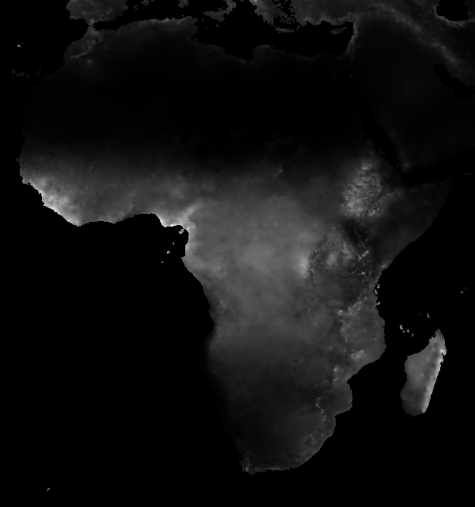
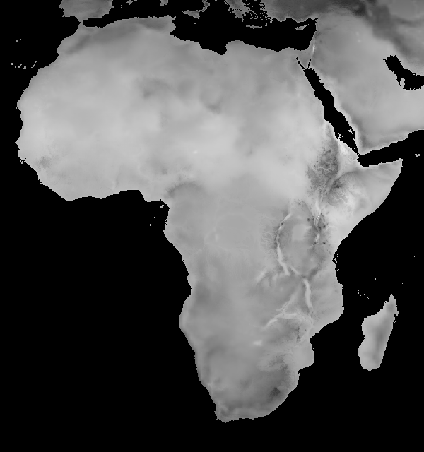
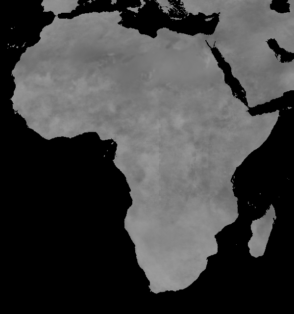

# Observational CHIRPS / CHIRTS-era5 — QAQC sandbox

Throwaway sandbox notebook for inspecting the freshly-published observational
parquets on S3. Not wired into the published Atlas site; render on demand only.

## Data consumed

Two parquets, both at the `domain=climate/type=observational/source=chirps-chirts-era5/region=africa/` root on `digital-atlas`:

- `processing=admin-monthly/variable=adm0_obs.parquet` — one row per (zone × year × month × variable), 1980–2026.
- `processing=admin-periods/variable=adm0_obs.parquet` — one row per (zone × year × period × variable). `period` is season (`annual` + 12 rolling 3-month seasons JFM…DJF), **not** baseline.

## Source attribution (per variable)

`source = 'chirps-chirts-era5'` is a single combined string in the parquet, but it actually means **two distinct sources**:

- **PTOT**: [CHIRPS](https://www.chc.ucsb.edu/data/chirps) (Climate Hazards Group InfraRed Precipitation with Station data)
- **TAVG / TMAX / TMIN**: [CHIRTS-era5](https://www.chc.ucsb.edu/data/chirtsdaily) (CHIRTS temperature, ERA5-based version)
- **SPEI-01 / 03 / 06 / 12 / 24**: derived from CHIRPS precipitation + PET computed from CHIRTS-era5 temperatures

## Known QAQC flags (Stage 1)

1. **Disputed-territory polygons** (CR-075): EGY ships 3 adm0 polygons (Egypt + Bīr Ṭawīl + Hala'ib), KEN ships 2 (Kenya + Ilemi), SDN ships 2 (Sudan + Abyei). This sandbox filters to the main-country polygon (the `gaul0_code` with the largest admin1 count per iso3) so the disputed-territory rows are dropped from the plots below. Long-term fix is pipeline-side (see CR-075).
2. **Non-finite SPEI values** (Inf at distribution tails) in admin-monthly: SPEI-01 0.15% → SPEI-24 4.4% of rows. SPEI tail issue, not data corruption — happens when the log-logistic fit blows up at extreme drought/wet years. Filtered to NA before plotting. The admin-periods parquet has already cleaned these via the Inf-strict aggregation fix in upstream `d1fc80d`.
3. **Naming gotcha**: the column is `value_mean` for all variables, but at the admin-periods grain it carries the **aggregation result per variable** (sum for PTOT, mean for TAVG/SPEI, max for TMAX, min for TMIN). Same column name regardless. Spot-checked: annual TAVG = average-of-12-months, annual PTOT = sum-of-12-months.
4. **`source` column** is the combined string `'chirps-chirts-era5'` (one value), so the parquet itself doesn't attribute per variable. See "Source attribution" above for the breakdown.

```{ojs}
//| output: false
obsBase = "https://digital-atlas.s3.amazonaws.com/domain=climate/type=observational/source=chirps-chirts-era5/region=africa/";
monthlyAdm0URL = obsBase + "processing=admin-monthly/variable=adm0_obs.parquet";
periodsAdm0URL = obsBase + "processing=admin-periods/variable=adm0_obs.parquet";

// DuckDB-WASM ships with httpfs built-in — no INSTALL/LOAD needed
// (that would fail at runtime since WASM extensions are compile-time).
db = await DuckDBClient.of();
```

```{ojs}
// Hardcoded country selector (sandbox scope). The full notebook will
// reuse components/_adminSelectors; here we only need 3 known countries
// to spot-check observational data quality.
countries = [
  { iso3: "AGO", name: "Angola"  },
  { iso3: "TGO", name: "Togo"    },
  { iso3: "KEN", name: "Kenya"   },
];

viewof country = Inputs.select(countries, {
  label: "Country",
  format: (d) => `${d.iso3} — ${d.name}`,
});
```

```{ojs}
// CR-075 short-term filter — pick the main-country gaul0_code per iso3
// (the one with the largest admin1 count). Disputed-territory polygons
// each carry exactly 1 admin1, so this reliably drops Bīr Ṭawīl /
// Hala'ib / Ilemi / Abyei from the adm0 query results.
mainGaul = {
  const resp = await db.query(`
    WITH per_polygon AS (
      SELECT iso3, gaul0_code, COUNT(DISTINCT admin1_name) AS n_admin1
      FROM read_parquet('${monthlyAdm0URL.replace("adm0_obs", "adm1_obs")}')
      GROUP BY iso3, gaul0_code
    ),
    ranked AS (
      SELECT iso3, gaul0_code,
             ROW_NUMBER() OVER (PARTITION BY iso3 ORDER BY n_admin1 DESC) AS rn
      FROM per_polygon
    )
    SELECT iso3, gaul0_code FROM ranked WHERE rn = 1
  `);
  const map = new Map();
  for (const row of resp) map.set(row.iso3, row.gaul0_code);
  return map;
}
```

## Section A — Monthly precipitation (PTOT)

```{ojs}
ptot_monthly = {
  const iso3 = country.iso3;
  const gaul = mainGaul.get(iso3);
  if (gaul == null) return [];
  const resp = await db.query(`
    SELECT year, month,
           CAST(year AS DOUBLE) + (CAST(month AS DOUBLE) - 1) / 12.0 AS year_frac,
           value_mean
    FROM read_parquet('${monthlyAdm0URL}')
    WHERE iso3 = '${iso3}'
      AND gaul0_code = ${gaul}
      AND variable = 'PTOT'
      AND value_mean IS NOT NULL
      AND isfinite(value_mean)
    ORDER BY year, month
  `);
  return Array.from(resp);
}

ptot_plot = Plot.plot({
  width: 1200,
  height: 320,
  marginLeft: 60,
  marginBottom: 50,
  style: { color: "#333" },
  x: { label: "Year", tickFormat: (d) => `${d}` },
  y: { label: "Precipitation (mm / month)", grid: true },
  marks: [
    Plot.ruleY([0], { stroke: "#999", strokeWidth: 0.5 }),
    Plot.line(ptot_monthly, {
      x: "year_frac",
      y: "value_mean",
      stroke: "#4FB5B7",
      strokeWidth: 1,
    }),
  ],
});
```

```{ojs}
//| output: false
{
  const div = document.getElementById("ptot-plot");
  if (div) div.replaceChildren(ptot_plot);
}
```

::: {#ptot-plot}
:::

Monthly precipitation total in mm per month at the country (admin0) level. Solid line, no smoothing. Source: CHIRPS.

## Section B — Monthly mean temperature (TAVG)

```{ojs}
tavg_monthly = {
  const iso3 = country.iso3;
  const gaul = mainGaul.get(iso3);
  if (gaul == null) return [];
  const resp = await db.query(`
    SELECT year, month,
           CAST(year AS DOUBLE) + (CAST(month AS DOUBLE) - 1) / 12.0 AS year_frac,
           value_mean
    FROM read_parquet('${monthlyAdm0URL}')
    WHERE iso3 = '${iso3}'
      AND gaul0_code = ${gaul}
      AND variable = 'TAVG'
      AND value_mean IS NOT NULL
      AND isfinite(value_mean)
    ORDER BY year, month
  `);
  return Array.from(resp);
}

tavg_plot = Plot.plot({
  width: 1200,
  height: 320,
  marginLeft: 60,
  marginBottom: 50,
  style: { color: "#333" },
  x: { label: "Year", tickFormat: (d) => `${d}` },
  y: { label: "Mean temperature (°C)", grid: true },
  marks: [
    Plot.line(tavg_monthly, {
      x: "year_frac",
      y: "value_mean",
      stroke: "#EE624F",
      strokeWidth: 1,
    }),
  ],
});
```

```{ojs}
//| output: false
{
  const div = document.getElementById("tavg-plot");
  if (div) div.replaceChildren(tavg_plot);
}
```

::: {#tavg-plot}
:::

Monthly mean temperature in °C at the country (admin0) level. Solid line, no smoothing. Source: CHIRTS-era5.

## Section C — Period means per (period × variable)

Annual + 12 rolling 3-month seasons. PTOT is summed across a period's months; TAVG / SPEI are averaged. Each dot is the per-year period value; horizontal bars mark the 1995–2014 mean for that (period × variable) cell, so you can eyeball anomalies year-on-year.

```{ojs}
periods_data = {
  const iso3 = country.iso3;
  const gaul = mainGaul.get(iso3);
  if (gaul == null) return [];
  const resp = await db.query(`
    SELECT period, variable, year, value_mean
    FROM read_parquet('${periodsAdm0URL}')
    WHERE iso3 = '${iso3}'
      AND gaul0_code = ${gaul}
      AND variable IN ('PTOT', 'TAVG', 'SPEI-12')
      AND value_mean IS NOT NULL
      AND isfinite(value_mean)
    ORDER BY variable, period, year
  `);
  return Array.from(resp);
}

// Compute 1995–2014 baseline mean per (variable × period) for reference lines
baselines = {
  const rows = periods_data.filter((d) => d.year >= 1995 && d.year <= 2014);
  const grouped = d3.rollup(
    rows,
    (v) => d3.mean(v, (d) => d.value_mean),
    (d) => `${d.variable}|${d.period}`,
  );
  return Array.from(grouped, ([key, mean]) => {
    const [variable, period] = key.split("|");
    return { variable, period, mean };
  });
}

periodOrder = ["annual","DJF","JFM","FMA","MAM","AMJ","MJJ","JJA","JAS","ASO","SON","OND","NDJ"];

periods_plot = Plot.plot({
  width: 1200,
  height: 600,
  marginLeft: 80,
  marginRight: 30,
  marginBottom: 50,
  marginTop: 30,
  style: { color: "#333" },
  facet: { data: periods_data, x: "variable", y: "period" },
  fx: { label: null },
  fy: { domain: periodOrder, label: null, tickFormat: (d) => d },
  x: { label: "Year", tickFormat: (d) => `${d}` },
  y: { label: null, grid: true },
  marks: [
    Plot.dot(periods_data, {
      x: "year",
      y: "value_mean",
      r: 1.5,
      fill: "#4FB5B7",
      opacity: 0.7,
    }),
    Plot.ruleY(baselines, { y: "mean", stroke: "#999", strokeDasharray: "2,2" }),
  ],
});
```

```{ojs}
//| output: false
{
  const div = document.getElementById("periods-plot");
  if (div) div.replaceChildren(periods_plot);
}
```

::: {#periods-plot}
:::

Each row of facets = one season (`annual` + 12 rolling 3-month); each column = one variable. Dashed grey line = 1995–2014 mean for that cell. Hover-over not yet wired (sandbox).

## Section D — Climatology COG spot checks

The climatology side of the publish — `processing=climatology/{variable}/{period}/{clim}/{stat}/*.tif` — has its own QAQC story. 1,404 COGs total (9 variables × 13 periods × 3 climatologies × 4 stats). All sit on S3 alongside the parquets.

### Raster contents are sound

Spot-checked three COGs (`annual_1995-2014_mean.tif` for PTOT, TAVG, SPEI-12) with `gdalinfo`:

| variable | min | max | range plausible? |
|---|---|---|---|
| PTOT annual mean | 0.045 mm/yr | 5,195 mm/yr | ✓ Sahara → equatorial rainforest |
| TAVG annual mean | 5.57 °C | 36.84 °C | ✓ Atlas / Ethiopian highlands → Sahara |
| SPEI-12 annual mean | −0.50 | +0.49 | ✓ z-score, ≈0 over reference period |

All COGs: 1500×1600 px, 0.05° resolution, WGS84, Africa bounding box (20°W → 55°E, 40°S → 40°N), Float32, 512×512 tiled blocks, NoData = `nan`. Standard COG layout.

Grayscale thumbnails (`gdal_translate -of PNG -ot Byte -scale ... -outsize 600 0`):

::: {layout-ncol=3}
{width=100%}

{width=100%}

{width=100%}
:::

Visual sanity: TAVG shows the expected continental temperature gradient (dark = cooler Atlas + Ethiopian highlands, lighter = Sahara). PTOT shows the expected wet/dry pattern (Sahara dark, Gulf of Guinea / Congo basin bright). SPEI-12 is uniformly near zero (expected: z-score over its own reference period).

### Pipeline bug 1 — Hive partition tokens collapsed (CR-076)

**All ~1,404 COGs land in a single physical S3 directory**:

```
processing=climatology/variable=PTOT/period=AMJ/clim=wmo_1991-2020/stat=max/
  └─ PTOT_AMJ_1991-2020_mean.tif
  └─ PTOT_AMJ_1995-2014_max.tif
  └─ TAVG_annual_full_sd.tif
  └─ SPEI-12_DJF_1995-2014_min.tif
  └─ ... (all 1,404 files here)
```

Filenames carry the metadata correctly (`{var}_{period}_{clim}_{stat}.tif`) but the Hive partition tokens in the path are stuck on the first-iteration value: `variable=PTOT`, `period=AMJ`, `clim=wmo_1991-2020`, `stat=max`. Consumers using path-based partition pruning (e.g. terra::rast, DuckDB's globbed `read_parquet`, MapLibre tile-source path lookups) won't find files at the "right" partition paths. Workaround: glob the single directory and parse the filename.

Probable cause: the publish step's `name_fn` (per the hazards_prototype observational README, "translates the on-disk 4-token climatology label into the descriptive S3 partition value") sets the partition tokens once at startup based on the first file, then reuses those values for every subsequent upload instead of recomputing per-file.

### Pipeline bug 2 — Stats metadata are sentinel `-9999` (CR-076)

Every COG ships with bogus mean/stddev in the embedded stats:

```
STATISTICS_MAXIMUM = <real value>     ✓
STATISTICS_MINIMUM = <real value>     ✓
STATISTICS_MEAN    = -9999            ✗  (sentinel; never computed)
STATISTICS_STDDEV  = -9999            ✗  (sentinel; never computed)
```

GDAL writes -9999 when the bake step skips full statistics computation. Min/max were computed but mean/stddev were not. Downstream consumers that read embedded stats to set colour-scale defaults will pick up the bogus -9999 and break.

Both pipeline bugs filed as **CR-076** — bundle into the next hazards_prototype dispatch alongside CR-068 / CR-064 / CR-075.

## Quick row-count sanity check

```{ojs}
row_counts = {
  const iso3 = country.iso3;
  const gaul = mainGaul.get(iso3);
  if (gaul == null) return [];
  const resp = await db.query(`
    SELECT variable,
           COUNT(*) AS n_rows,
           MIN(year) AS min_year,
           MAX(year) AS max_year,
           SUM(CASE WHEN value_mean IS NULL THEN 1 ELSE 0 END) AS n_null,
           SUM(CASE WHEN value_mean IS NOT NULL AND NOT isfinite(value_mean) THEN 1 ELSE 0 END) AS n_inf
    FROM read_parquet('${monthlyAdm0URL}')
    WHERE iso3 = '${iso3}' AND gaul0_code = ${gaul}
    GROUP BY variable
    ORDER BY variable
  `);
  return Array.from(resp);
}

Inputs.table(row_counts, { width: 600 });
```
